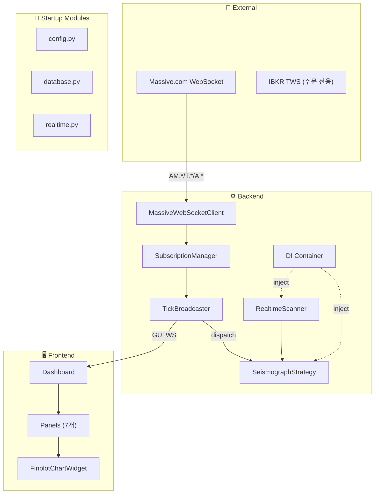
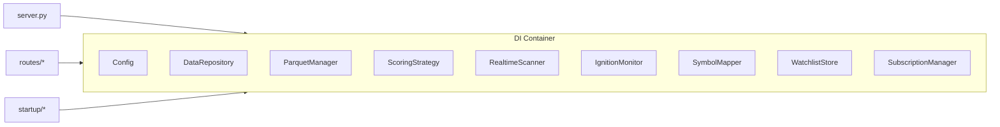

# Sigma9 시스템 아키텍처

> **버전**: v3.5 (2026-01-10)  
> **철학**: "Detect the Accumulation, Strike the Ignition, Harvest the Surge."

---

## 1. 아키텍처 개요

```
┌─────────────────────────────────────────────────────────────────────────┐
│                    🇺🇸 AWS EC2 (us-east-1)                             │
│  ┌───────────────────────────────────────────────────────────────────┐  │
│  │                     Trading Engine Server                         │  │
│  │  Strategy Engine (Scanning + Trading) │ IBKR Gateway (TWS)        │  │
│  │  LLM Oracle          │ Risk Manager    │ FastAPI + WebSocket      │  │
│  └───────────────────────────────────────────────────────────────────┘  │
└─────────────────────────────────────────────────────────────────────────┘
                                     ▲
                                     │ WebSocket (Data Push) / REST (Commands)
                                     ▼
┌─────────────────────────────────────────────────────────────────────────┐
│                        🇰🇷 Local Client (Windows)                       │
│  ┌───────────────────────────────────────────────────────────────────┐  │
│  │  PyQt6 GUI Dashboard + finplot Charts (Historical Scroll)        │  │
│  └───────────────────────────────────────────────────────────────────┘  │
└─────────────────────────────────────────────────────────────────────────┘
```

---

## 2. Tech Stack

### 2.1 Backend (AWS EC2)

| Component | Library | Purpose |
|-----------|---------|---------|
| API Server | `FastAPI` + `uvicorn` | REST + WebSocket 서버 |
| DI Container | `dependency-injector` | 의존성 주입 |
| Broker | `ib_insync` | IBKR 연동, OCA 주문 |
| Market Data | Massive.com (WebSocket + REST) | Universe + 실시간 |
| Data Analysis | `pandas` + `pandas_ta` | OBV, ATR, VWAP |
| LLM | `openai` / `anthropic` / `google` | 해설 및 분석 |
| Storage | `pyarrow` (Parquet) | 시계열 데이터 저장 |
| Logging | `loguru` | JSON Structured Logging |

### 2.2 Frontend (Local Windows)

| Component | Library | Purpose |
|-----------|---------|---------|
| GUI | `PyQt6` + `qfluentwidgets` | Glassmorphism 대시보드 |
| Charts | `finplot` | 금융 차트 (OHLCV + Historical Scroll) |
| HTTP | `httpx` | REST 클라이언트 |
| WebSocket | `websockets` | 실시간 데이터 수신 |
| Async | `qasync` | PyQt + asyncio 통합 |

---

## 3. 데이터 파이프라인



| Phase | 흐름 | 채널 | 갱신 주기 |
|-------|------|------|----------|
| Tier 1 Watchlist | Massive A → 1초봉 | `A.*` | 1초 |
| Tier 2 Hot Zone | Massive T → 틱 | `T.*` | 실시간 |
| Chart | Massive AM → OHLC | `AM.*` | 1분 |

---

## 4. 전체 데이터스트림

> [!NOTE]
> 아래 내용은 `realtime.py`, `tick_broadcaster.py`, `realtime_scanner.py`, `ignition_monitor.py` 실제 코드 분석 기반.

### 4.1 초기화 흐름 (server.py → realtime.py)

```
server.py lifespan
       │
       └→ initialize_realtime_services()
               │
               ├─ 1. IgnitionMonitor 초기화
               │       └→ SeismographStrategy 주입
               │
               ├─ 2. MassiveWebSocketClient 생성
               │       └→ delayed=False (실시간)
               │
               ├─ 3. TickDispatcher 생성 (중앙 틱 배포자)
               │       ├→ register("strategy", strategy_tick_handler)
               │       └→ register("trailing_stop", trailing_tick_handler)
               │
               ├─ 4. TickBroadcaster 생성
               │       ├→ massive_ws.on_bar = _on_bar (콜백 연결)
               │       └→ massive_ws.on_tick = _on_tick (콜백 연결)
               │
               ├─ 5. SubscriptionManager 생성
               │       └→ sync_watchlist() 호출 (초기 구독)
               │
               └─ 6. RealtimeScanner 시작
                       ├→ _polling_loop() (1초 폴링)
                       ├→ _periodic_watchlist_broadcast()
                       └→ _periodic_score_recalculation() (1시간)
```

---

### 4.2 실시간 스트림 (코드 분석 기반)

#### Stream 1: WebSocket 실시간 데이터 (AM/T 채널)

```
MassiveWebSocketClient (wss://socket.massive.com)
       │
       ├── on_bar (AM.* 1분봉)
       │       │
       │       └→ TickBroadcaster._on_bar()
       │               │
       │               └→ ws_manager.broadcast_bar() → GUI WebSocket
       │
       └── on_tick (T.* 틱)
               │
               └→ TickBroadcaster._on_tick()
                       │
                       ├→ TickDispatcher.dispatch()
                       │       ├→ strategy_tick_handler → SeismographStrategy.on_tick()
                       │       └→ trailing_tick_handler → TrailingStopManager.on_price_update()
                       │
                       └→ ws_manager.broadcast_tick() → GUI WebSocket
```

#### Stream 2: Gainers 폴링 (RealtimeScanner)

```
RealtimeScanner._polling_loop() [1초 간격]
       │
       └→ massive_client.get_gainers()  ← Massive REST API
               │
               └→ 신규 종목 탐지 (Set diff)
                       │
                       ├─ 1. DataRepository.get_daily_bars(ticker, 20일)
                       │
                       ├─ 2. SeismographStrategy.calculate_watchlist_score_detailed()
                       │       └→ score_v3, stage, signals, intensities
                       │
                       ├─ 3. WatchlistStore.save_watchlist() [병합]
                       │
                       ├─ 4. ws_manager.broadcast_watchlist() → GUI WebSocket
                       │
                       └─ 5. IgnitionMonitor.add_ticker() [옵션]
```

#### Stream 3: Ignition 모니터링 (1초 폴링)

```
IgnitionMonitor._polling_loop() [1초 간격]
       │
       └→ _update_all_scores()
               │
               ├→ _fetch_quotes() ← Polygon Snapshot API (현재가 조회)
               │
               ├→ SeismographStrategy.calculate_ignition_score()
               │       └→ bid/ask 분석, 급등 감지
               │
               └→ ws_manager.broadcast({type: "IGNITION", ...}) → GUI WebSocket
```

#### Stream 4: 주기적 Watchlist 갱신 (1초)

```
RealtimeScanner._periodic_watchlist_broadcast() [1초 간격]
       │
       ├→ load_watchlist() ← WatchlistStore
       │
       ├→ Hydration (실시간 가격 적용)
       │       └→ _latest_prices[ticker] → dollar_volume 재계산
       │
       ├→ score_v3 없는 항목 실시간 계산
       │       └→ DataRepository + SeismographStrategy
       │
       └→ ws_manager.broadcast_watchlist() → GUI WebSocket
```

---

### 4.3 콜백 연결 구조

| 컴포넌트 | 콜백 | 호출자 | 역할 |
|---------|------|-------|------|
| `MassiveWSClient.on_bar` | `TickBroadcaster._on_bar` | `realtime.py` | 1분봉 → GUI |
| `MassiveWSClient.on_tick` | `TickBroadcaster._on_tick` | `realtime.py` | 틱 → Dispatcher + GUI |
| `TickDispatcher.register("strategy")` | `strategy_tick_handler` | `realtime.py` | 틱 → 전략 |
| `TickDispatcher.register("trailing_stop")` | `trailing_tick_handler` | `realtime.py` | 틱 → 손절 |

---

### 4.4 데이터 저장소

| 저장소 | 위치 | 형식 | 용도 |
|--------|------|------|------|
| 일봉 | `data/parquet/daily/` | Parquet | 일봉 OHLCV |
| 1분봉 | `data/parquet/1m/` | Parquet | 분봉 차트 |
| 1시간봉 | `data/parquet/1h/` | Parquet | 일중 차트 |
| Intraday | `data/parquet/intraday/` | Parquet | 수집 스크립트 |
| Watchlist | `data/watchlist.json` | JSON | 현재 Watchlist |
| 설정 | `config/` | YAML | 시스템 설정 |

---

## 4. 모듈 구조

```
Sigma9-0.1/
├── backend/                          # ← AWS 배포
│   ├── server.py                     # FastAPI 메인 서버 (~204줄)
│   ├── container.py                  # DI Container (dependency-injector)
│   │
│   ├── startup/                      # 서버 시작 로직 모듈화 (4개)
│   │   ├── config.py                 # Config + Logging 초기화
│   │   ├── database.py               # DB + StrategyLoader 초기화
│   │   ├── realtime.py               # Massive WS, Scanner, Monitor 초기화
│   │   └── shutdown.py               # Graceful Shutdown
│   │
│   ├── core/                         # 전략 엔진, 리스크 관리 (25개)
│   │   ├── interfaces/               # 추상 인터페이스
│   │   │   └── scoring.py            # ScoringStrategy 인터페이스
│   │   ├── strategy_base.py          # 전략 추상 인터페이스
│   │   ├── strategy_loader.py        # 전략 로더 (폴더 기반)
│   │   ├── realtime_scanner.py       # 실시간 스캐너 (~791줄)
│   │   ├── scanner.py                # 일일 스캐너 (bulk query)
│   │   ├── ignition_monitor.py       # 점화 모니터 (~444줄)
│   │   ├── subscription_manager.py   # 채널 구독 관리 (AM/T/A)
│   │   ├── tick_broadcaster.py       # Massive WS → GUI 브릿지
│   │   ├── tick_dispatcher.py        # 틱 분배기
│   │   ├── ticker_filter.py          # 티커 필터링 (warrants 등 제외)
│   │   ├── risk_manager.py           # 리스크 관리
│   │   ├── order_manager.py          # 주문 관리
│   │   ├── trailing_stop.py          # 트레일링 스탑
│   │   ├── technical_analysis.py     # 기술적 분석 (indicators)
│   │   ├── zscore_calculator.py      # Z-Score 계산
│   │   ├── deduplicator.py           # 이벤트 중복 제거
│   │   ├── event_sequencer.py        # 이벤트 순서 보장
│   │   ├── audit_logger.py           # 감사 로깅
│   │   ├── scheduler.py              # 스케줄러
│   │   ├── config_loader.py          # 설정 로더
│   │   ├── divergence_detector.py    # 다이버전스 탐지
│   │   ├── double_tap.py             # Double Tap 로직
│   │   ├── backtest_engine.py        # 백테스트 엔진
│   │   ├── backtest_report.py        # 백테스트 리포트
│   │   ├── mock_data.py              # 목 데이터
│   │   └── logging/                  # Rheograph 로깅
│   │       └── trade_logger.py       # 상태 전이 로그
│   │
│   ├── models/                       # 중앙 모델 저장소
│   │   ├── tick.py                   # TickData
│   │   ├── quote.py                  # QuoteData + Lee-Ready (Rheograph)
│   │   ├── watchlist.py              # WatchlistItem
│   │   ├── order.py                  # OrderStatus, OrderRecord, Position
│   │   ├── risk.py                   # RiskConfig
│   │   ├── backtest.py               # BacktestConfig, Trade, BacktestReport
│   │   ├── ticker_info.py            # [15-001] TickerInfo, SEC Filing 매핑
│   │   └── technical.py              # IndicatorResult, ZScoreResult, DailyStats
│   │
│   ├── strategies/                   # 전략 플러그인
│   │   ├── score_v3_config.py        # Score V3 설정
│   │   ├── _template.py              # 전략 템플릿
│   │   ├── seismograph/              # Phase 1-2 전략 (매집→폭발)
│   │   │   ├── strategy.py           # SeismographStrategy (~400줄)
│   │   │   ├── models.py             # 전략 전용 모델
│   │   │   ├── signals/              # 시그널 모듈 (5개)
│   │   │   │   ├── tight_range.py
│   │   │   │   ├── obv_divergence.py
│   │   │   │   ├── accumulation_bar.py
│   │   │   │   └── volume_dryout.py
│   │   │   └── scoring/              # 점수 계산
│   │   │       ├── v1.py             # Stage-based
│   │   │       ├── v2.py             # Weighted sum
│   │   │       └── v3.py             # Pinpoint algorithm
│   │   └── rheograph/                # Rheograph 전략 엔진 (신규)
│   │       ├── __init__.py           # 패키지 초기화
│   │       ├── models.py             # Layer 1-4 데이터 모델
│   │       ├── raw_metrics.py        # Layer 1 계산기
│   │       ├── derived_metrics.py    # Layer 2 계산기 (Tick Proxy)
│   │       ├── micro_state.py        # Layer 3 FSM
│   │       ├── macro_state.py        # Layer 4 합성
│   │       ├── rotation_tracker.py   # Float Rotation 가속도
│   │       ├── adversarial_gate.py   # 7조건 반박 게이트
│   │       ├── collapse_warning.py   # 붕괴 예고 시스템
│   │       ├── adaptive_stream.py    # 틱 폭발 시 1초봉 전환
│   │       ├── dilution_checker.py   # SEC EDGAR 크롤링/ATM 감지
│   │       ├── monitor.py            # RheographMonitor 통합
│   │       └── setup_matcher.py      # 6대 플레이북 패턴 매칭
│   │
│   ├── data/                         # DB, API 클라이언트 (11개)
│   │   ├── data_repository.py        # [11-002] 통합 데이터 접근 레이어
│   │   ├── flush_policy.py           # [11-002] 캐시 Flush 정책
│   │   ├── parquet_manager.py        # [11-001] Parquet I/O
│   │   ├── database.py               # Legacy DB (마이그레이션 중)
│   │   ├── massive_client.py         # Massive REST
│   │   ├── massive_ws_client.py      # Massive WebSocket (AM/T/A 채널)
│   │   ├── massive_loader.py         # Massive 데이터 로더
│   │   ├── symbol_mapper.py          # 심볼 매핑
│   │   ├── ticker_info_service.py    # [15-001] 티커 종합 정보 API + SQLite 캐싱
│   │   └── watchlist_store.py        # Watchlist 저장소
│   │
│   ├── broker/                       # IBKR 연동
│   │
│   ├── scripts/                      # 스크립트
│   │   └── procure_intraday_data.py  # Intraday 데이터 수집
│   │
│   └── api/                          # REST/WebSocket 핸들러
│       └── routes/                   # 라우터 패키지 (14개 도메인)
│           ├── __init__.py           # 라우터 조합
│           ├── models.py             # 공유 Pydantic 모델
│           ├── common.py             # 공용 유틸리티
│           ├── status.py             # /status, /engine/status
│           ├── control.py            # /control, /kill-switch
│           ├── watchlist.py          # /watchlist
│           ├── position.py           # /positions
│           ├── strategy.py           # /strategies
│           ├── scanner.py            # /scanner, /gainers
│           ├── ignition.py           # /ignition
│           ├── chart.py              # /chart/intraday, /chart/bars
│           ├── llm.py                # /oracle
│           ├── tier2.py              # /tier2
│           ├── zscore.py             # /zscore
│           └── sync.py               # /sync
│
├── frontend/                         # ← 로컬 Windows
│   ├── gui/                          # 대시보드, 차트
│   │   ├── dashboard.py              # 메인 대시보드 (~2,153줄)
│   │   ├── panels/                   # 분리된 UI 패널 (7개)
│   │   │   ├── watchlist_panel.py    # Tier1 Watchlist
│   │   │   ├── tier2_panel.py        # Hot Zone
│   │   │   ├── log_panel.py          # 로그 패널
│   │   │   ├── chart_panel.py        # 차트 패널
│   │   │   ├── resample_panel.py     # Intraday 리샘플 컨트롤 (09-002)
│   │   │   ├── position_panel.py     # P&L/포지션
│   │   │   └── oracle_panel.py       # LLM 분석
│   │   ├── state/                    # 상태 관리
│   │   │   └── dashboard_state.py    # DashboardState
│   │   ├── chart/                    # 차트 관련
│   │   │   └── finplot_chart.py      # FinplotChartWidget (Historical Scroll)
│   │   ├── widgets/                  # 커스텀 위젯
│   │   │   └── traffic_light.py      # Rheograph 신호등 UI (신규)
│   │   ├── watchlist_model.py        # Watchlist 데이터 모델
│   │   ├── particle_effects.py       # 파티클 효과
│   │   ├── theme.py                  # 테마 관리
│   │   ├── ticker_info_window.py     # [15-001] 티커 종합 정보 창
│   │   └── settings_dialog.py        # 설정 다이얼로그
│   └── services/                     # Backend 통신
│       ├── backend_client.py         # REST/WS 클라이언트
│       ├── rest_adapter.py           # REST 어댑터
│       └── ws_adapter.py             # WebSocket 어댑터
│
└── docs/
    ├── Plan/                         # 실행 계획
    ├── devlog/                       # 개발 로그
    └── context/                      # 📘 핵심 정책 문서
        ├── ARCHITECTURE.md           # (이 문서)
        ├── REFACTORING.md
        └── strategy/
            ├── seismograph.md
            ├── mep.md
            └── ignition.md
```

---

## 5. 아키텍처 패턴

### 5.1 의존성 주입 (DI Container)



- **도입**: 02-001 (2026-01-08)
- **목적**: 싱글톤 패턴 제거, 테스트 용이성 향상
- **완료된 마이그레이션**:
  - `RealtimeScanner` (02-002)
  - `IgnitionMonitor` (02-003)
  - `WatchlistStore` (02-004)
  - `SymbolMapper` (02-005)
  - `DataRepository` (11-002)
  - `SubscriptionManager` (02-006)
  - `TickerInfoService` (15-001)

### 5.2 인터페이스 추출 (순환 의존성 해결)

```
                  ScoringStrategy (Interface)
                        ↑
                 SeismographStrategy
                        ↑
server.py → inject → RealtimeScanner
```

- **도입**: 01-001 (2026-01-08)
- **해결된 문제**: `realtime_scanner.py ↔ seismograph.py` 순환 참조

---

## 6. 3-Phase Trading Cycle

```
[Phase 1: Setup]        [Phase 2: Trigger]       [Phase 3: Harvest]
     ↓                        ↓                        ↓
  일봉 스캔 ──→ Watchlist 50 ──→ 실시간 감시 ──→ 진입 ──→ 청산
  (매집 탐지)    (상위 선별)      (폭발 감지)     (OCA)    (Trail)
```

| Phase | 역할 | 상세 문서 |
|-------|------|----------|
| Phase 1 | 매집 탐지 → Watchlist 선정 | [seismograph.md](strategy/seismograph.md) |
| Phase 2 | 폭발 감지 → 진입 결정 | [ignition.md](strategy/ignition.md) |
| Phase 3 | 수익 실현 + 재진입 | [mep.md](strategy/mep.md) |

---

## 7. Tiered Watchlist System

```
┌─────────────────────────────────────────────────────────┐
│                    WATCHLIST PANEL                       │
├─────────────────────────────────────────────────────────┤
│  ⚡ TIER 2 - HOT ZONE (Tick-level, 1초 갱신)             │
│  ┌─────────────────────────────────────────────────────┐│
│  │ AAPL  $178.25  🔥85  +3.2%  Z:V+2.1 Z:P+0.3        ││
│  └─────────────────────────────────────────────────────┘│
├─────────────────────────────────────────────────────────┤
│  📋 TIER 1 - WATCHLIST (A 채널 1초 갱신)                 │
│  ┌─────────────────────────────────────────────────────┐│
│  │ MSFT   +1.2%  [100]  🔥45   560K                   ││
│  └─────────────────────────────────────────────────────┘│
└─────────────────────────────────────────────────────────┘
```

---

## 8. API Endpoints

```
REST:
  GET  /api/status            - 서버 상태
  GET  /api/watchlist         - Watchlist 조회
  GET  /api/positions         - 현재 포지션
  POST /api/kill-switch       - 긴급 정지
  POST /api/order             - 수동 주문
  GET  /api/strategies        - 전략 목록
  GET  /api/chart/bars        - Historical bars (L2→L3 캐시)
  POST /api/tier2/check-promotion - Tier2 승격 조건 판단

WebSocket:
  WS /ws/market               - 실시간 시장 데이터
  WS /ws/trade                - 거래 이벤트 스트림
```

---

## 9. Risk Management

| Parameter | Value | Action |
|-----------|-------|--------|
| Max Position Size | Kelly × 0.5 | Half Kelly |
| Max Concurrent | 3개 | 동시 포지션 제한 |
| **Per-Trade Stop** | **-5.0%** | OCA Stop Loss |
| Daily Loss Limit | -3% | 봇 자동 정지 |
| Weekly Loss Limit | -10% | 수동 리뷰 필요 |

---

## 10. 관련 문서

- [@PROJECT_DNA.md](../../@PROJECT_DNA.md) - 프로젝트 진입점
- [REFACTORING.md](REFACTORING.md) - 리팩터링 정책
- [strategy/](strategy/) - 전략별 상세 문서

---

## 11. 변경 이력

| 버전 | 날짜 | 주요 변경 |
|------|------|----------|
| v3.5 | 2026-01-10 | finplot 차트 마이그레이션, Historical Scroll (09-003), Resample Panel 추가 |
| v3.4 | 2026-01-10 | 전체 모듈 현황 반영, SubscriptionManager 추가, A 채널 추가, 파일 개수 정확화 |
| v3.3 | 2026-01-10 | DataRepository 통합, Parquet 전면 전환 (11-002) |
| v3.2 | 2026-01-08 | DI Container, startup/, models/, routes/ 분할, panels/ 반영 |
| v3.1 | 2026-01-08 | 초기 버전 |
