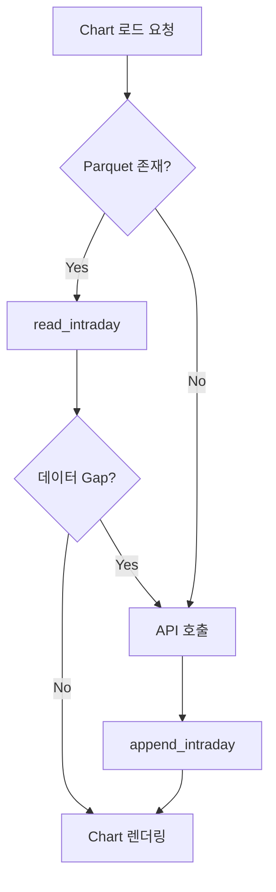

# 데이터 조달 계획서 (1m/1h Parquet Data)

> **작성일**: 2026-01-10 03:05
> **관련 계획서**: [11-001_parquet_migration.md](./refactor/11-001_parquet_migration.md)
> **상태**: 📋 대기 (User Review 필요)

---

## 1. 개요

Parquet 마이그레이션 완료 후, 실제 전략 운영에 필요한 **1분봉(1m)** 및 **1시간봉(1h)** 데이터를 사전에 조달하여:
- **차트 로딩 지연 제거**: 첫 방문 시에도 즉시 차트 표시
- **백테스트 지원**: 과거 데이터로 전략 검증 가능
- **API 비용 절감**: 반복 조회 방지

---

## 2. 조달 방법 (How)

### 2.1 데이터 소스: Massive Aggregates API

```
GET /v2/aggs/ticker/{ticker}/range/{multiplier}/minute/{from}/{to}
```

| 파라미터    | 1분봉 (1m) | 1시간봉 (1h) |
|------------|-----------|-------------|
| multiplier | 1         | 60          |
| limit      | 5000      | 5000        |
| sort       | desc      | desc        |

> [!NOTE]
> 기존 `MassiveClient.fetch_intraday_bars()` 메서드 사용 가능.
> Paid 플랜 기준 Rate Limit: **100 req/min**.

### 2.2 저장 로직


**흐름**:
1. `MassiveClient.fetch_intraday_bars(ticker, multiplier, from_date, to_date)` 호출
2. 응답 DataFrame을 `ParquetManager.append_intraday(ticker, timeframe, df)`로 저장
3. 티커별 분리 파일 생성 (예: `AAPL_1m.parquet`, `AAPL_1h.parquet`)

---

## 3. 조달 범위 (How Much)

### 3.1 목표 종목 수

| 구분 | 기준 | 예상 종목 수 |
|------|------|-------------|
| **Tier 1 Watchlist** | 실시간 모니터링 대상 | ~50개 |
| **Tier 2 Position** | 포지션 보유 후보 | ~20개 |
| **Full Universe** | 스캔 대상 전체 | ~500개 |

> [!IMPORTANT]
> **권장**: Watchlist (50개) + Position (20개) = **70개 종목**만 1m/1h 사전 조달.
> Full Universe(500개)는 On-Demand 방식으로 필요 시 조회.

### 3.2 기간 설정

| 타임프레임 | 조달 기간 | 근거 |
|-----------|----------|------|
| **1분봉 (1m)** | 5 거래일 | 차트 기본 표시 범위 (5일 이상은 스크롤 필요) |
| **1시간봉 (1h)** | 20 거래일 (~1달) | 스윙 분석 기준 (1달치 트렌드 확인) |

### 3.3 데이터량 계산

#### 1분봉 (1m)
```
1일 = 390분 (09:30-16:00, 정규장)
5일 = 1,950 rows/ticker
70 tickers × 1,950 = 136,500 rows (총)
```

#### 1시간봉 (1h)
```
1일 = 7시간 (6.5시간 반올림)
20일 = 140 rows/ticker
70 tickers × 140 = 9,800 rows (총)
```

---

## 4. 예상 시간 및 데이터 크기

### 4.1 API 호출 소요 시간

| 타임프레임 | API 호출 수 | Rate Limit (100/min) 기준 |
|-----------|-----------|--------------------------|
| 1m (5일) | 70 calls | ~42초 (1회/ticker) |
| 1h (20일) | 70 calls | ~42초 (1회/ticker) |
| **합계** | 140 calls | **~1분 30초** |

> [!TIP]
> 각 API 호출은 `limit=5000`으로 한 번에 5일치(1m) 또는 20일치(1h) 데이터 수신 가능.

### 4.2 파일 크기 예상

| 항목 | 계산 | 예상 크기 |
|------|------|----------|
| 1m 데이터 (70 tickers × 1,950 rows) | ~10 columns × 8 bytes × 136,500 | ~10 MB (Raw) |
| 1h 데이터 (70 tickers × 140 rows) | ~10 columns × 8 bytes × 9,800 | ~0.8 MB (Raw) |
| Snappy 압축 효율 | ~60% 압축률 | **1m: ~6 MB, 1h: ~0.5 MB** |
| **총 Parquet 파일 크기** | - | **~7 MB** |

---

## 5. 업데이트 전략 (Update Policy)

### 5.1 옵션 비교

| 전략 | 설명 | 장점 | 단점 |
|------|------|------|------|
| **A. 실시간 업데이트** | WebSocket으로 매 분마다 append | 항상 최신 | 복잡성 ↑, 리소스 ↑ |
| **B. 로드 시 Gap-Fill** | 차트 로드 시 빈 구간만 API 조회 | 단순, 필요 시만 호출 | 첫 로드 지연 가능 |
| **C. 하이브리드** | 장중: WebSocket / 장 종료 후: 빈칸 전체 보정 | 균형잡힌 접근 | 구현 복잡도 중간 |

### 5.2 권장 전략: **B. Gap-Fill On-Load**



**이유**:
1. **구현 단순성**: WebSocket 분봉 스트리밍 없이 REST API로 충분
2. **API 효율성**: 불필요한 실시간 업데이트 없이 필요 시에만 호출
3. **차트 로딩 속도**: 대부분의 경우 Parquet에서 즉시 로드

> [!NOTE]
> **Gap 정의**: `Parquet 최신 timestamp < 현재 시간 - 5분` (1m 기준)

### 5.3 장 종료 후 보정 (Optional Enhancement)

초기에는 Gap-Fill만 구현하고, 이후 필요 시 다음 기능 추가:
- **Daily Cron Job**: 장 종료 후 (16:30 EST) 모든 Watchlist 종목의 당일 전체 1m/1h 보정
- **주말 정기 작업**: 주간 데이터 무결성 검증

---

## 6. 구현 계획 (Implementation)

### Phase 1: 초기 조달 스크립트

| 파일 | 설명 |
|------|------|
| `backend/scripts/procure_intraday_data.py` | 1m/1h 초기 조달 CLI |

**기능**:
```bash
# 50개 Watchlist 티커에 대해 5일치 1m + 20일치 1h 조달
python -m backend.scripts.procure_intraday_data --tickers watchlist --days-1m 5 --days-1h 20
```

### Phase 2: Gap-Fill 로직

| 파일 | 변경 |
|------|------|
| `frontend/services/chart_data_service.py` | `_get_intraday_data()` Gap 감지 및 자동 보정 |
| `backend/api/routes/chart.py` | `/chart/intraday` 엔드포인트 Gap-Fill 지원 |

---

## 7. 리스크 및 고려사항

| 리스크 | 완화 방안 |
|--------|----------|
| Rate Limit 초과 | 초기 조달은 배치로 분산 (10 tickers/batch, 6초 간격) |
| 티커 목록 변동 | Watchlist 변경 시 자동 조달 트리거 |
| 장 중 Gap 발생 | 차트 로드 시 자동 Gap-Fill (Phase 2) |
| 디스크 공간 | Parquet Snappy 압축으로 최소화 (~7MB) |

---

## 8. User Review Required

> [!IMPORTANT]
> **확인 필요 사항**:
> 1. **조달 범위**: 70개 종목 (Watchlist + Position) vs 500개 (Full Universe)?
> 2. **1m 기간**: 5일 vs 10일 vs 더 길게?
> 3. **1h 기간**: 20일 vs 30일 vs 60일?
> 4. **업데이트 전략**: Gap-Fill Only vs 장 종료 후 보정 추가?
> 5. **실행 시점**: Parquet 마이그레이션 완료 직후 즉시 vs 이후 별도?

---

## 9. 관련 문서

- [11-001_parquet_migration.md](./refactor/11-001_parquet_migration.md) — Parquet 마이그레이션 계획
- [Knowledge: ParquetManager Details](file:///C:/Users/USER/.gemini/antigravity/knowledge/sigma9_core_engine/artifacts/implementation/parquet_manager_details.md)
- [massive_client.py](file:///d:/Codes/Sigma9-0.1/backend/data/massive_client.py) — API 클라이언트 구현
