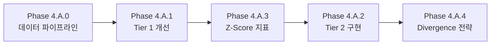

# Step 4.A: Tiered Watchlist System 구현 계획

> **버전**: 1.1 (Revised)  
> **상태**: 📋 계획 중  
> **예상 기간**: 5-7일

---

## ⚠️ 선행 조건 분석

> **질문**: 현재 로직을 구현하기 위해 watchlist 종목들에 최신 data(tick or 1m or ...)를 공급하고 
> 그것을 chart에서 표시하게 할 수 있도록 해야 논리적으로 위 시스템을 구동할 수 있는 것이 아닌가?

**답변**: ✅ **예**

현재 상태:
- ❌ Intraday 데이터 API 미구현 (Step 2.7 미완료)
- ❌ Tick 스트리밍 → GUI 차트 반영 미구현
- ❌ Watchlist 실시간 업데이트 미구현

**결론**: Phase 0 (데이터 파이프라인)을 먼저 완료해야 Tier 시스템 구현 가능

---

## 📋 개요

현재 단일 Watchlist를 **2-Tier 시스템**으로 확장하여 실시간 모니터링 및 진입 타이밍 최적화

```
┌─────────────────────────────────────────────────────────┐
│                    WATCHLIST PANEL                       │
├─────────────────────────────────────────────────────────┤
│  ⚡ TIER 2 - HOT ZONE (Tick-level, 1초 갱신)             │
│  ┌─────────────────────────────────────────────────────┐│
│  │ AAPL  $178.25  1.2M  🔥85  +3.2%  Z:V+2.1 Z:P+0.3 ││
│  │ NVDA  $495.30  2.8M  🔥92  +5.1%  Z:V+3.2 Z:P+1.1 ││
│  └─────────────────────────────────────────────────────┘│
├─────────────────────────────────────────────────────────┤
│  📋 TIER 1 - WATCHLIST (1분/5분 갱신)                    │
│  ┌─────────────────────────────────────────────────────┐│
│  │ MSFT   +1.2%  [100]  🔥45   560K                   ││
│  │ TSLA   -0.3%  [80]   🔥32   1.2M                   ││
│  └─────────────────────────────────────────────────────┘│
└─────────────────────────────────────────────────────────┘
```

---

## 🎯 Phase 구성 (Revised)

### 🔴 Phase 4.A.0: 실시간 데이터 파이프라인 (선행 필수)

> **의존성**: Step 2.7 완료 필요

| Step | 작업 내용 | 파일 |
|------|-----------|------|
| 4.A.0.1 | IBKR Tick 스트리밍 → WebSocket 브로드캐스트 | `ibkr_connector.py`, `websocket.py` |
| 4.A.0.2 | Intraday Bar 데이터 API (1m, 5m) | `routes.py`, `database.py` |
| 4.A.0.3 | Chart 실시간 업데이트 (Tick → Candlestick 변환) | `chart_widget.py`, `ws_adapter.py` |
| 4.A.0.4 | Watchlist 종목 Tick 구독 관리 | `ignition_monitor.py` |

---

### Phase 4.A.1: Tier 1 Enhancement (기존 Watchlist 개선)

| Step | 작업 내용 | 파일 |
|------|-----------|------|
| 4.A.1.1 | Tier 1 명명 및 Dollar Volume 컬럼 추가 (K/M/B 표기) | `dashboard.py` |
| 4.A.1.2 | 헤더 정렬 기능 추가 (모든 헤더 오름차순·내림차순) | `dashboard.py` |
| 4.A.1.3 | Tier 1 주기적 갱신 (1분/5분 타이머) | `backend_client.py`, `routes.py` |

---

### Phase 4.A.2: Tier 2 Hot Zone 구현

| Step | 작업 내용 | 파일 |
|------|-----------|------|
| 4.A.2.1 | Tier 2 데이터 모델 설계 (zenV, zenP 포함) | `models.py` |
| 4.A.2.2 | Ignition Score 상위 5개종목 Tier 2 승격 로직 | `ignition_monitor.py` |
| 4.A.2.3 | Day Gainers → Tier 2 자동 추가 로직 | `routes.py` |
| 4.A.2.4 | Tier 2 GUI 패널 생성 (Watchlist 상단 배치) | `dashboard.py` |
| 4.A.2.5 | Tier 2 Tick-level 실시간 업데이트 (1초) | `ws_adapter.py` |

---

### Phase 4.A.3: Z-Score Indicator 구현

| Step | 작업 내용 | 파일 |
|------|-----------|------|
| 4.A.3.1 | zenV (Z-score Normalized Volume) 계산 | `seismograph.py` |
| 4.A.3.2 | zenP (Z-score Normalized Price) 계산 | `seismograph.py` |
| 4.A.3.3 | GUI에 Z-score 표시 (Z:V+2.1 형태) | `dashboard.py` |

---

### Phase 4.A.4: zenV-zenP Divergence 전략

| Step | 작업 내용 | 파일 |
|------|-----------|------|
| 4.A.4.1 | "High zenV + Low zenP" 조건 탐지 | `seismograph.py` |
| 4.A.4.2 | Divergence 기반 진입 시그널 생성 | `seismograph.py` |
| 4.A.4.3 | 기존 Ignition 로직과 병행 (OR 조건) | `trading_engine.py` |

---

## 📊 Tier 비교

| 항목 | Tier 1 (Watchlist) | Tier 2 (Hot Zone) |
|------|--------------------|-------------------|
| **갱신 주기** | 1분 / 5분 | 1초 (Tick) |
| **승격 조건** | Scanner 50점 초과 | Ignition ≥ 70 또는 Day Gainer |
| **표시 항목** | Ticker, 등락율, Score, Ignition, DollarVol | Ticker, Price, DollarVol, Ignition, 등락율, zenV, zenP |
| **정렬** | 등락율/Score/Ignition | 등락율/Ignition/zenV/zenP |
| **종목 수** | 최대 50개 | **상위 5개** (종합스코어 기준, 최대 10개) |

---

## 🔢 종합 스코어 계산

```python
def composite_score(ignition_score: float, zenV: float, zenP: float) -> float:
    """Ignition과 zen-V/P 합친 종합 스코어 차용, 그러나 ignition score높을 경우 zen-v/p가 낮더라도 승격"""
    zen_score = (zenV - zenP) * 10  # Volume-Price Divergence
    return max(ignition_score, zen_score)
```

---

## ⚠️ 주의사항

1. **Rate Limit**: Tier 2의 1초 갱신은 IBKR Tick 데이터 사용 (Polygon 아님)
2. **메모리**: Tier 2 종목 수 제한 → 종합스코어 상위 5개 (최대 10개)
3. **기존 로직 유지**: Ignition 기반 진입은 그대로, zenV-zenP는 추가 조건

---

## 📝 구현 순서 (권장)



**1순위**: Phase 4.A.0 (선행 필수)  
**2순위**: Phase 4.A.1 + 4.A.3 (병행 가능)  
**3순위**: Phase 4.A.2 + 4.A.4