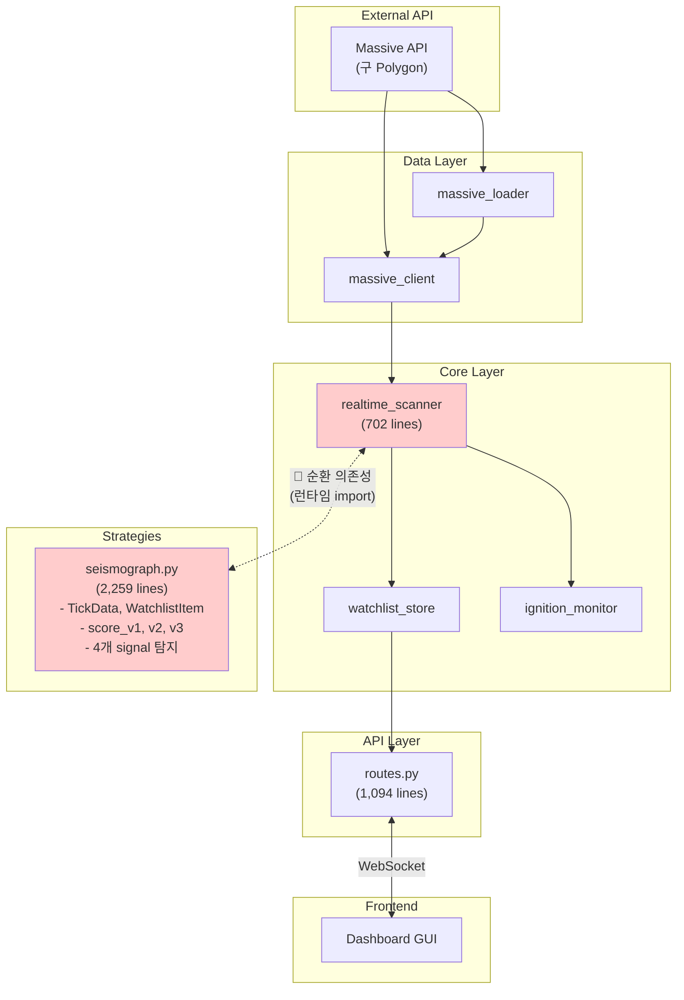
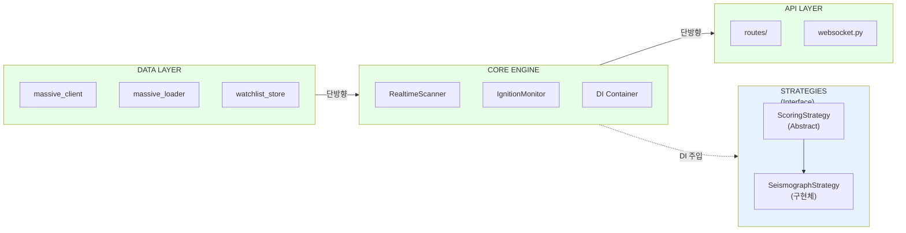

# Sigma9 리팩터링 가이드

> **버전**: v2.3 (2026-01-08)  
> **목적**: 리팩터링 품질 보장을 위한 자동화 체계  
> **최종 수정**: 2026-01-08 | 전체 섹션 개선, Mermaid 다이어그램, Architecture Tests 완성

**관련 문서**:
- [운영 정책](./OPERATIONAL_POLICIES.md) - 장애 모드, 감사, 보안
- [아키텍처](./ARCHITECTURE.md) - 시스템 구조, 데이터 플로우
- [전략 문서](./STRATEGY.md) - MEP, Seismograph 전략

---

## 목차

1. [코드베이스 현황](#1-코드베이스-현황)
2. [클린업 프로세스 (Phase 0)](#2-클린업-프로세스-phase-0) ← **리팩터링 전 필수**
3. [리팩터링 우선순위](#3-리팩터링-우선순위)
4. [자동화 도구](#4-자동화-도구)
5. [리팩터링 도구 사용 정책](#5-리팩터링-도구-사용-정책)
6. [Dependency Injection 패턴](#6-dependency-injection-패턴)
7. [CI/CD GitHub Actions](#7-cicd-github-actions)
8. [Architecture Tests](#8-architecture-tests)
9. [PR 체크리스트](#9-pr-체크리스트)
10. [커밋 컨벤션](#10-커밋-컨벤션)
11. [설치 명령어](#11-설치-명령어)

---

## 1. 코드베이스 현황

### 1.1 모듈 구조

| 모듈 | 파일 수 | 핵심 역할 |
|------|---------|----------|
| **backend/core/** | 22 | 전략 엔진, 스캐너, 리스크 관리 |
| **backend/api/** | 3 | FastAPI REST/WebSocket |
| **backend/data/** | 7 | DB, Polygon API, Watchlist |
| **backend/strategies/** | 4 | Seismograph 전략 |
| **frontend/gui/** | 10 | PyQt6 대시보드 |
| **frontend/services/** | 5 | BackendClient, 어댑터 |

### 1.2 주요 문제점

> **라인 수 기준**: 2026-01-07 측정

| 파일 | 라인 수 | 문제 |
|------|---------|------|
| `seismograph.py` | 2,259 | God Class (9+ 책임) |
| `dashboard.py` | 2,565 | Monolithic GUI |
| `routes.py` | 1,094 | 15개 엔드포인트 혼재 |
| `realtime_scanner.py` | 702 | Singleton + 순환 의존성 |

### 1.3 순환 의존성

> 상세 데이터 플로우 다이어그램은 [섹션 1.5](#15-데이터-플로우-시각화) 참조

```
realtime_scanner.py ←→ seismograph.py  (런타임 import로 회피 중)
```

**런타임 Import 위치**:
```python
# backend/core/realtime_scanner.py (Line 94)
from backend.strategies.seismograph import SeismographStrategy

# backend/core/realtime_scanner.py (Line 338)
from backend.data.watchlist_store import load_watchlist, save_watchlist
```

### 1.4 Singleton Anti-Pattern

| 모듈 | 패턴 | 문제점 | 상태 |
|------|------|--------|------|
| `realtime_scanner.py` | ~~`_scanner_instance`~~ | ~~테스트 어려움, 상태 오염~~ | ✅ 제거 (02-002) |
| `ignition_monitor.py` | ~~`get_ignition_monitor()`~~ | ~~의존성 주입 불가~~ | ✅ 제거 (02-003) |
| `watchlist_store.py` | ~~`_store_instance`~~ | ~~레거시 편의 함수~~ | ✅ 제거 (02-006) |
| `symbol_mapper.py` | ~~`_mapper_instance`~~ | ~~레거시 편의 함수~~ | ✅ 제거 (02-006) |
| `backend_client.py` | `BackendClient.instance()` | 멀티 인스턴스 테스트 불가 | 📋 대기 (Frontend) |

### 1.5 데이터 플로우 시각화

#### 현재 데이터 플로우 (문제점)



**문제점 요약**:
- 🔴 `realtime_scanner` ↔ `seismograph` 순환 의존성 (런타임 import로 회피 중)
- 🔴 God Class: `seismograph.py` 2,259줄, 9+ 책임
- 🔴 Monolithic: `routes.py` 1,094줄, 15개 엔드포인트 혼재

#### 목표 데이터 플로우 (개선)



**개선 목표**:
- ✅ **단방향 의존성**: Data → Core → API
- ✅ **순환 없음**: 인터페이스 추출로 DIP 적용
- ✅ **DI Container**: 전역 싱글톤 제거, 테스트 용이성 확보

---

## 2. 클린업 프로세스 (Phase 0)

> [!IMPORTANT]
> **대규모 리팩터링 전 필수 수행**. 클린업을 먼저 완료해야 리팩터링 범위가 명확해집니다.

### 2.1 클린업 대상 목록

#### 루트 디렉터리 정리

| 파일 | 유형 | 조치 |
|------|------|------|
| `test_epsm_data.py` | 임시 테스트 | `tests/` 이동 또는 삭제 |
| `test_epsm_nov.py` | 임시 테스트 | `tests/` 이동 또는 삭제 |
| `test_gui_imports.py` | 임시 테스트 | `tests/` 이동 또는 삭제 |
| `test_particles_standalone.py` | 임시 테스트 | `tests/` 이동 또는 삭제 |
| `test_score_v2.py` | 임시 테스트 | `tests/` 이동 또는 삭제 |
| `test_score_v3.py` | 임시 테스트 | `tests/` 이동 또는 삭제 |
| `test_store.py` | 임시 테스트 | `tests/` 이동 또는 삭제 |
| `analysis_result.txt` | 임시 출력 | 삭제 |
| `test_output.txt` | 임시 출력 | 삭제 |
| `test_result.txt` | 임시 출력 | 삭제 |
| `check_tickers.py` | 유틸리티 | `backend/scripts/` 이동 |
| `diagnose_chart.py` | 유틸리티 | `backend/scripts/` 이동 |

#### data/ 디렉터리 (Git 제외 권장)

| 파일 | 크기 | 조치 |
|------|------|------|
| `market_data.db` | ~1.4GB | `.gitignore`에 추가 (이미 추가 가정) |
| `watchlist/` | 351개 파일 | 필요시 아카이브, 오래된 파일 정리 |

### 2.2 클린업 실행 절차

```bash
# 1. 임시 출력 파일 삭제
rm analysis_result.txt test_output.txt test_result.txt

# 2. backend/scripts/ 디렉터리 생성 및 유틸리티 이동
mkdir -p backend/scripts
mv check_tickers.py diagnose_chart.py backend/scripts/

# 3. 테스트 파일 정리 (필요한 것만 이동, 나머지 삭제)
# 유지할 테스트 → tests/로 이동
mv test_score_v2.py test_score_v3.py tests/

# 검토 후 삭제 대상 (일회성 테스트)
rm test_epsm_data.py test_epsm_nov.py test_gui_imports.py
rm test_particles_standalone.py test_store.py

# 4. .gitignore 확인 및 업데이트
echo "data/market_data.db" >> .gitignore
echo "data/market_data.db-*" >> .gitignore
```

### 2.3 클린업 체크리스트

- [ ] 루트 디렉터리에 `.py` 파일 없음 (진입점 제외)
- [ ] 임시 `.txt` 출력 파일 없음
- [ ] 모든 테스트가 `tests/` 디렉터리 내에 위치
- [ ] 유틸리티 스크립트가 `backend/scripts/` 디렉터리 내에 위치
- [ ] 대용량 데이터 파일이 `.gitignore`에 포함

---

## 3. 리팩터링 우선순위

**총 예상 시간**: 24-34시간

| 순위 | 대상 | 예상 소요 | 위험도 | 상태 |
|------|------|----------|--------|------|
| 1 | 인터페이스 추출 (순환 해소) | 2-3h | 낮음 | ✅ 완료 |
| 2 | DI Container 도입 | 3-4h | 낮음 | ✅ 완료 |
| 3a | `seismograph.py` Phase 1 (패키지화) | 1-2h | 낮음 | ✅ 완료 |
| 3b | `seismograph.py` Phase 2 (로직 분리) | 4-5h | 중간 | ✅ 완료 |
| 3c | `seismograph.py` Phase 3 (완전 마이그레이션) | 1h | 낮음 | ✅ 완료 |
| 4 | `server.py` lifespan 분리 | 2-3h | 낮음 | ✅ 완료 |
| 5 | `dashboard.py` 분리 | 6-8h | 중간 | 🔄 Phase 4 완료 (2,324줄) |
| 6 | `routes.py` 분할 | 2-3h | 낮음 | ✅ 완료 |
| 7 | 데이터 모델 통합 | 1-2h | 낮음 | 📋 대기 |

> **상태 범례**: 📋 대기 | 🔄 진행 중 | ✅ 완료

#### 3b. seismograph Phase 2 세부 작업

| 작업 | 파일 | 이동 대상 |
|------|------|----------|
| Tight Range 분리 | `_calc_tight_range_intensity*()` | `signals/tight_range.py` |
| OBV Divergence 분리 | `_calc_obv_divergence_intensity*()` | `signals/obv_divergence.py` |
| Accumulation Bar 분리 | `_calc_accumulation_bar_intensity*()` | `signals/accumulation_bar.py` |
| Volume Dryout 분리 | `_calc_volume_dryout_intensity*()` | `signals/volume_dryout.py` |
| Score V1 분리 | `calculate_watchlist_score()` | `scoring/v1.py` |
| Score V2 분리 | `calculate_watchlist_score_v2()` | `scoring/v2.py` |
| Score V3 분리 | `calculate_watchlist_score_v3()` | `scoring/v3.py` |
| 백업 파일 삭제 | `seismograph_backup.py` | 삭제 |


### 2.1 seismograph.py 분리 제안

```
backend/strategies/seismograph/
├── __init__.py          # SeismographStrategy (진입점)
├── models.py            # TickData, WatchlistItem
├── scoring/             # 점수 계산 모듈
│   ├── __init__.py
│   ├── v1.py            # Stage-based scoring
│   ├── v2.py            # Weighted intensity
│   └── v3.py            # Pinpoint algorithm
└── signals/             # 시그널 탐지 모듈
    ├── __init__.py
    ├── tight_range.py
    ├── obv_divergence.py
    ├── accumulation_bar.py
    └── volume_dryout.py
```

### 2.2 dashboard.py 분리 제안

```
frontend/gui/
├── dashboard.py              # 메인 윈도우 (조합자)
├── panels/
│   ├── watchlist_panel.py    # 워치리스트 테이블
│   ├── tier2_panel.py        # Hot Zone
│   ├── chart_panel.py        # 차트 컨테이너
│   └── log_panel.py          # 로그 패널
└── state/
    └── dashboard_state.py    # 중앙 상태 관리
```

### 2.3 routes.py 분할 제안

```
backend/api/routes/
├── __init__.py           # 라우터 조합
├── status.py             # /status, /engine/*
├── watchlist.py          # /watchlist/*
├── scanner.py            # /scanner/*, /gainers/*
├── chart.py              # /chart/*
├── backtest.py           # /backtest/*
└── websocket.py          # WebSocket 핸들러
```

### 2.4 Model 중앙화 제안

현재 데이터클래스(`@dataclass`)가 **14개 이상의 파일**에 분산되어 있음:

| 현재 위치 | 포함된 모델 |
|----------|-------------|
| `backend/strategies/seismograph.py` | TickData, WatchlistItem |
| `backend/strategies/score_v3_config.py` | ScoreV3Config |
| `backend/core/risk_manager.py` | RiskConfig, Position |
| `backend/core/order_manager.py` | OrderRequest, OrderResult |
| `backend/core/backtest_engine.py` | BacktestConfig, BacktestResult |
| `backend/core/config_loader.py` | EngineConfig |
| 기타 10+ 파일 | 다양한 설정/상태 모델 |

**통합 구조**:
```
backend/models/
├── __init__.py
├── watchlist.py      # WatchlistItem, WatchlistState
├── tick.py           # TickData, TickBuffer
├── order.py          # OrderRequest, OrderResult
├── risk.py           # RiskConfig, Position
├── backtest.py       # BacktestConfig, BacktestResult
└── technical.py      # OHLCData, TechnicalSignals, ZScoreData
```

> [!IMPORTANT]
> **범위 제외 (확정)**:
> | 파일 | 이유 |
> |------|------|
> | `config_loader.py` (18개 모델) | 설정 로딩 로직과 밀접하게 결합, 순환 import 위험 |
> | `score_v3_config.py` (8개 모델) | Seismograph 전략 전용 설정, 분리 불필요 |


### 2.5 Core 모듈 그룹화 제안

현재 `backend/core/`에 22개 파일이 평면적으로 산재. 논리적 그룹으로 재구성:

```
backend/core/
├── scanning/         # scanner, ignition_monitor
├── tick/             # broadcaster, dispatcher
├── backtest/         # engine, report
├── trading/          # order_manager, risk_manager
├── analysis/         # technical_analysis, zscore
├── audit/            # decision_logger, failure_modes ✅ (구현됨)
└── interfaces/       # scoring.py (추상 클래스)
```

> [!NOTE]
> `audit/` 디렉터리는 이미 구현되어 있음. [운영 정책](./OPERATIONAL_POLICIES.md#52-audit-로깅-정책) 참조.

---

## 4. 자동화 도구

> [!WARNING]
> 아래 설정은 **권장 설정**입니다. 현재 프로젝트에 `pyproject.toml`, `.pre-commit-config.yaml` 파일이 없을 수 있습니다.
> 적용 시 [섹션 11. 설치 명령어](#11-설치-명령어)를 참고하세요.

### 3.1 Ruff (Lint + Format)

```toml
# pyproject.toml
[tool.ruff]
target-version = "py310"
line-length = 100
exclude = [".venv", "__pycache__", "docs/references", "*.ipynb"]

[tool.ruff.format]
quote-style = "double"
indent-style = "space"
docstring-code-format = true

[tool.ruff.lint]
select = ["E", "W", "F", "I", "B", "C4", "UP", "SIM", "TCH", "RUF", "PTH", "PL"]
ignore = ["E501", "PLR0913"]

[tool.ruff.lint.per-file-ignores]
"tests/**/*.py" = ["S101", "PLR2004"]
"**/__init__.py" = ["F401"]

[tool.ruff.lint.isort]
combine-as-imports = true
known-first-party = ["backend", "frontend"]
section-order = ["future", "standard-library", "third-party", "first-party", "local-folder"]
```

### 3.2 mypy (Type Check)

```toml
[tool.mypy]
python_version = "3.10"
warn_return_any = true
disallow_untyped_defs = true
disallow_incomplete_defs = true
check_untyped_defs = true
no_implicit_optional = true
show_error_codes = true

[[tool.mypy.overrides]]
module = ["backend.strategies.seismograph", "frontend.gui.dashboard"]
disallow_untyped_defs = false  # 리팩터링 전까지 임시 완화

[[tool.mypy.overrides]]
module = ["ib_insync.*", "qfluentwidgets.*", "pandas_ta.*"]
ignore_missing_imports = true
```

### 3.3 import-linter (경계 규칙)

```toml
[tool.importlinter]
root_package = "."

# 규칙 1: Backend ↔ Frontend 분리
[[tool.importlinter.contracts]]
name = "Backend-Frontend Separation"
type = "independence"
modules = ["backend", "frontend"]

# 규칙 2: 레이어 의존성 방향
[[tool.importlinter.contracts]]
name = "Backend Layer Order"
type = "layers"
layers = ["backend.api", "backend.core", "backend.strategies", "backend.data", "backend.broker"]

# 규칙 3: Data 모듈은 비즈니스 로직 import 금지
[[tool.importlinter.contracts]]
name = "Data Layer Independence"
type = "forbidden"
source_modules = ["backend.data"]
forbidden_modules = ["backend.strategies", "backend.core.realtime_scanner"]

# 규칙 4: Strategies는 Core 인터페이스만 의존
[[tool.importlinter.contracts]]
name = "Strategy Dependency Control"
type = "forbidden"
source_modules = ["backend.strategies"]
forbidden_modules = ["backend.api", "backend.core.realtime_scanner"]
```

### 3.4 pydeps (의존성 시각화)

```bash
# 순환 의존성 검출
pydeps backend --only backend --show-cycles --no-output

# 모듈별 의존성 그래프 생성
pydeps backend.strategies.seismograph -o docs/diagrams/seismograph_deps.svg
```

### 3.5 Pre-commit Hooks

> [!TIP]
> 버전은 설정 시점의 최신 안정 버전을 사용하세요. `pre-commit autoupdate` 명령으로 자동 업데이트 가능합니다.

```yaml
# .pre-commit-config.yaml
repos:
  - repo: https://github.com/astral-sh/ruff-pre-commit
    rev: v0.8.0  # 최신 버전 확인: https://github.com/astral-sh/ruff/releases
    hooks:
      - id: ruff
        args: [--fix]
      - id: ruff-format

  - repo: https://github.com/pre-commit/mirrors-mypy
    rev: v1.13.0  # 최신 버전 확인
    hooks:
      - id: mypy
        additional_dependencies: [types-PyYAML, pydantic]

  - repo: https://github.com/pre-commit/pre-commit-hooks
    rev: v5.0.0  # 최신 버전 확인
    hooks:
      - id: trailing-whitespace
      - id: end-of-file-fixer
      - id: check-yaml
      - id: check-added-large-files
        args: ['--maxkb=500']
```

---

## 5. 리팩터링 도구 사용 정책

> [!IMPORTANT]
> 아래 도구는 **모든 리팩터링 PR에서 필수**로 실행해야 합니다.

| 도구 | 버전 | 실행 시점 | 강제 조건 |
|------|------|-----------|-----------|
| **import-linter** | 설치됨 | PR 전, 매 커밋 | `lint-imports` 실패 시 PR 머지 불가 |
| **pydeps** | 3.x | 신규 모듈 추가 시 | 순환 의존성 검출 시 리팩터링 필수 |
| **dependency-injector** | 4.x | 신규 서비스 생성 시 | 전역 싱글톤 사용 금지 |

### 사용 규칙

#### import-linter (경계 검증)
- **필수**: `lint-imports` 명령어를 모든 PR 전에 실행
- **실패 허용 안 됨**: 계층 위반 또는 순환 import 감지 시 즉시 수정
- **예외 신청**: `# import-linter: ignore` 주석과 함께 PR 설명에 명시

#### pydeps (의존성 분석)
- **신규 모듈 추가 시**: `pydeps --show-cycles` 실행 후 결과를 PR에 첨부
- **순환 감지 시**: 해당 PR에서 순환 해소 필수

#### dependency-injector (DI 컨테이너)
- **신규 서비스**: 반드시 `Container`에 등록 후 주입받아 사용
- **금지 패턴**: `get_*_instance()`, 전역 `_instance` 변수

---

## 6. Dependency Injection 패턴

### 5.0 인터페이스 추출 (순환 해소 선행 작업)

DI 도입 전, 순환 의존성 해소를 위해 **인터페이스 추출**이 선행되어야 함:

```python
# backend/core/interfaces/scoring.py
from abc import ABC, abstractmethod
from typing import Any

class ScoringStrategy(ABC):
    """Score 계산 인터페이스 - 순환 의존성 해소를 위한 DIP"""
    
    @abstractmethod
    def calculate_score(self, tick_data: Any, watchlist_item: Any) -> float:
        pass
```

**적용 방식**:
- `SeismographStrategy`가 위 인터페이스 구현
- `realtime_scanner`는 인터페이스에만 의존 (구현체 직접 import 안 함)
- DI Container가 런타임에 구현체 주입

### 5.1 현재 (Anti-pattern)

```python
# 전역 싱글톤
scanner = get_realtime_scanner()
```

### 5.2 개선 (DI Container)

```python
from dependency_injector import containers, providers

class Container(containers.DeclarativeContainer):
    db_client = providers.Singleton(DatabaseClient, url=config.db.url)
    
    scanner = providers.Singleton(
        RealtimeScanner,
        db=db_client,  # ← Dependency Injection
    )
```

**장점**: 테스트 시 Mock 교체 용이, 전역 상태 오염 방지, 객체 수명 명확화

---

## 7. CI/CD GitHub Actions

### 6.1 Lint & Format Check

```yaml
# .github/workflows/lint.yml
name: Lint & Format
on:
  push:
    branches: [main, develop]
  pull_request:
    branches: [main, develop]

jobs:
  lint:
    runs-on: ubuntu-latest
    steps:
      - uses: actions/checkout@v4
      - uses: actions/setup-python@v5
        with:
          python-version: "3.10"
          cache: 'pip'  # pip 캐싱으로 CI 속도 개선
      - name: Install dependencies
        run: |
          pip install --upgrade pip
          pip install ruff mypy import-linter
          pip install -e .  # 프로젝트 의존성 설치 (있는 경우)
      - run: ruff format --check .
      - run: ruff check .
      - run: mypy backend frontend --ignore-missing-imports
      - run: lint-imports
```

### 6.2 Architecture Tests

```yaml
# .github/workflows/architecture.yml
name: Architecture Tests
on:
  pull_request:
    branches: [main, develop]

jobs:
  arch-test:
    runs-on: ubuntu-latest
    steps:
      - uses: actions/checkout@v4
      - uses: actions/setup-python@v5
        with:
          python-version: "3.10"
      - run: pip install pytest
      - run: pytest tests/architecture/ -v
```

---

## 8. Architecture Tests

> [!NOTE]
> 아래 테스트는 `tests/architecture/` 디렉터리에 배치합니다. 현재 미구현 상태입니다.

### 7.1 파일 크기 제한 테스트

```python
# tests/architecture/test_file_size.py
import pytest
from pathlib import Path

MAX_LINES = 500
PROJECT_ROOT = Path(__file__).parent.parent.parent
EXCEPTIONS = {
    "backend/strategies/seismograph.py",
    "frontend/gui/dashboard.py",
}

def get_python_files():
    """프로젝트 내 모든 Python 파일 경로 반환"""
    for pattern in ["backend/**/*.py", "frontend/**/*.py"]:
        yield from PROJECT_ROOT.glob(pattern)

@pytest.mark.parametrize("filepath", list(get_python_files()))
def test_file_size_limit(filepath: Path):
    relative = str(filepath.relative_to(PROJECT_ROOT))
    if relative in EXCEPTIONS:
        pytest.skip(f"Exception: {relative}")
    
    lines = filepath.read_text(encoding="utf-8").splitlines()
    assert len(lines) <= MAX_LINES, f"{relative}: {len(lines)} lines (max: {MAX_LINES})"
```

### 7.2 God Class 방지 테스트

```python
# tests/architecture/test_class_size.py
import ast
import pytest
from pathlib import Path

MAX_METHODS = 30
MAX_CLASS_LINES = 400
PROJECT_ROOT = Path(__file__).parent.parent.parent
EXCEPTIONS = {"SeismographStrategy", "Sigma9Dashboard"}

def get_classes_from_file(filepath: Path):
    """파일에서 클래스 정의 추출"""
    try:
        tree = ast.parse(filepath.read_text(encoding="utf-8"))
        for node in ast.walk(tree):
            if isinstance(node, ast.ClassDef):
                yield node
    except SyntaxError:
        pass

def collect_classes():
    """모든 클래스 수집"""
    for pattern in ["backend/**/*.py", "frontend/**/*.py"]:
        for filepath in PROJECT_ROOT.glob(pattern):
            for cls in get_classes_from_file(filepath):
                yield filepath, cls

@pytest.mark.parametrize("filepath,cls", list(collect_classes()))
def test_class_size_limit(filepath: Path, cls: ast.ClassDef):
    if cls.name in EXCEPTIONS:
        pytest.skip(f"Exception: {cls.name}")
    
    methods = [n for n in cls.body if isinstance(n, (ast.FunctionDef, ast.AsyncFunctionDef))]
    class_lines = cls.end_lineno - cls.lineno + 1 if cls.end_lineno else 0
    
    assert len(methods) <= MAX_METHODS, f"{cls.name}: {len(methods)} methods (max: {MAX_METHODS})"
    assert class_lines <= MAX_CLASS_LINES, f"{cls.name}: {class_lines} lines (max: {MAX_CLASS_LINES})"
```

---

## 9. PR 체크리스트

### 기본 체크 (필수)
- [ ] `ruff format --check .` 통과
- [ ] `ruff check .` 통과
- [ ] `mypy backend frontend` 통과

### 리팩터링 체크
- [ ] `lint-imports` 통과 (순환 의존성 없음)
- [ ] Backend ↔ Frontend 분리 유지
- [ ] 신규 파일 ≤ 500 라인
- [ ] 신규 클래스 ≤ 30 메서드
- [ ] Singleton 대신 DI 사용

### 테스트 체크
- [ ] 관련 테스트 추가/수정
- [ ] `pytest tests/` 통과
- [ ] 커버리지 감소 없음

### 문서 체크
- [ ] 공개 API 변경 시 docstring 업데이트
- [ ] 주요 변경 사항 CHANGELOG 기록 (있는 경우)

---

## 10. 커밋 컨벤션

```
<type>(<scope>): <description>

[optional body]

[optional footer(s)]
```

**예시**:
```
refactor(seismograph): extract score_v3 module

BREAKING CHANGE: calculate_score() signature changed
```

### Type 목록

| Type | 설명 |
|------|------|
| `feat` | 새 기능 |
| `fix` | 버그 수정 |
| `refactor` | 리팩터링 (기능 변경 없음) |
| `perf` | 성능 개선 |
| `test` | 테스트 추가/수정 |
| `docs` | 문서 수정 |
| `style` | 코드 스타일 (포맷팅, 세미콜론 등) |
| `ci` | CI/CD 설정 변경 |
| `build` | 빌드 시스템, 외부 의존성 변경 |
| `chore` | 기타 (빌드 스크립트 등) |

### Scope 목록

| Scope | 대상 |
|-------|------|
| `api` | backend/api/ |
| `core` | backend/core/ |
| `data` | backend/data/ |
| `models` | backend/models/ (예정) |
| `broker` | backend/broker/ |
| `scanner` | realtime_scanner, ignition_monitor |
| `seismograph` | Seismograph 전략 |
| `dashboard` | frontend/gui/dashboard.py |
| `gui` | frontend/gui/ 전체 |

> [!TIP]
> **Breaking Change**: API 시그니처 변경, 데이터 포맷 변경 등은 footer에 `BREAKING CHANGE:` 명시

---

## 11. 설치 명령어

> **요구사항**: Python 3.10+

### 10.1 개발 도구 설치

```bash
# 가상환경 생성 (권장)
python -m venv .venv
source .venv/bin/activate  # Windows: .venv\Scripts\activate

# 개발 도구 설치
pip install --upgrade pip
pip install ruff mypy import-linter pre-commit pydeps dependency-injector pytest
```

### 10.2 Pre-commit 설정

```bash
# Pre-commit 초기화
pre-commit install

# (선택) .pre-commit-config.yaml 파일이 없는 경우
# 섹션 3.5의 예시를 참고하여 생성
```

### 10.3 검증 명령어

```bash
# 전체 Lint 검사
pre-commit run --all-files

# Import 경계 검증
lint-imports

# Architecture 테스트
pytest tests/architecture/ -v

# 순환 의존성 검출
pydeps backend --only backend --show-cycles --no-output
```

---

**관련 문서**:
- 의존성 다이어그램: `docs/diagrams/backend_architecture.svg`
- [운영 정책](./OPERATIONAL_POLICIES.md) - 장애 모드, 감사, 보안
- [아키텍처](./ARCHITECTURE.md) - 시스템 구조, 데이터 플로우

