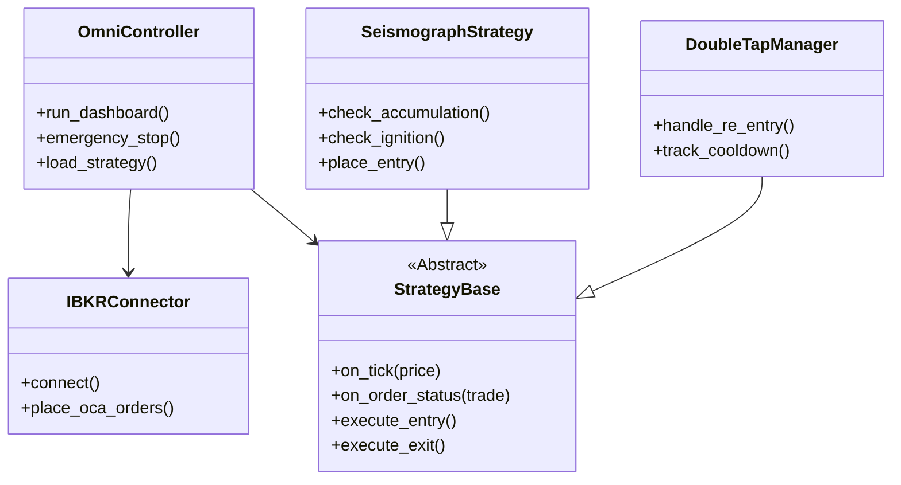
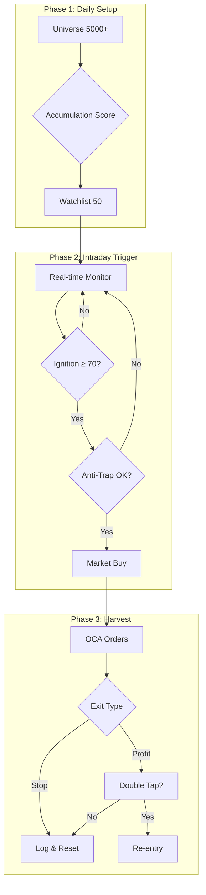

# 📘 Σ-IX (Sigma-Nine) Master Plan v2.0

> **Official Name**: Sigma9 
> **Version**: v2.1 (Post-Refactoring)  
> **Philosophy**: "Detect the Accumulation, Strike the Ignition, Harvest the Surge."  
> **Core Edge**: Volume-Price Divergence + Information Asymmetry

---

## 1. Executive Summary

Σ-IX는 미국 마이크로캡 주식에서 **세력의 매집(Accumulation)**을 사전 탐지하고, **폭발 순간(Ignition)**을 포착하여 진입한 후, **동적 청산(Parabolic Harvest)**과 **재진입(Double Tap)**으로 수익을 극대화하는 자동 트레이딩 시스템이다.

### Strategy Cycle
```
[Strategy Scanning] → [Watchlist 50] → [Intraday Trigger] → [Entry] → [Harvest] → [Double Tap]
```

---

## 2. Tech Stack

> 📌 **핵심 원칙**: 개발 초기부터 **Backend/Frontend 분리** 구조로 설계하여 AWS 마이그레이션 용이성 확보

### 2.1 Backend (AWS EC2)

| Component | Library | Purpose |
|-----------|---------|---------|
| **API Server** | `FastAPI` + `uvicorn` | REST API + WebSocket 서버 |
| **Broker API** | `ib_insync` | IBKR 연동, 서버사이드 OCA 주문 |
| **Database** | `SQLAlchemy` (SQLite) | Historical Data Persistence |
| **Data Analysis** | `pandas` + `pandas_ta` | OBV, ATR, VWAP 계산 |
| **Market Data** | Massive.com REST + WebSocket | Universe + 실시간 데이터 |
| **LLM** | `openai(chatGPT)` / `anthropic(claude)` / `google(Gemini)` | 해설 및 분석 리포트 (Multi-Model Support) |
| **Logging** | `loguru` | 컬러 로깅 |
| **Task Queue** | `asyncio` | 비동기 작업 처리 |

### 2.2 Frontend (Local Windows)

| Component | Library | Purpose |
|-----------|---------|---------|
| **GUI Framework** | `PyQt6` | 데스크탑 관제탑 |
| **Charting** | `pyqtgraph` | 고성능 네이티브 차트 (캔들스틱, 인디케이터) |
| **API Client** | `httpx` + `websockets` | Backend 통신 (`frontend/services/`) |
| **Async** | `qasync` | PyQt + asyncio 통합 |

### 2.3 통신 레이어

```
┌─────────────────────────────────────────────────────────────┐
│  Backend (AWS)                    Frontend (Local)          │
│  ┌─────────────┐                  ┌─────────────────────┐   │
│  │ FastAPI     │◀──── REST ──────▶│ httpx Client        │   │
│  │ :8000       │                  │                     │   │
│  │             │◀── WebSocket ───▶│ websockets Client   │   │
│  └─────────────┘                  └─────────────────────┘   │
└─────────────────────────────────────────────────────────────┘

API Endpoints:
  GET  /api/watchlist          - Watchlist 조회
  GET  /api/positions          - 현재 포지션
  POST /api/kill-switch        - 긴급 정지
  POST /api/order              - 수동 주문
  WS   /ws/market              - 실시간 시장 데이터
  WS   /ws/trade               - 거래 이벤트 스트림
```

---

## 3. Phase 1: The Setup (Strategy Scanning)

### 3.1 Universe Data Source (Hybrid)

| Source | Role | Method |
|--------|------|--------|
| **Massive.com** | **Universe Scan + History + Real-time** | `Grouped Daily` (전체 시장 일봉) → Local DB, **WebSocket** (실시간) |
| **IBKR** | **주문 실행 전용** | `place_order`, `get_positions` 등 |

**Massive WebSocket 채널**:
| 채널 | 데이터 | 용도 |
|------|--------|------|
| `AM.*` | 1분봉 (Aggregate Minute) | 차트 실시간 갱신 |
| `T.*` | 틱 (Trades) | Trailing Stop, 가격 모니터링 |

### 3.1.1 실시간 데이터 파이프라인 (Step 4.A.0)

> 📋 **상세 계획**: [step_4.a_plan.md](./steps/step_4.a_plan.md)  
> 📝 **구현 리포트**: [step_4.a.0_report.md](../devlog/step_4.a.0_report.md)

Tiered Watchlist 및 실시간 차트를 위한 **데이터 흐름**:

```
┌─────────────────────────────────────────────────────────────────────┐
│                    REAL-TIME DATA PIPELINE                          │
├─────────────────────────────────────────────────────────────────────┤
│                                                                     │
│  Massive WebSocket (wss://socket.massive.com/stocks)                │
│        │                                                           │
│        │ AM.* (1분봉), T.* (틱)                                      │
│        ▼                                                           │
│  [MassiveWebSocketClient] ──▶ [SubscriptionManager]                │
│        │                              │                            │
│        │ on_bar / on_tick            │ 구독 동기화                   │
│        ▼                              ▼                            │
│  [TickBroadcaster] ───────▶ [TickDispatcher] ◀── Step 4.A.0.b      │
│        │                        │                                  │
│        │ GUI 브로드캐스트        ├──▶ [Strategy.on_tick]            │
│        │                        ├──▶ [TrailingStopManager]         │
│        │                        └──▶ [IgnitionMonitor]             │
│        ▼                                                           │
│  [ConnectionManager] ───▶ GUI WebSocket                             │
│        │                                                           │
│        ▼                                                           │
│  [WsAdapter] bar_received / tick_received                          │
│        │                                                           │
│        └─────────────▶ [Dashboard]                                   │
│                            │                                       │
│                            ▼                                       │
│                     [PyQtGraphChart]                                │
│                     update_realtime_bar()                          │
│                                                                     │
└─────────────────────────────────────────────────────────────────────┘
```

| Component | 데이터 유형 | 갱신 주기 |
|-----------|-------------|-----------|
| **Tier 2 Hot Zone** | Massive T 채널 (틱) | 1초 |
| **Tier 1 Watchlist** | Massive AM 채널 (1분봉) | 1분 |
| **Chart** | Massive AM → OHLC | 실시간 |
| **Z-Score (zenV/zenP)** | 20일 통계 기반 | Tick 마다 재계산 |


### 3.2 Universe Filter Logic (Local DB)

| Filter | Value | Rationale |
|--------|-------|-----------|
| **Price** | $2.00 ~ $10.00 | 폭발력 최대 구간 |
| **Market Cap** | $50M ~ $300M | 마이크로캡 (세력 개입 용이) |
| **Float** | < 15M shares | Low Float = 급등 용이 |
| **Avg Volume** | > 100K/day | 최소 유동성 확보 |
| **Change%** | 0% ~ 5% | 아직 터지지 않은 종목만 |

### 3.3 Accumulation Stage Detection (매집 단계 탐지)

> 📌 **Design Decision**: [Research Reference](../references/research/scoring_vs_filtering_debate.md)
> 기존 Weighted Sum 대신 **Stage-Based Priority System** 채택.
> 단타 머신의 특성상 "폭발 임박" 종목을 최우선 선별.

#### 3.3.1 매집 4단계 (Accumulation Stages)

| Stage | 신호 | 조건 | 의미 | 역할 |
|-------|------|------|------|------|
| 1 | **Volume Dry-out** | 최근 3일 거래량 < 20일 평균의 40% | 매집 준비 | Monitoring |
| 2 | **OBV Divergence** | 주가 기울기 ≤ 0 & OBV 기울기 > 0 | 매집 진행 | Monitoring |
| 3 | **Accumulation Bar** | 가격 ±2.5% & 거래량 > 3× 평균 | 매집 완료 | Alert |
| 4 | **Tight Range (VCP)** | 5일 ATR < 20일 ATR의 50% | 🔥 폭발 임박 | **Priority Selection** |

#### 3.3.2 우선순위 로직 (Priority Logic)

```
Watchlist Selection (Priority Order):
├── 1순위 (100점): Tight Range + OBV Divergence  → 즉시 진입 대기
├── 2순위 (80점):  Tight Range only              → 높은 관심
├── 3순위 (70점):  Accumulation Bar + OBV        → 관심 대상
├── 4순위 (50점):  Accumulation Bar only         → 추적 중
├── 5순위 (30점):  OBV Divergence only           → 모니터링
└── 6순위 (10점):  Volume Dry-out only           → 관찰 대상
```

#### 3.3.3 핵심 원칙

- **폭발 임박 신호(Tight Range)가 뜬 종목을 최우선으로 선별**
- Stage 1~2 종목은 Watchlist에 올리되, 실거래 대상은 아님
- 자본 효율 최대화: "오늘 터질 종목"에 집중

---

## 4. Phase 2: The Trigger (Intraday)

### 4.1 Ignition Conditions

| 조건 | 로직 | Weight |
|------|------|--------|
| **Tick Velocity** | 10초 체결 > 1분 평균의 8× | 35% |
| **Volume Burst** | 1분 거래량 > 5분 평균의 6× | 30% |
| **Price Break** | 현재가 > 박스권 상단 + 0.5% | 20% |
| **Buy Pressure** | 시장가 매수/매도 > 1.8 | 15% |

### 4.2 Anti-Trap Filter

| 조건 | 설명 |
|------|------|
| Spread < 1.0% | 스프레드 너무 넓으면 SKIP |
| 장 시작 후 15분 이후 | 오프닝 노이즈 회피 |
| VWAP 위에 위치 | 당일 평균 이상에서만 진입 |

**→ Ignition Score ≥ 70점 시: Market Buy**

---

## 5. Phase 3: The Harvest (Exit)

### 5.1 Server-Side OCA Group

진입 즉시 3개 주문을 OCA로 묶어 전송:

| Order | Type | Condition |
|-------|------|-----------|
| **Safety Stop** | Stop Loss @ -2.0% | 매집 실패 시 즉시 손절 |
| **Time Stop** | GTD 3분 후 시장가 | 미발화 시 탈출 |
| **Profit Harvester** | TRAIL (ATR×1.5) | +3% 도달 시 활성화 |

### 5.2 Double Tap (재진입)

1. **Cooldown**: 1차 청산 후 3분 대기
2. **Filter**: 주가 > VWAP
3. **Trigger**: HOD 돌파 시 `Stop-Limit @ HOD + $0.01`
4. **Size**: 1차의 50%
5. **Exit**: Trailing Stop 1.0%

---

## 6. Architecture

### 6.1 Class Diagram

> ⚠️ **v2.0 구현 범위**: `OmniController` 및 `TradingEngine`은 **Phase 5**에서 구현 예정.  
> 현재는 Strategy Signal → `OrderManager` 직접 연결 구조로 운영 중.



### 6.2 Execution Flow



### 6.3 Deployment Architecture

> 💡 **핵심 원칙**: 트레이딩 엔진은 **AWS EC2 (us-east-1)**에서 구동하여 **레이턴시 최소화**, GUI는 **양방향(Bidirectional)** 통신으로 모니터링 + 제어 가능.

| 역할 | 비중 | 설명 |
|------|------|------|
| **📊 모니터링** | 80% | Watchlist, 차트, P&L, 로그 수신 |
| **🎮 제어** | 20% | Kill Switch, Manual Order, Config 변경, 전략 ON/OFF |

```
┌─────────────────────────────────────────────────────────────────────────┐
│                    🇺🇸 AWS EC2 (us-east-1, N. Virginia)                 │
│  ┌───────────────────────────────────────────────────────────────────┐  │
│  │                     Trading Engine Server                         │  │
│  │  ┌─────────────┐  ┌─────────────┐  ┌─────────────────────────┐   │  │
│  │  │ Strategy    │  │ Risk Mgr    │  │ IBKR Gateway            │   │  │
│  │  │ Engine      │  │             │  │ (TWS/IB Gateway)        │   │  │
│  │  │ (Scan+Trade)│  │             │  │                         │   │  │
│  │  └─────────────┘  └─────────────┘  └─────────────────────────┘   │  │
│  │  ┌─────────────┐                   ┌─────────────────────────┐   │  │
│  │  │ LLM Oracle  │                   │ WebSocket/REST API      │   │  │
│  │  └─────────────┘                   └─────────────────────────┘   │  │
│  └───────────────────────────────────────────────────────────────────┘  │
└─────────────────────────────────────────────────────────────────────────┘
                                    ▲
                                    │ ⬆️ Data Push (WebSocket)
                                    │ ⬇️ Commands (REST API)
                                    ▼
┌─────────────────────────────────────────────────────────────────────────┐
│                        🇰🇷 Local Client (User's PC)                     │
│  ┌───────────────────────────────────────────────────────────────────┐  │
│  │                     PyQt6 GUI Dashboard                           │  │
│  │  📊 [RECEIVE] Watchlist, 차트, P&L, 로그, LLM 해설                 │  │
│  │  🎮 [SEND] Kill Switch, Manual Order, Config, Strategy Toggle     │  │
│  └───────────────────────────────────────────────────────────────────┘  │
└─────────────────────────────────────────────────────────────────────────┘
```

#### ✅ 확정 인프라: AWS EC2

| 항목 | 스펙 | 비용 |
|------|------|------|
| **Region** | us-east-1 (N. Virginia) | - |
| **Instance** | t3.medium (2 vCPU, 4GB RAM) | ~$30/월 (On-Demand) |
| **IP** | Elastic IP (고정) | ~$3.65/월 |
| **Storage** | EBS gp3 30GB | ~$2.40/월 |
| **Backup** | EBS Snapshot (주간 자동) | ~$1/월 |
| **Monitoring** | CloudWatch + SNS 알림 | 무료 티어 |
| **Total** | - | **~$37/월** |

#### AWS 선택 근거

| 기준 | AWS 장점 |
|------|----------|
| **안정성** | 99.99% SLA, NYSE/NASDAQ 파트너십 |
| **IBKR 호환** | Xvfb + IBC 검증 완료, 문서 풍부 |
| **레이턴시** | Mahwah (NYSE), Carteret (NASDAQ)과 근접 |
| **백업** | EBS Snapshot, S3 자동 백업 |
| **모니터링** | CloudWatch + SNS (이메일/SMS 알림) |
| **확장성** | 필요시 t3.large 업그레이드 용이 |

#### 통신 프로토콜

| Channel | Protocol | Purpose |
|---------|----------|---------|
| **Market Data Push** | WebSocket | Watchlist, Price, Ignition 이벤트 |
| **Trade Events** | WebSocket | Fill, P&L, Position 업데이트 |
| **Commands** | REST API | Kill Switch, Manual Order, Config |
| **LLM Response** | REST API | 해설 리포트 요청/응답 |

#### 보안 고려사항

- 🔐 **API Key 인증**: JWT 또는 API Key 기반 인증
- 🔒 **TLS/SSL**: 모든 통신 암호화 (ACM 인증서)
- 🛡️ **Security Group**: GUI 클라이언트 IP만 허용
- 📝 **CloudTrail**: 모든 API 호출 감사 로그

---

## 7. GUI Dashboard

### 7.1 Layout

| Panel | Content |
|-------|---------|
| **Top** | 🔴 KILL SWITCH, IBKR 연결 상태, Strategy ON/OFF |
| **Left** | Watchlist 50 (매집점수, 클릭 시 차트 전환) |
| **Center** | Lightweight Charts (VWAP, Stop 라인, 매매 마커) |
| **Right** | **Tabbed Panel**: [Trading] (Positions, P&L) / [Oracle] (LLM Chat & Reports) |
| **Bottom** | 실시간 로그 콘솔 |

### 7.2 Chart Features (PyQtGraph 기반)

- **고성능 pyqtgraph 네이티브 렌더링** (JavaScript 브릿지 없음)
- 실시간 1분/5분/15분/1시간/4시간/1일 봉 (Massive.com + IBKR)
- VWAP 오버레이
- ATR Stop-Loss / Trailing Stop 라인 (동적)
- Buy/Sell 마커
- **증분 렌더링**: 틱 도착 시 마지막 캔들만 업데이트
- **주말 갭 제거**: 인덱스 기반 X축 (거래일만 표시)

### 7.3 Theme & Aesthetics

> 🎨 **Design Goal**: Modern, Glassmorphism, Premium Feel

**Centralized Theme Policy**:
모든 GUI 컴포넌트는 개별 스타일링을 지양하고 **중앙화된 테마 매니저**를 통해 스타일을 상속받아야 한다. 이를 통해 일관된 디자인 언어를 유지하고 유지보수성을 극대화한다.

**Visual Style (Glassmorphism)**:
- **Acrylic Effect**: Windows 11 스타일의 반투명 블러 효과(Acrylic)를 메인 윈도우 및 패널 배경에 적용
- **Translucency**: 배경이 은은하게 비치는 반투명 패널 사용
- **Modern Controls**: 기본 위젯 대신 현대적인 커스텀 위젯 사용

**Key Libraries**:
- **PyQt-Fluent-Widgets (`qfluentwidgets`)**: Windows 11 Fluent Design 스타일의 고품질 위젯 라이브러리 사용
- **Acrylic Integration**: Native API 또는 브릿지 라이브러리를 통해 리얼타임 블러 효과 구현

### 7.4 Tiered Watchlist System (Step 4.A)

> 📋 **상세 계획**: [step_4.a_plan.md](./steps/step_4.a_plan.md)

기존 단일 Watchlist를 **2-Tier 시스템**으로 확장:

```
┌─────────────────────────────────────────────────────────┐
│                    WATCHLIST PANEL                       │
├─────────────────────────────────────────────────────────┤
│  ⚡ TIER 2 - HOT ZONE (Tick-level, 1초 갱신)             │
│  ┌─────────────────────────────────────────────────────┐│
│  │ AAPL  $178.25  1.2M  🔥85  +3.2%  Z:V+2.1 Z:P+0.3 ││
│  │ NVDA  $495.30  2.8M  🔥92  +5.1%  Z:V+3.2 Z:P+1.1 ││
│  └─────────────────────────────────────────────────────┘│
├─────────────────────────────────────────────────────────┤
│  📋 TIER 1 - WATCHLIST (1분/5분 갱신)                    │
│  ┌─────────────────────────────────────────────────────┐│
│  │ MSFT   +1.2%  [100]  🔥45   560K                   ││
│  │ TSLA   -0.3%  [80]   🔥32   1.2M                   ││
│  └─────────────────────────────────────────────────────┘│
└─────────────────────────────────────────────────────────┘
```

| 항목 | Tier 1 (Watchlist) | Tier 2 (Hot Zone) |
|------|--------------------|-------------------|
| **갱신 주기** | 1분 / 5분 | 1초 (Tick) |
### 7.3 Watchlist Pipeline (Architecture V2)

> **Philosophy**: "Scout & Strike" (선-진입, 후-불타기)
> **Goal**: 폭발(Ignition) 전에 미리 들어가고(Scout), 폭발 시 비중을 태운다(Strike).

**1. The Sourcer (종목 발굴)**:
- **Source A (Pre-Market)**: `Daily Z-Score Divergence` (zenV > 2.0, zenP < 0.5)
  - "누군가 조용히 매집 중인 종목" → **Watchlist 등록**
- **Source B (Real-Time)**: `Top Gainers` & `Volume Spikes`
  - "지금 당장 움직이는 종목" → **Watchlist 등록**

**2. The Ranker (우선순위)**:
- Watchlist 내 50개 종목을 **Ignition Score** 기준으로 실시간 정렬.
- **Top 5**는 자동으로 **Tier 2 (Hot Zone)** 승격.

**3. The Trigger (진입)**:
- **Trigger 1: Scout Entry (정찰)**
  - 조건: `Diff(zenV, zenP) > 1.5` (Divergence 심화)
  - 비중: 시드의 30%
  - 의미: "폭발 임박 징후 포착, 길목 지키기"
- **Trigger 2: Strike Entry (확인)**
  - 조건: `Ignition Score > 70` (폭발 시작)
  - 비중: 시드의 70% (Pyramiding)
  - 의미: "폭발 확인, 물량 투입"

---

### 7.4 Tier 2 Hot Zone (GUI)

- **구성**: 상단 5개 슬롯 (고정)
- **표시 데이터**:
  | Column | Data | Visual |
  |--------|------|--------|
  | **Tick** | 종목코드 | 클릭 시 차트 연동 |
  | **Ign** | Ignition Score | >70 Red, >50 Orange |
  | **zenV** | Volume Z-Score | >2.0 Green (매집) |
  | **Prc** | 현재가 | 실시간 등락 색상 |
  | **Chg** | 등락률 | 퍼센트 |

---

## 8. LLM Intelligence Layer

### 8.1 Current Role: Analyst & Narrator

LLM은 현재 세대(v2.0)에서 **읽기 전용 해설자** 역할을 담당:

| Function | Description | Data Source |
|----------|-------------|-------------|
| **Selection Rationale** | 이 종목이 왜 Watchlist에 선정되었는지 설명 | Accumulation Score 상세 분해 |
| **Technical Analysis** | 지표(OBV, ATR, VWAP 등)에 대한 기술적 해설 | pandas_ta 계산 결과 |
| **Market Context** | 왜 급등 중인지 (Why Is It Moving?: WIIM, Benzinga)., 외부 뉴스 API, SEC 공시 등, 종목 전용 Calendar|
| **Trade Journal** | 진입/청산 결정에 대한 사후 분석 리포트 | 거래 로그 + 차트 스냅샷 |

### 8.2 External Data Integration

```
┌─────────────────────────────────────────────────────┐
│                   LLM Context Builder               │
├─────────────────────────────────────────────────────┤
│  [Internal]           │  [External API]             │
│  - Accumulation Score │  - News API (Benzinga, etc) │
│  - Ignition Score     │  - SEC EDGAR Filings        │
│  - Technical Metrics  │  - Social Sentiment         │
│  - Trade History      │  - Sector Catalyst Calendar │
└─────────────────────────────────────────────────────┘
```

### 8.3 Future Evolution Roadmap

> ⚠️ **설계 원칙**: 현재는 읽기 전용이지만, 차후 LLM의 권한이 대폭 상승할 예정이므로 **플러그인 아키텍처**로 구현.

| Generation | LLM Capability | Authority Level |
|------------|----------------|-----------------|
| **v2.0 (Current)** | 해설 & 분석 리포트 | 🟢 Read-Only |
| **v3.0** | 전략 파라미터 제안 (인간 승인 필요) | 🟡 Suggest |
| **v4.0** | 실시간 파라미터 미세 조정 | 🟠 Adjust (Bounded) |
| **v5.0** | 백테스팅 자동화 + 전략 A/B 테스트 | 🔴 Execute (Supervised) |

### 8.4 Extensible Architecture (Multi-Model Strategy)

**LLMOracle 클래스 구조**:

`LLMOracle`은 **Provider Agnostic**한 설계를 따르며, OpenAI, Anthropic, Google (Gemini) 등 다양한 모델을 런타임에 교체하여 사용할 수 있다.

**Provider Strategy Pattern**:
- `LLMProvider` (Interface): `generate_text()`, `list_models()`
- `OpenAIProvider`: GPT-4o, GPT-3.5-turbo 등
- `AnthropicProvider`: Claude 3.5 Sonnet, Haiku 등
- `GoogleProvider`: Gemini 1.5 Pro, Flash 등

**Dynamic Model Discovery**:
- 각 Provider API의 Models Endpoint를 호출하여 현재 사용 가능한 모델 리스트를 동적으로 가져온다.
- `GET /api/oracle/models`: 통합된 모델 리스트 반환 (예: `["gpt-4o", "claude-3-5-sonnet", "gemini-1.5-pro"]`)
- GUI 설정창에서 사용자가 선호하는 모델을 드롭다운으로 선택 가능.

**Fallback Mechanism**:
- 주 모델 API 장애 시 2순위 모델로 자동 절체하는 회로 차단기(Circuit Breaker) 패턴 적용.

**v2.0 (현재) 메서드**:
- `explain_selection(ticker)`: 종목 선정 이유 해설 → 문자열 반환
- `technical_analysis(ticker)`: 기술적 지표 해설 리포트 → dict 반환
- `why_is_it_hot(ticker)`: 외부 API 기반 급등 이유 분석 → 문자열 반환
- `trade_journal_entry(trade)`: 거래 사후 분석 리포트 생성 → 문자열 반환

**v3.0+ (미래) 메서드 스텁**:
- `suggest_params()`: 전략 파라미터 제안 (v3.0)
- `adjust_params(adjustments)`: 실시간 파라미터 조정 (v4.0)
- `run_backtest(strategy_variant)`: 백테스팅 자동화 (v5.0)

### 8.5 GUI Integration (Dedicated Oracle Panel)

> 📌 **Design Change**: 기존의 분산형(툴팁) 방식 대신, **우측 패널(Right Panel)**을 탭(Tab) 구조로 변경하여 독립된 "오라클 대화창"을 신설한다.

**우측 패널 구조**:
- **Tab 1: Trading (기존)**: 포지션 현황, P&L, Force Sell 버튼
- **Tab 2: Oracle (신규)**: LLM과의 대화 및 리포트 출력 전용 패널

**Oracle Panel 기능 (4대 핵심)**:
1.  **[Scanner Question] 선정 사유 & 재료**: "A종목이 왜 선정되었으며, 상승 재료는 무엇인가?"
2.  **[Deep Dive] 펀더멘탈 분석**: "이 기업의 재무 상태와 섹터 현황 분석해줘."
3.  **[Reflection] 매매 반성**: "오늘의 모든 매매를 복기하고, 잘한 점과 못한 점을 반성해줘." (DB 저장 → 전략 수정 데이터로 활용)
4.  **[General] 지능화 질의응답**: 트레이딩 관련 자유 질문.

**워크플로우**:
1.  Watchlist 종목 클릭 → Oracle 탭의 `[Why?]` 버튼 클릭 → 분석 리포트 확인
2.  Trading 탭으로 전환하여 진입/청산 수행
3.  장 마감 후 Oracle 탭의 `[Daily Reflection]` 클릭 → 일일 반성문 생성

---

## 9. Configurable Parameters

### Phase 1: Setup

| Parameter | Default | Range |
|-----------|---------|-------|
| Lookback Period | 20일 | 10~30일 |
| Spike Factor | 3.0× | 2.0~5.0× |
| Dry-out Threshold | 40% | 30~60% |
| Min Accumulation Score | 60점 | 50~80점 |

### Phase 2: Trigger

| Parameter | Default | Range |
|-----------|---------|-------|
| Tick Velocity | 8× | 5~15× |
| Volume Burst | 6× | 4~10× |
| Buy Pressure Ratio | 1.8 | 1.5~2.5 |
| Min Ignition Score | 70점 | 60~85점 |

### Phase 3: Exit

| Parameter | Default | Range |
|-----------|---------|-------|
| Stop Loss | -2.0% | -1.5~-3.0% |
| Time Stop | 3분 | 2~5분 |
| Trail Activation | +3.0% | +2~5% |
| Trail Amount | ATR×1.5 | ATR×1.0~2.0 |

---

## 10. Position Sizing (Kelly Criterion)

### 10.1 Kelly Formula

```
f* = (p × b - q) / b

Where:
  f* = 최적 베팅 비율 (계좌 대비 %)
  p  = 승률 (Win Rate)
  q  = 패률 (1 - p)
  b  = 평균 수익/평균 손실 비율 (Risk-Reward Ratio)
```

### 10.2 Fractional Kelly (권장)

Full Kelly는 변동성이 너무 크므로 **Half Kelly (50%)**  사용:

| Kelly Type | Risk Level | Formula |
|------------|------------|---------|
| Full Kelly | 🔴 High | f* |
| Half Kelly | 🟡 Medium | f* × 0.5 |
| Quarter Kelly | 🟢 Low | f* × 0.25 |

### 10.3 예시 계산

```
가정:
  - 승률 (p) = 55%
  - 평균 수익 = +8%
  - 평균 손실 = -2%
  - b = 8/2 = 4.0

Full Kelly:
  f* = (0.55 × 4 - 0.45) / 4 = 0.4375 = 43.75%

Half Kelly (권장):
  f* × 0.5 = 21.87% → 대략 계좌의 20%
```

**Position Size 계산 로직**:

`calculate_position_size` 함수는 다음 단계로 포지션 크기를 계산한다:

1. **Risk-Reward Ratio (b)** 계산: 평균 수익 ÷ 평균 손실
2. **Kelly 공식 적용**: `f* = (승률 × b - 패률) / b`
3. **Fractional Kelly 적용**: 기본값 Half Kelly (×0.5) 사용
4. **최대 한도 적용**: 계좌의 50%를 초과하지 않도록 제한
5. **최종 포지션 금액**: 계좌 잔고 × 조정된 Kelly 비율

---

## 11. Risk Management

### 11.1 Position Limits

| Parameter | Value | Description |
|-----------|-------|-------------|
| **Max Position Size** | 계좌의 100% | Kelly 계산값과 min() 적용 |
| **Max Concurrent Positions** | 3개 | 동시 포지션 제한 |
| **Max Daily Trades** | 50회 | 과잉 거래 방지 |

### 11.2 Loss Limits

| Parameter | Value | Action |
|-----------|-------|--------|
| **Per-Trade Stop** | -5.0% | OCA Stop Loss |
| **Daily Loss Limit** | -3%, 전체계좌 | 봇 자동 정지 |
| **Weekly Loss Limit** | -10% | 수동 리뷰 필요 |

### 11.3 Kill Switch

- 🔴 **버튼 클릭 시**: 모든 미체결 주문 취소 + 전 포지션 시장가 청산
- **자동 트리거**: Daily Loss Limit 도달 시
- **로깅**: 모든 Kill Switch 발동 이력 기록

---

> **"Smart money leaves footprints. We just need to read them."**

---

## 12. Development Roadmap

> 📌 **개발 전략**: 로컬 Windows에서 MVP 개발 → Backend/Frontend 분리 → AWS 이식

### 12.1 프로젝트 구조

```
Sigma9-0.1/
├── backend/                          # ← AWS로 배포
│   ├── server.py                     # FastAPI 메인 서버 (~200줄)
│   ├── container.py                  # DI Container (dependency-injector)
│   ├── __main__.py                   # 엔트리포인트 (uvicorn 실행)
│   ├── core/
│   │   ├── interfaces/               # 추상 인터페이스
│   │   │   └── scoring.py            # ScoringStrategy 인터페이스
│   │   ├── strategy_base.py          # 전략 추상 인터페이스 (Scanning + Trading)
│   │   ├── strategy_loader.py        # 플러그인 로더 (동적 로딩 + Hot Reload)
│   │   ├── scanner.py                # Scanner Orchestrator (Phase 1)
│   │   ├── ignition_monitor.py       # Ignition Score 실시간 모니터링 (Phase 2)
│   │   ├── realtime_scanner.py       # 실시간 스캐너 (Gainers → Tier2)
│   │   ├── risk_manager.py           # 리스크 관리 (Kelly, Loss Limits)
│   │   ├── order_manager.py          # 주문 상태 관리 (OCA Groups)
│   │   ├── double_tap.py             # 재진입 로직
│   │   ├── trailing_stop.py          # 트레일링 스탑 (Harvest)
│   │   ├── scheduler.py              # APScheduler 백엔드 자동화
│   │   ├── config_loader.py          # Pydantic 중앙 설정 로더
│   │   ├── tick_broadcaster.py       # Massive WS → GUI WebSocket 브릿지
│   │   ├── subscription_manager.py   # Massive 구독 동기화
│   │   ├── tick_dispatcher.py        # 📶 틱 중앙 배포자
│   │   ├── technical_analysis.py     # 기술적 지표 (VWAP, ATR, SMA, EMA, RSI)
│   │   ├── backtest_engine.py        # 백테스팅 엔진
│   │   └── backtest_report.py        # 백테스트 리포트 생성
│   ├── startup/                      # 서버 시작 로직 모듈화
│   │   ├── __init__.py               # 패키지 exports
│   │   ├── config.py                 # Config + Logging 초기화
│   │   ├── database.py               # DB 초기화
│   │   ├── realtime.py               # Massive WS, Scanner, IgnitionMonitor 초기화
│   │   └── shutdown.py               # Graceful Shutdown 로직
│   ├── models/                       # 중앙 모델 저장소 (dataclasses)
│   │   ├── __init__.py               # 모든 모델 re-export
│   │   ├── tick.py                   # TickData
│   │   ├── watchlist.py              # WatchlistItem
│   │   ├── order.py                  # OrderStatus, OrderRecord, Position
│   │   ├── risk.py                   # RiskConfig
│   │   ├── backtest.py               # BacktestConfig, Trade, BacktestReport
│   │   └── technical.py              # IndicatorResult, ZScoreResult, DailyStats
│   ├── broker/
│   │   └── ibkr_connector.py         # IBKR 주문 실행 전용 (place_order, get_positions)
│   ├── data/
│   │   ├── database.py               # SQLAlchemy + SQLite (WAL Mode)
│   │   ├── massive_ws_client.py      # 📶 Massive WebSocket 실시간 클라이언트
│   │   ├── massive_client.py         # Massive.com REST API 클라이언트
│   │   ├── massive_loader.py         # 히스토리 데이터 Incremental Sync
│   │   ├── symbol_mapper.py          # Massive ↔ IBKR 심볼 매핑
│   │   └── watchlist_store.py        # Watchlist 영속화 (JSON/DB)
│   ├── llm/
│   │   └── oracle.py                 # LLM Intelligence Layer
│   ├── api/
│   │   ├── routes/                   # REST API 라우터 패키지 (12개 도메인)
│   │   │   ├── __init__.py           # 라우터 조합 + 모델 re-export
│   │   │   ├── models.py             # 공유 Pydantic 모델
│   │   │   ├── common.py             # 공용 유틸리티
│   │   │   ├── status.py, control.py, watchlist.py, position.py
│   │   │   ├── strategy.py, scanner.py, ignition.py, chart.py
│   │   │   ├── llm.py, tier2.py, zscore.py, sync.py
│   │   └── websocket.py              # WebSocket 핸들러 (ConnectionManager)
│   ├── strategies/                   # ← 전략 플러그인 폴더
│   │   ├── __init__.py
│   │   ├── _template.py              # 새 전략 개발 템플릿
│   │   └── seismograph/              # Sigma9 메인 전략 (패키지)
│   │       ├── __init__.py           # 진입점 (re-export)
│   │       ├── strategy.py           # SeismographStrategy 클래스
│   │       ├── models.py             # 전략 전용 모델
│   │       ├── signals/              # 시그널 강도 계산
│   │       │   ├── base.py, tight_range.py, obv_divergence.py
│   │       │   ├── accumulation_bar.py, volume_dryout.py
│   │       └── scoring/              # 점수 계산
│   │           ├── v1.py, v2.py, v3.py
│   ├── config/
│   │   └── settings.yaml
│   ├── requirements.txt
│   └── Dockerfile
│
├── frontend/                         # ← 로컬 Windows 유지
│   ├── main.py                       # PyQt6 진입점 (qasync 이벤트루프)
│   ├── gui/
│   │   ├── dashboard.py              # 메인 대시보드 (Tiered Watchlist)
│   │   ├── panels/                   # 분리된 UI 패널
│   │   │   ├── watchlist_panel.py, tier2_panel.py, log_panel.py
│   │   ├── state/                    # 상태 관리
│   │   │   └── dashboard_state.py
│   │   ├── chart/                    # 📊 차트 서브패키지
│   │   │   ├── pyqtgraph_chart.py    # 고성능 pyqtgraph 차트 위젯
│   │   │   ├── candlestick_item.py   # 캔들스틱 렌더링 아이템
│   │   │   └── chart_data_manager.py # 차트 데이터 캐싱/로딩
│   │   ├── control_panel.py          # 🎛️ Control Panel (Connect, Kill Switch)
│   │   ├── settings_dialog.py        # 설정 다이얼로그
│   │   ├── custom_window.py          # Acrylic 프레임리스 윈도우
│   │   ├── window_effects.py         # Windows DWM API 래퍼
│   │   ├── particle_effects.py       # 트레이딩 파티클 이펙트
│   │   ├── theme.py                  # 중앙화된 테마 매니저
│   │   └── assets/                   # GUI 리소스
│   ├── services/                     # 📡 Backend 통신 레이어
│   │   ├── backend_client.py         # 어댑터 관리 + 상태 동기화
│   │   ├── rest_adapter.py           # REST API 클라이언트
│   │   ├── ws_adapter.py             # WebSocket 클라이언트
│   │   └── chart_data_service.py     # 차트 데이터 요청/캐싱 서비스
│   └── config/
│       └── settings.yaml             # 서버 주소 설정
│
├── docs/
│   ├── Plan/
│   │   ├── MASTERPLAN.md             # 이 문서
│   │   ├── steps/                    # 단계별 상세 계획
│   │   ├── refactor/                 # 리팩터링 계획서
│   │   └── migration_guide.md        # 마이그레이션 상세 가이드
│   ├── devlog/                       # 개발 로그
│   │   └── refactor/                 # 리팩터링 devlog
│   └── context/                      # 핵심 정책 문서
│       ├── ARCHITECTURE.md, REFACTORING.md
│       └── strategy/
│
├── data/
│   └── market_data.db                # SQLite 시장 데이터 (WAL Mode)
│
└── tests/
    ├── test_strategies.py
    └── test_api.py
```


---

## 13. Modular Strategy Architecture

> 📌 **설계 원칙**: 프레임워크 없이 **Strategy Pattern + Plugin Architecture**로 전략 모듈화 및 런타임 교체 가능

### 13.1 설계 목표

| 목표 | 설명 |
|------|------|
| **모듈화** | 전략마다 독립된 파일, 수정 시 다른 코드 영향 없음 |
| **Hot Reload** | 서버 재시작 없이 전략 파일 교체 가능 |
| **GUI 연동** | 드롭다운에서 전략 선택 → 즉시 적용 |
| **타입 안전** | ABC 인터페이스로 필수 메서드 강제 |
| **테스트 용이** | 각 전략 독립적으로 단위 테스트 가능 |

### 13.2 전략 폴더 구조

```
backend/
├── core/
│   ├── strategy_base.py      # 추상 인터페이스 (모든 전략의 부모)
│   ├── strategy_loader.py    # 플러그인 로더 (동적 로딩)
│   └── engine.py             # 전략 실행 엔진
│
└── strategies/               # ← 전략 플러그인 폴더
    ├── __init__.py
    ├── _template.py          # 새 전략 개발 템플릿
    └── seismograph/          # Sigma9 메인 전략 (패키지)
        ├── strategy.py       # SeismographStrategy 클래스
        ├── signals/          # 시그널 강도 계산
        └── scoring/          # 점수 계산 (v1, v2, v3)
```

### 13.3 Strategy Base (추상 인터페이스)

`StrategyBase`는 모든 전략이 상속해야 하는 ABC(Abstract Base Class)이다.

**Signal 데이터 클래스**: 전략이 생성하는 매매 신호로, `action`(BUY/SELL/HOLD), `ticker`, `confidence`(0.0~1.0), `reason`, `metadata`를 포함한다.

**StrategyBase 필수 구현 메서드**:

| Layer | Method | Description |
|-------|--------|-------------|
| **Scanning** | `get_universe_filter()` | Phase 1 Universe 필터 조건 (가격, 시가총액, Float 등) 반환 |
| **Scanning** | `calculate_watchlist_score(ticker, daily_data)` | 일봉 기반 Watchlist 점수 계산 (0~100) |
| **Scanning** | `calculate_trigger_score(ticker, tick_data, bar_data)` | 실시간 Trigger 점수 계산 (0~100) |
| **Scanning** | `get_anti_trap_filter()` | Anti-Trap 필터 조건 반환 |
| **Trading** | `initialize()` | 전략 초기화 (로드 시 1회) |
| **Trading** | `on_tick(ticker, price, volume, timestamp)` | 틱 데이터 처리 → Signal 반환 |
| **Trading** | `on_bar(ticker, ohlcv)` | 분봉/일봉 처리 → Signal 반환 |
| **Trading** | `on_order_filled(order)` | 주문 체결 콜백 |
| **Config** | `get_config()` | 설정값 반환 (GUI 표시용) |
| **Config** | `set_config(config)` | 설정값 변경 (런타임) |

**클래스 속성**: `name`, `version`, `description` (메타정보)

### 13.4 Seismograph 전략 (메인 구현체)

`SeismographStrategy`는 Sigma9의 핵심 전략으로, `StrategyBase`를 상속한다.

**설정 파라미터**:
- `accumulation_threshold`: 매집 점수 진입 기준 (기본 60, 범위 40~80)
- `ignition_threshold`: 급등 점수 진입 기준 (기본 70, 범위 50~90)
- `tick_velocity_multiplier`: 틱 속도 배수 (기본 8, 범위 4~15)
- `volume_burst_multiplier`: 거래량 폭발 배수 (기본 6, 범위 3~12)

**핵심 동작**:
- `on_tick()`: 종목별 틱 버퍼를 유지하며 (최근 10초), Ignition Score 계산 후 임계값 도달 시 BUY Signal 반환
- `on_bar()`: 일봉 기반 Accumulation Detection으로 Watchlist 관리
- 내부 메서드 `_calculate_ignition_score()`로 실제 점수 계산

### 13.5 Strategy Loader (플러그인 시스템)

`StrategyLoader`는 전략 파일을 동적으로 로드하는 플러그인 시스템이다.

**초기화**: `strategies/` 폴더 경로를 지정하여 생성

**주요 메서드**:
| Method | Description |
|--------|-------------|
| `discover_strategies()` | `strategies/` 폴더의 모든 전략 파일 탐색 (`_`로 시작하는 파일 제외) |
| `load_strategy(name)` | 특정 전략 동적 로드 (importlib 사용, StrategyBase 서브클래스 탐색 후 인스턴스화) |
| `reload_strategy(name)` | 핸 리로드 - 기존 인스턴스 삭제 후 재로드 |
| `get_strategy(name)` | 로드된 전략 인스턴스 반환 |
| `list_loaded()` | 모든 로드된 전략의 메타정보 리스트 반환 |

### 13.6 Strategy API 엔드포인트

FastAPI 라우터로 `/api/strategies` 경로에 등록된다.

| Method | Endpoint | Description |
|--------|----------|-------------|
| GET | `/` | 사용 가능한 전략 파일 목록 |
| GET | `/loaded` | 현재 로드된 전략 목록 |
| POST | `/{name}/load` | 전략 로드 |
| POST | `/{name}/reload` | 전략 핸 리로드 |
| GET | `/{name}/config` | 전략 설정값 조회 |
| POST | `/{name}/config` | 전략 설정값 수정 (런타임) |

### 13.7 GUI 전략 선택 워크플로우

```
┌─────────────────────────────────────────────────────────────────┐
│  전략 교체 워크플로우                                            │
├─────────────────────────────────────────────────────────────────┤
│                                                                 │
│  1. 새 전략 파일 작성 (예: my_strategy.py)                      │
│     └─ StrategyBase 상속, 필수 메서드 구현                      │
│                                                                 │
│  2. backend/strategies/ 폴더에 복사                             │
│                                                                 │
│  3. GUI에서:                                                    │
│     ┌─────────────────────────────────────────┐                 │
│     │  Strategy: [▼ my_strategy  ]  [🔄 Reload] │                 │
│     └─────────────────────────────────────────┘                 │
│                                                                 │
│  4. 드롭다운에 자동 표시 → 선택 → 즉시 적용!                    │
│                                                                 │
└─────────────────────────────────────────────────────────────────┘
```

### 13.8 새 전략 개발 템플릿

`_template.py`는 새 전략 개발 시 복사해서 사용하는 기본 템플릿이다.

**필수 구현 요소**:
1. 클래스 속성: `name`, `version`, `description`
2. `__init__()`: config 딕셔너리 초기화 (value, min, max, description 포함)
3. 모든 `@abstractmethod` 구현: Scanning Layer 4개 + Trading Layer 4개 + Config Layer 2개

---

## 14. GUI Control Panel

> 📌 **핵심 개념**: Backend는 AWS EC2에서 **24/7 상시 가동**, GUI는 Backend에 **원격 연결**하여 제어

### 14.1 Control Panel 구조

```
┌─────────────────────────────────────────────────────────────────────────┐
│  🎛️ Control Panel (Top Bar)                                            │
├─────────────────────────────────────────────────────────────────────────┤
│  [🔌 Connect]  [🚀 Boot Engine]  [🔴 Shutdown]  [🔄 Reload]  [⚡ Kill]  │
│       │              │               │              │            │      │
│   연결/해제      엔진 시작       엔진 종료     전략 리로드   긴급정지   │
└─────────────────────────────────────────────────────────────────────────┘
```

### 14.2 버튼별 동작 & 로딩창

| 버튼 | API Endpoint | 로딩창 | 설명 |
|------|--------------|--------|------|
| **Connect** | `GET /api/health` + WebSocket | ✅ "Connecting..." | Backend 연결 |
| **Disconnect** | WebSocket close | ❌ | 즉시 해제 |
| **Boot Engine** | `POST /api/engine/start` | ✅ "Starting Engine..." | 트레이딩 엔진 시작 |
| **Shutdown Engine** | `POST /api/engine/stop` | ✅ "Stopping Engine..." | 트레이딩 엔진 종료 |
| **Reload Strategy** | `POST /api/strategies/{name}/reload` | ✅ "Reloading..." | 전략 핫 리로드 |
| **Kill Switch** | `POST /api/kill-switch` | ❌ 즉시 실행 | 긴급 정지 (UX상 지연 없어야 함) |

### 14.3 로딩창 UI 사양

로딩 오버레이는 다음 속성을 가진다:
- **타입**: 모달 오버레이
- **배경**: 반투명 검정 (rgba 0,0,0,0.7)
- **스피너**: 원형 (circular)
- **메시지**: 동적 텍스트 ("Connecting...", "Starting Engine..." 등)
- **취소 가능**: 아니오
- **타임아웃**: 30초 후 에러 표시

### 14.4 Backend Engine API

FastAPI 라우터로 `/api/engine` 경로에 등록된다.

| Method | Endpoint | Description |
|--------|----------|-------------|
| GET | `/status` | 엔진 상태 조회 (running/stopped, uptime) |
| POST | `/start` | 트레이딩 엔진 시작 (IBKR 연결, 전략 로드) |
| POST | `/stop` | 트레이딩 엔진 종료 (포지션 청산 안 함, 신규 진입 차단) |

### 14.5 GUI 상태 표시

| 상태 | 표시 | 색상 |
|------|------|------|
| Disconnected | 🔴 | Red |
| Connecting... | 🟡 | Yellow (깜빡임) |
| Connected (Engine Off) | 🟠 | Orange |
| Connected (Engine On) | 🟢 | Green |

---

## 15. System Reliability & Standards

> 📌 **엔터프라이즈급 표준**: 안정성, 확장성, 유지보수성을 보장하기 위한 시스템 표준 정의

### 15.1 Data Persistence

- **Database**: `SQLite` (WAL Mode) - v2.0 MVP 단일 파일 DB 장점 활용 (v3.0에서 PostgreSQL 마이그레이션 예정)
- **ORM**: `SQLAlchemy` 2.0 (Async) + `Pydantic` Models
- **Migration**: `Alembic`을 이용한 스키마 버전 관리

### 15.2 Observability & Logging

- **Logging Policy**: `Structured JSON Logging` (CloudWatch/ELK 수집 용이)
- **Library**: `loguru` (Colorized Dev Output + JSON File Output)
- **Retention**: Local 7일 보관 + CloudWatch Logs 무제한 아카이빙 (AWS 배포 시)
- **Log Levels**:
  - `DEBUG`: 기술적 상세, 변수 상태
  - `INFO`: 주요 비즈니스 이벤트 (Order Fill, Strategy Signal)
  - `WARNING`: 비치명적 오류 (API Timeout, Retry)
  - `ERROR`: 치명적 오류, 예외 발생

### 15.3 Error Handling

- **Global Exception Handler**: FastAPI `ExceptionMiddleware`로 모든 예외 중앙 처리
- **Error Codes**: 자체 정의 에러 코드 사용 (예: `ERR_BROKER_001`, `ERR_DATA_003`)
- **Alerting**: `ERROR` 레벨 발생 시 즉시 SNS/Slack 알림 트리거

### 15.4 CI/CD & Quality

- **CI**: GitHub Actions
  - On Push/PR: `pytest` (Unit/Integration Tests), `mypy` (Type Check), `ruff` (Linting)
- **CD**: Docker Image Build → AWS ECR Push → EC2 Pull & Restart (Shell Script 자동화)

---

> **"Simple is better than complex. But a good interface makes complex things simple."**
