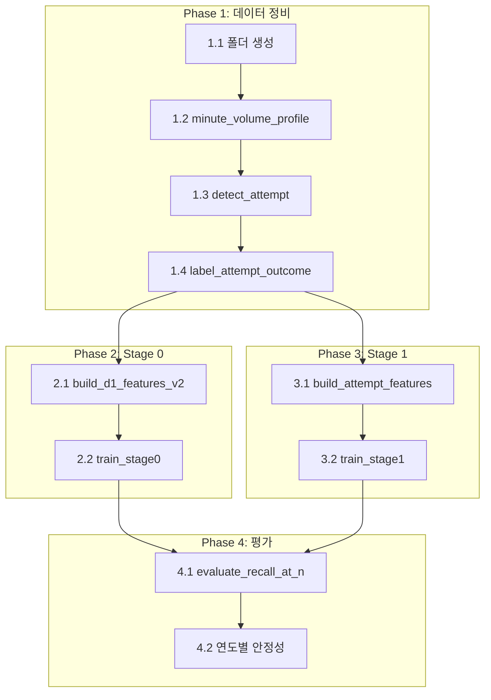

# 3-Stage 백테스트 Full 구현 계획서

> **작성일**: 2026-01-15 | **예상**: 16h (Phase 1~4)  
> **기반**: [reflect01.md](./reflect/reflect01.md), [reflect02.md](./reflect/reflect02.md), [005-01_3stage_impl_plan.md](./005-01_3stage_impl_plan.md)  
> **상태**: 📋 Full Plan (개발 가능 상태)

---

## 1. 목표

**3-Stage 파이프라인 구현:**
- **Stage 0**: D-1 Attempt Scanner (`has_attempt` 예측)
- **Stage 1**: Success vs Fail Classifier (`is_success` 예측)
- **Stage 2**: Alert Policy (운영 최적화)

### 1.1 핵심 성과 지표 (KPI)

| 지표 | Stage | 목표 | 측정 방법 |
|------|-------|------|----------|
| **Recall@200** | 0 | ≥ 70% | 일별 Top-200 내 Attempt 종목 비율 평균 |
| **Candidates/day** | 0 | 150-250 | 일별 후보 수 분포 |
| **Alerts/day** | 1 | 20-50 | 일별 평균 알림 수 |
| **Success Rate** | 1 | ≥ 50% | Alerts 중 Daygainer 비율 |
| **Lead Time** | 1 | ≥ 15min | T0 - Alert 시간 평균 |

---

## 2. 레이어 체크

> **참조**: [REFACTORING.md](../../refactor/REFACTORING.md)

- [x] 레이어 규칙 위반 없음 (독립 스크립트 — `scripts/` 폴더)
- [x] 순환 의존성 없음 (분석용 스크립트, 별도 프로세스)
- [x] DI Container 등록 필요: **아니오** (백엔드 서비스 아님)

---

## 3. 기존 솔루션 검색 결과

| 솔루션 | 출처 | 채택 여부 | 사유 |
|--------|------|----------|------|
| **pandas-ta** | PyPI | ✅ 유지 | 130+ 지표, CCI 개별 검증 필요 |
| **XGBoost** | PyPI | ✅ 유지 | 분류기 + L1/L2 정규화 |
| **SHAP** | PyPI | ✅ 유지 | 피처 중요도 분석 |
| **Polars** | PyPI | ✅ 채택 | 대용량 분봉 처리 (pandas 대비 10x 빠름) |
| **imodels (RuleFit)** | PyPI | 🆕 채택 | 해석 가능한 룰 추출 |
| **scikit-learn** | PyPI | ✅ 유지 | GroupKFold, 전처리 |
| **DuckDB** | PyPI | ⏸️ 대기 | 필요시 조인 최적화 |

---

## 4. 핵심 정의

### 4.1 Attempt Trigger (Stage 0 타깃)

분봉 t에서 아래 조건 충족 시 **Attempt 이벤트** 생성:

```python
minute_rvol(t) >= 3.0  # 동일 minute-of-day 20일 평균 대비
AND (
    ret_5m(t) >= +1.5%       # 5분 수익률
    OR breakout_flag(t)      # 60분 박스 상단 돌파
)
```

**상세 파라미터:**

| 파라미터 | 기본값 | 범위 | 설명 |
|----------|--------|------|------|
| `RVOL_TRIG` | 3.0 | 2.0~5.0 | 분당 RVOL 임계값 |
| `P_TRIG` | 1.5% | 1.0%~3.0% | 5분 수익률 임계값 |
| `BREAKOUT_WINDOW` | 60 | 30~120 | 박스 돌파 윈도우 (분) |
| `COOLDOWN` | 30 | 15~60 | 연속 Attempt 최소 간격 (분) |

### 4.2 Failed Pump (Stage 1 음성)

```python
has_attempt = 1
AND is_daygainer = 0
AND drawdown_from_hod >= 30%  # HOD 이후 최대 드로다운
```

### 4.3 Daygainer (최종 라벨)

```python
oc_return = (close - open) / open >= 0.75  # +75% 이상
AND dollar_volume >= 500_000              # $50만 이상
AND price >= 0.10                         # $0.1 이상
```

---

## 5. 데이터 스키마

### 5.1 출력 파일 목록

| 파일 | 설명 | PK | 예상 크기 |
|------|------|-----|----------|
| `data/backtest/ref_minute_volume_profile.parquet` | minute-of-day별 기대 거래량 | `(symbol, asof_date, minute_of_day)` | ~50MB |
| `data/backtest/event_attempt.parquet` | Attempt 이벤트 테이블 | `(symbol, trade_date, attempt_id)` | ~5MB |
| `data/backtest/label_attempt_outcome.parquet` | Attempt 성공/실패 라벨 | `(symbol, trade_date, attempt_id)` | ~1MB |
| `data/backtest/feat_d1_asof.parquet` | Stage 0용 D-1 피처 | `(symbol, trade_date)` | ~100MB |
| `data/backtest/feat_intraday_at_attempt.parquet` | Stage 1용 분봉 피처 | `(symbol, trade_date, attempt_id)` | ~20MB |
| `data/backtest/ml_stage0_examples.parquet` | Stage 0 학습 데이터 | `(symbol, trade_date)` | ~150MB |
| `data/backtest/ml_stage1_examples.parquet` | Stage 1 학습 데이터 | `(symbol, trade_date, attempt_id)` | ~30MB |

### 5.2 참조 테이블 스키마

#### `ref_minute_volume_profile`

| 컬럼 | 타입 | 설명 |
|------|------|------|
| `symbol` | STRING | 티커 |
| `asof_date` | DATE | 이 날짜 **이전** 20거래일로 계산 |
| `minute_of_day` | INT16 | 0~389 (미국 정규장 390분) |
| `exp_volume_20d` | FLOAT64 | 기대 거래량 (중앙값) |
| `exp_volume_std_20d` | FLOAT64 | 표준편차 |

#### `event_attempt`

| 컬럼 | 타입 | 설명 |
|------|------|------|
| `symbol` | STRING | 티커 |
| `trade_date` | DATE | 거래일 |
| `attempt_id` | INT8 | 1, 2, … (기본: 1만 사용) |
| `t_attempt` | DATETIME | Attempt trigger 시점 |
| `trig_minute_rvol` | FLOAT64 | 트리거 당시 minute_rvol |
| `trig_ret_5m` | FLOAT64 | 트리거 당시 5분 수익률 |
| `trig_breakout_flag` | BOOL | 박스 돌파 여부 |
| `minute_of_day` | INT16 | Attempt 발생 시간 (분) |

#### `label_attempt_outcome`

| 컬럼 | 타입 | 설명 |
|------|------|------|
| `symbol` | STRING | 티커 |
| `trade_date` | DATE | 거래일 |
| `attempt_id` | INT8 | FK to event_attempt |
| `is_daygainer` | BOOL | Daygainer 여부 |
| `is_success` | BOOL | = is_daygainer |
| `is_failed_pump` | BOOL | Failed Pump 여부 |
| `hod_after_attempt` | FLOAT64 | Attempt 이후 당일 고점 |
| `max_drawdown_pct` | FLOAT64 | HOD 대비 최대 드로다운 % |

---

## 6. 변경/생성 파일

| 파일 | 유형 | 예상 라인 | 설명 |
|------|-----|----------|------|
| `scripts/backtest/build_minute_volume_profile.py` | [NEW] | ~150 | minute-of-day별 기대 거래량 계산 |
| `scripts/backtest/detect_attempt.py` | [NEW] | ~250 | Attempt Trigger 탐지 |
| `scripts/backtest/label_attempt_outcome.py` | [NEW] | ~120 | Success/Failed Pump 라벨링 |
| `scripts/backtest/build_d1_features_v2.py` | [NEW] | ~350 | D-1 피처 (pandas_ta 130개 + 괴리) |
| `scripts/backtest/build_attempt_features.py` | [NEW] | ~300 | t_attempt 직전 분봉 피처 |
| `scripts/backtest/train_stage0.py` | [NEW] | ~250 | Stage 0 학습 (has_attempt) |
| `scripts/backtest/train_stage1.py` | [NEW] | ~250 | Stage 1 학습 (is_success) |
| `scripts/backtest/evaluate_recall_at_n.py` | [NEW] | ~200 | 일별 Recall@N 평가 |
| `scripts/backtest/utils.py` | [NEW] | ~100 | 공통 유틸리티 |
| `scripts/backtest/__init__.py` | [NEW] | ~10 | 패키지 초기화 |

**총 예상**: ~1,980줄 (10개 파일)

---

## 7. 실행 단계

### Phase 1: 데이터 정비 (~4h)

#### Step 1.1: 폴더 구조 생성

```bash
mkdir -p scripts/backtest
mkdir -p data/backtest
```

#### Step 1.2: minute_volume_profile 생성

**파일**: `scripts/backtest/build_minute_volume_profile.py`

**입력**:
- `data/parquet/intraday/1m/{SYMBOL}.parquet` (분봉 데이터)

**처리 로직**:
```python
def build_volume_profile(symbol: str, asof_date: date) -> pl.DataFrame:
    """
    1. asof_date 이전 20거래일 분봉 로드
    2. minute_of_day = (ts - 09:30) // 1분 계산
    3. (symbol, minute_of_day) 그룹별 volume 중앙값/std 계산
    4. 결과 저장
    """
    # 포인트-인-타임 강제: asof_date 이전만 사용
    minute_df = load_minute_bars(symbol, start=asof_date - 30, end=asof_date - 1)
    
    # 최근 20거래일만 필터
    trading_days = minute_df.select("trade_date").unique().sort().tail(20)
    minute_df = minute_df.filter(pl.col("trade_date").is_in(trading_days))
    
    # minute_of_day 계산 (09:30 = 0, 09:31 = 1, ...)
    minute_df = minute_df.with_columns([
        ((pl.col("ts").dt.hour() - 9) * 60 + pl.col("ts").dt.minute() - 30)
        .alias("minute_of_day")
    ])
    
    # 집계
    profile = minute_df.group_by("minute_of_day").agg([
        pl.col("volume").median().alias("exp_volume_20d"),
        pl.col("volume").std().alias("exp_volume_std_20d")
    ])
    
    return profile.with_columns([
        pl.lit(symbol).alias("symbol"),
        pl.lit(asof_date).alias("asof_date")
    ])
```

**출력**: `data/backtest/ref_minute_volume_profile.parquet`

**검증**:
```python
assert profile["minute_of_day"].min() >= 0
assert profile["minute_of_day"].max() <= 389
assert profile["exp_volume_20d"].null_count() == 0
```

---

#### Step 1.3: Attempt 탐지

**파일**: `scripts/backtest/detect_attempt.py`

**입력**:
- `data/parquet/intraday/1m/{SYMBOL}.parquet` (분봉)
- `data/backtest/ref_minute_volume_profile.parquet` (기대 거래량)
- `scripts/control_groups.csv` (대상 심볼)

**처리 로직**:
```python
# 파라미터 (config로 외부화)
RVOL_TRIG = 3.0
P_TRIG = 0.015  # 1.5%
BREAKOUT_WINDOW = 60
COOLDOWN_MINUTES = 30

def detect_attempt(symbol: str, trade_date: date) -> list[dict]:
    """
    1. 해당 일자 분봉 로드
    2. minute_rvol = volume / exp_volume_20d
    3. ret_5m = (close - close.shift(5)) / close.shift(5)
    4. breakout_flag = close > rolling_max(close, 60).shift(1)
    5. 트리거 조건 충족 분봉 탐지
    6. 첫 Attempt만 저장 (or COOLDOWN 적용)
    """
    # 분봉 로드
    minute_df = load_minute_bars(symbol, trade_date)
    
    # 기대 거래량 조인 (asof_date = trade_date 기준)
    profile = load_volume_profile(symbol, asof_date=trade_date)
    minute_df = minute_df.join(profile, on="minute_of_day", how="left")
    
    # minute_rvol 계산
    minute_df = minute_df.with_columns([
        (pl.col("volume") / pl.col("exp_volume_20d")).alias("minute_rvol")
    ])
    
    # ret_5m 계산
    minute_df = minute_df.with_columns([
        ((pl.col("close") - pl.col("close").shift(5)) / pl.col("close").shift(5))
        .alias("ret_5m")
    ])
    
    # breakout_flag 계산
    minute_df = minute_df.with_columns([
        (pl.col("close") > pl.col("close").rolling_max(BREAKOUT_WINDOW).shift(1))
        .alias("breakout_flag")
    ])
    
    # 트리거 조건
    trigger_mask = (
        (pl.col("minute_rvol") >= RVOL_TRIG) &
        ((pl.col("ret_5m") >= P_TRIG) | (pl.col("breakout_flag")))
    )
    
    triggers = minute_df.filter(trigger_mask)
    
    # 하루 첫 Attempt만 (or COOLDOWN 적용)
    if len(triggers) == 0:
        return []
    
    first_attempt = triggers.sort("ts").head(1)
    return first_attempt.to_dicts()
```

**출력**: `data/backtest/event_attempt.parquet`

**컬럼**:
```
symbol, trade_date, attempt_id, t_attempt, 
trig_minute_rvol, trig_ret_5m, trig_breakout_flag, minute_of_day
```

---

#### Step 1.4: Attempt 라벨링

**파일**: `scripts/backtest/label_attempt_outcome.py`

**입력**:
- `data/backtest/event_attempt.parquet`
- `data/parquet/intraday/1m/{SYMBOL}.parquet` (분봉)
- `scripts/control_groups.csv` (is_daygainer 컬럼)

**처리 로직**:
```python
def label_outcome(symbol: str, trade_date: date, t_attempt: datetime) -> dict:
    """
    1. t_attempt 이후 분봉 로드
    2. HOD_after_attempt = max(high) after t_attempt
    3. 종가 또는 15:30 가격 확인
    4. drawdown = (HOD - close) / HOD
    5. is_failed_pump = drawdown >= 0.30 AND not is_daygainer
    """
    # Attempt 이후 분봉
    after_df = load_minute_bars(symbol, trade_date, after=t_attempt)
    
    hod_after = after_df["high"].max()
    final_close = after_df.sort("ts").tail(1)["close"].item()
    
    drawdown = (hod_after - final_close) / hod_after if hod_after > 0 else 0
    
    # 외부에서 is_daygainer 가져옴
    is_daygainer = get_daygainer_label(symbol, trade_date)
    
    return {
        "is_daygainer": is_daygainer,
        "is_success": is_daygainer,
        "is_failed_pump": (drawdown >= 0.30) and not is_daygainer,
        "hod_after_attempt": hod_after,
        "max_drawdown_pct": drawdown
    }
```

**출력**: `data/backtest/label_attempt_outcome.parquet`

---

### Phase 2: Stage 0 구현 (~4h)

#### Step 2.1: D-1 피처 생성 (v2)

**파일**: `scripts/backtest/build_d1_features_v2.py`

**기존 코드 참조**: `scripts/build_d1_features.py` (확장)

**입력**:
- `data/parquet/daily/all_daily.parquet` (일봉)
- `scripts/control_groups.csv` (대상 심볼/날짜)

**피처 목록** (총 ~150개):

##### A. pandas_ta 130개 지표

```python
import pandas_ta as ta

# 전략 기반 전체 지표 계산
df.ta.strategy("all")  # 130+ 지표

# CCI 이상치 검증
df = df.with_columns([
    pl.when(pl.col("CCI_20").abs() > 1000)
    .then(None)
    .otherwise(pl.col("CCI_20"))
    .alias("CCI_20_validated")
])
```

##### B. 괴리 피처 (Divergence)

| 피처명 | 계산식 | 용도 |
|--------|--------|------|
| `rsi_5_14_div` | RSI_5 - RSI_14 | 단기 과열 + 중기 여력 |
| `macd_signal_div` | MACD - Signal | 추세 분기점 |
| `sma_5_20_div` | SMA_5 / SMA_20 - 1 | 이평선 이격도 |
| `close_vs_ma20` | close / SMA_20 - 1 | 가격 레벨 |
| `bb_width_pctile` | BB_width 20일 백분위 | 변동성 수축 |

##### C. 구조적 피처

| 피처명 | 계산식 | 용도 |
|--------|--------|------|
| `dist_to_20d_low` | (close - low_20d) / low_20d | 바닥 이격도 |
| `dist_to_52w_high` | close / high_52w - 1 | 고점 대비 위치 |
| `rvol_20d` | volume / avg_volume_20d | 거래량 이상 징후 |
| `atr_pctile` | ATR 20일 대비 백분위 | 변동성 상태 |
| `tight_range_intensity` | (high - low) / ATR | VCP 패턴 |
| `gap_history_3d` | 최근 3일 갭 평균 | 갭 빈도 |

##### D. asof_date 강제

```python
# 핵심: 모든 피처는 D-1까지만 사용
def build_d1_features(symbol: str, trade_date: date) -> dict:
    asof_date = trade_date - timedelta(days=1)  # D-1
    daily_df = load_daily(symbol, end=asof_date)
    
    # pandas_ta 계산 (D-1까지만)
    features = calculate_ta_features(daily_df)
    
    return {
        "symbol": symbol,
        "trade_date": trade_date,  # 예측 대상 D
        "asof_date": asof_date,    # 피처 기준 D-1
        **features
    }
```

**출력**: `data/backtest/feat_d1_asof.parquet`

---

#### Step 2.2: Stage 0 학습

**파일**: `scripts/backtest/train_stage0.py`

**입력**:
- `data/backtest/feat_d1_asof.parquet`
- `data/backtest/event_attempt.parquet` (has_attempt 라벨)

**처리 로직**:
```python
from sklearn.model_selection import GroupKFold
from xgboost import XGBClassifier
import shap

def train_stage0():
    # 1. 데이터 로드 및 병합
    features = pl.read_parquet("data/backtest/feat_d1_asof.parquet")
    attempts = pl.read_parquet("data/backtest/event_attempt.parquet")
    
    # has_attempt 라벨 생성
    features = features.with_columns([
        pl.col("symbol").is_in(attempts["symbol"]).alias("has_attempt")
    ])
    
    # 2. 학습/테스트 분할 (시계열 기반)
    train_mask = features["trade_date"] < "2025-01-01"
    train_df = features.filter(train_mask)
    test_df = features.filter(~train_mask)
    
    # 3. GroupKFold (trade_date 그룹)
    gkf = GroupKFold(n_splits=5)
    groups = train_df["trade_date"].to_numpy()
    
    # 4. XGBoost 학습
    model = XGBClassifier(
        n_estimators=200,
        max_depth=6,
        learning_rate=0.05,
        reg_alpha=0.1,  # L1
        reg_lambda=1.0, # L2
        scale_pos_weight=10,  # 클래스 불균형
        random_state=42
    )
    
    # CV 학습
    for fold, (train_idx, val_idx) in enumerate(gkf.split(X_train, y_train, groups)):
        model.fit(X_train[train_idx], y_train[train_idx])
        val_score = model.score(X_train[val_idx], y_train[val_idx])
        print(f"Fold {fold}: {val_score:.4f}")
    
    # 5. 최종 학습 및 저장
    model.fit(X_train, y_train)
    joblib.dump(model, "data/backtest/model_stage0.joblib")
    
    # 6. SHAP 분석
    explainer = shap.TreeExplainer(model)
    shap_values = explainer.shap_values(X_test)
    
    return model, shap_values
```

**출력**:
- `data/backtest/model_stage0.joblib`
- `data/backtest/shap_stage0.png`

---

### Phase 3: Stage 1 구현 (~4h)

#### Step 3.1: Attempt 피처 생성

**파일**: `scripts/backtest/build_attempt_features.py`

**입력**:
- `data/backtest/event_attempt.parquet`
- `data/parquet/intraday/1m/{SYMBOL}.parquet` (분봉)

**핵심 피처 (80개 = 20 Core × 4 Windows)**:

##### A. 윈도우 정의

| 윈도우 | 파라미터 | 용도 |
|--------|----------|------|
| 15m | t_attempt - 15분 | 직전 모멘텀 |
| 30m | t_attempt - 30분 | 단기 추세 |
| 60m | t_attempt - 60분 | 중기 패턴 |
| 120m | t_attempt - 120분 | 장기 컨텍스트 |

##### B. 핵심 20개 지표

| 카테고리 | 지표 | 설명 |
|----------|------|------|
| **Momentum** | `ret_{w}m` | 윈도우 수익률 |
| | `rsi_5` | RSI (5) |
| | `rsi_14` | RSI (14) |
| | `macd` | MACD |
| | `stoch_k` | Stochastic K |
| **Volume** | `vol_zscore_max` | 최대 거래량 z-score |
| | `vol_accel` | 거래량 가속도 |
| | `obv_change` | OBV 변화 |
| | `cmf` | Chaikin Money Flow |
| | `spike_count` | RVOL 스파이크 횟수 |
| **Volatility** | `range` | (high - low) / close |
| | `atr` | ATR |
| | `bb_width` | Bollinger 폭 |
| | `bb_pos` | Bollinger 위치 |
| **Structure** | `vwap_dist` | (close - vwap) / vwap |
| | `above_vwap_ratio` | VWAP 위 비율 |
| | `pullback_depth` | 직전 눌림 깊이 |
| | `price_accel` | 가격 가속도 |
| | `high_loc` | 고점 위치 (0~1) |
| | `close_loc` | 종가 위치 (0~1) |

**t_attempt 이전만 사용 강제**:
```python
def build_attempt_features(symbol: str, trade_date: date, t_attempt: datetime) -> dict:
    """포인트-인-타임 강제: t_attempt 직전까지만 사용"""
    minute_df = load_minute_bars(symbol, trade_date, before=t_attempt)
    
    features = {}
    for window in [15, 30, 60, 120]:
        window_df = minute_df.tail(window)
        features.update({
            f"ret_{window}m": calc_return(window_df),
            f"vol_zscore_max_{window}m": calc_vol_zscore_max(window_df),
            # ... 나머지 지표
        })
    
    return features
```

**출력**: `data/backtest/feat_intraday_at_attempt.parquet`

---

#### Step 3.2: Stage 1 학습

**파일**: `scripts/backtest/train_stage1.py`

**입력**:
- `data/backtest/feat_intraday_at_attempt.parquet`
- `data/backtest/feat_d1_asof.parquet` (D-1 피처 일부)
- `data/backtest/label_attempt_outcome.parquet`

**처리 로직**:
```python
def train_stage1():
    # 1. 데이터 로드
    attempt_features = pl.read_parquet("data/backtest/feat_intraday_at_attempt.parquet")
    d1_features = pl.read_parquet("data/backtest/feat_d1_asof.parquet")
    labels = pl.read_parquet("data/backtest/label_attempt_outcome.parquet")
    
    # 2. D-1 피처 일부 선택 (상위 10개)
    d1_top10 = ["atr_pctile", "tight_range_intensity", "dist_to_20d_low", ...]
    d1_subset = d1_features.select(["symbol", "trade_date"] + d1_top10)
    
    # 3. 병합
    df = attempt_features.join(d1_subset, on=["symbol", "trade_date"])
    df = df.join(labels, on=["symbol", "trade_date", "attempt_id"])
    
    # 4. Positive/Negative 정의
    # Positive: is_success = True
    # Negative: is_failed_pump = True (하드 네거티브)
    df = df.filter(pl.col("is_success") | pl.col("is_failed_pump"))
    
    # 5. 학습 (Stage 0과 동일 구조)
    model = XGBClassifier(...)
    model.fit(X_train, y_train)
    
    return model
```

**출력**:
- `data/backtest/model_stage1.joblib`
- `data/backtest/shap_stage1.png`

---

### Phase 4: 평가 및 검증 (~4h)

#### Step 4.1: Recall@N 평가

**파일**: `scripts/backtest/evaluate_recall_at_n.py`

**처리 로직**:
```python
def evaluate_recall_at_n(model, df: pl.DataFrame, n: int = 200) -> dict:
    """
    일별 Recall@N 평가
    
    1. 각 trade_date에 대해:
       a. 모든 종목에 대해 예측 점수 계산
       b. 점수 기준 상위 N개 선택
       c. Top-N 중 실제 Attempt 비율 (Recall)
    2. 일별 Recall 평균 및 분포
    """
    results = []
    
    for trade_date in df["trade_date"].unique():
        day_df = df.filter(pl.col("trade_date") == trade_date)
        
        # 예측 점수
        scores = model.predict_proba(day_df[feature_cols])[:, 1]
        
        # Top-N
        top_n_idx = np.argsort(scores)[-n:]
        top_n_labels = day_df[top_n_idx]["has_attempt"].to_numpy()
        
        # 그날 실제 Attempt 수
        total_attempts = day_df["has_attempt"].sum()
        
        # Recall@N
        recall = top_n_labels.sum() / total_attempts if total_attempts > 0 else 0
        
        results.append({
            "trade_date": trade_date,
            "recall_at_n": recall,
            "total_attempts": total_attempts,
            "candidates": n
        })
    
    return pl.DataFrame(results)
```

**출력 지표**:

| 지표 | Stage 0 | Stage 1 |
|------|---------|---------|
| Recall@200 (평균) | ≥ 70% | N/A |
| Recall@200 (std) | 보고 | N/A |
| Candidates/day (평균) | 150-250 | N/A |
| Alerts/day (평균) | N/A | 20-50 |
| Success Rate | N/A | ≥ 50% |
| Lead Time (평균) | N/A | ≥ 15min |

#### Step 4.2: 연도별 안정성 평가

```python
def evaluate_yearly_stability(model, df: pl.DataFrame) -> dict:
    """
    연도별 성능 분리 평가
    - 2021 / 2022 / 2023 / 2024 / 2025
    - 상위 피처/룰 일관성 확인
    """
    years = [2021, 2022, 2023, 2024, 2025]
    results = {}
    
    for year in years:
        year_df = df.filter(pl.col("trade_date").dt.year() == year)
        metrics = evaluate_recall_at_n(model, year_df)
        results[year] = {
            "recall_at_200_mean": metrics["recall_at_n"].mean(),
            "recall_at_200_std": metrics["recall_at_n"].std(),
            "sample_count": len(year_df)
        }
    
    return results
```

---

## 8. 의존성 순서



**병렬 가능**:
- Phase 2와 Phase 3는 Phase 1 완료 후 병렬 실행 가능
- Step 2.1과 Step 3.1은 독립적으로 실행 가능

---

## 9. 검증

### 9.1 자동 검증

```bash
# Lint
ruff check scripts/backtest/*.py

# Type check (선택)
mypy scripts/backtest/*.py

# 데이터 무결성
python scripts/backtest/validate_data.py
```

### 9.2 수동 검증

| 검증 항목 | 방법 | 기대 결과 |
|----------|------|----------|
| minute_volume_profile 정합성 | 샘플 10개 수동 검산 | 20일 중앙값 일치 |
| Attempt 탐지 정확도 | control_groups.csv 대비 교차 검증 | Attempt 종목 100% 탐지 |
| asof_date 강제 | feat_d1_asof에 D-0 데이터 없음 확인 | asof_date < trade_date |
| 피처 누수 검사 | t_attempt 이후 데이터 미사용 확인 | 로그 검증 |

### 9.3 성과 기준 (Pass/Fail)

| 지표 | 기준 | Pass 조건 |
|------|------|----------|
| Stage 0 Recall@200 | ≥ 70% | 2025 테스트셋 기준 |
| Stage 0 Candidates/day | 150-250 | 평균 범위 내 |
| Stage 1 Alerts/day | 20-50 | 평균 범위 내 |
| Stage 1 Success Rate | ≥ 50% | 2025 테스트셋 기준 |
| 연도별 편차 | std < 15% | 2021-2024 CV 기준 |

---

## 10. 리스크 및 완화

| 리스크 | 영향 | 완화 방안 |
|--------|------|----------|
| 분봉 데이터 누락 | Attempt 탐지 실패 | minute_coverage_report.csv 검증 후 다운로드 |
| pandas_ta CCI 이상치 | 피처 오염 | CCI 개별 검증 + 이상치 필터링 |
| Point-in-time 위반 | 백테스트 과적합 | asof_date 컬럼 강제, 로그 검증 |
| 클래스 불균형 | 모델 편향 | scale_pos_weight, 샘플링 조정 |

---

## 11. 사전 요구사항 체크리스트

- [ ] `scripts/control_groups.csv` 존재 확인 (4,205+ 행)
- [ ] `data/parquet/daily/all_daily.parquet` 존재 확인
- [ ] `data/parquet/intraday/1m/` 디렉토리 분봉 데이터 확인
- [ ] `minute_coverage_report.csv` 검증 → 누락 분봉 다운로드

---

**문서 이력**
| 버전 | 일자 | 변경 내용 |
|------|------|----------|
| 1.0 | 2026-01-15 | 초안 (005-01 기반 Full Plan 확장) |
