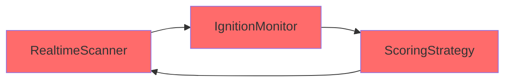
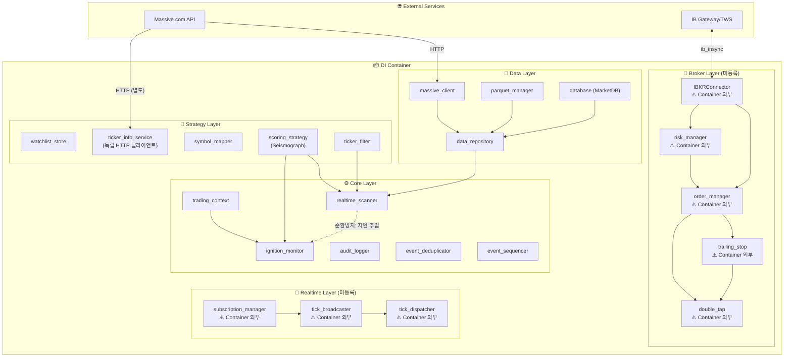
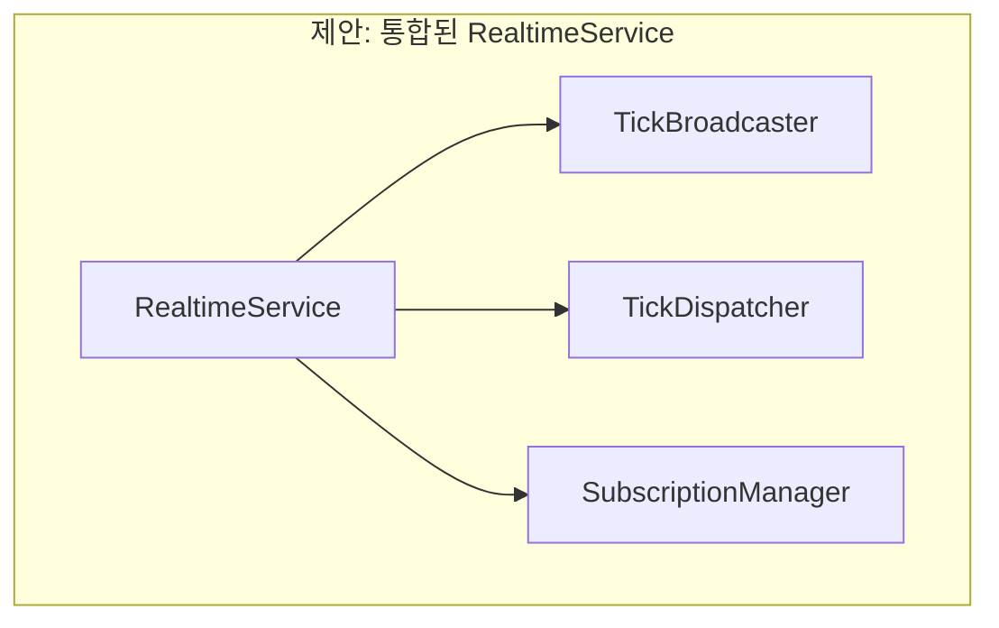

# Sigma9 Data Flow 및 의존성 분석 보고서

> **생성일**: 2026-01-16  
> **분석 대상**: `docs/_architecture/Full_DataFlow_Diagram.md`, `backend/container.py`, 핵심 모듈들

---

## 📋 Executive Summary

현재 Sigma9 시스템의 Data Flow 다이어그램과 실제 코드베이스를 비교 분석한 결과, **의존성 관리의 분산화**, **DI Container 미등록 컴포넌트**, **순환 참조 리스크** 등 여러 아키텍처 문제점을 발견했습니다.

---

## 🔍 발견된 문제점

### 1. DI Container 미등록 컴포넌트 (Critical)

현재 `container.py`에 등록된 서비스와 실제 사용되는 서비스 간 불일치:

| 카테고리 | Container에 등록됨 | 실제 존재/사용됨 | 상태 |
|---------|------------------|----------------|------|
| **Broker Layer** | ❌ | `IBKRConnector`, `OrderManager`, `RiskManager`, `TrailingStopManager`, `DoubleTapManager` | ⚠️ **미등록** |
| **Data Layer** | ✅ | `MassiveClient`, `ParquetManager`, `DataRepository`, `MarketDB` | ✅ OK |
| **Strategy Layer** | ✅ | `SeismographStrategy`, `WatchlistStore`, `TickerInfoService`, `SymbolMapper` | ✅ OK |
| **Core Layer** | ⚠️ 일부 | `RealtimeScanner`, `IgnitionMonitor`, `TradingContext`, `AuditLogger`, `EventDeduplicator`, `EventSequencer` | ⚠️ **일부만** |
| **Realtime** | ❌ | `TickBroadcaster`, `TickDispatcher`, `SubscriptionManager` | ⚠️ **미등록** |

> [!CAUTION]
> **Broker Layer 전체가 DI Container에 등록되지 않음**  
> `OrderManager`, `RiskManager`, `TrailingStopManager`, `DoubleTapManager`가 Container 외부에서 수동으로 인스턴스화되고 있어 테스트 용이성과 생명주기 관리가 어려움.

---

### 2. 의존성 방향 불일치 (Diagram vs Reality)

현재 다이어그램 (Section 7: DI 컨테이너 의존성 그래프)에서 표시된 의존성과 실제 코드가 다릅니다:

#### 📊 다이어그램에서 잘못된 부분:

```diff
- MC --> TI  (massive_client → ticker_info_service)
+ 실제: TickerInfoService는 내부에서 자체 HTTP 클라이언트를 생성 (MassiveClient 미사용)

- SM --> TI  (symbol_mapper → ticker_info_service)
+ 실제: SymbolMapper는 TickerInfoService를 사용하지 않음 (독립적)

- SM --> IBKR  (symbol_mapper → IBKRConnector)
+ 실제: SymbolMapper는 정적 매핑 테이블만 사용,  IBKRConnector 의존성 없음
```

#### 📊 다이어그램에 누락된 부분:

- `DoubleTapManager` → `OrderManager` 의존성
- `DoubleTapManager` → `TrailingStopManager` 의존성
- `RiskManager` → `IBKRConnector` 의존성
- `TickBroadcaster` → `TickDispatcher` 의존성
- `SubscriptionManager` → WebSocket 클라이언트 의존성

---

### 3. 순환 참조 잠재 리스크

현재 코드에서 발견된 순환 참조 위험 패턴:



**현재 해결 방식**: `container.py:315`에서 `ignition_monitor=None`으로 주입 후 나중에 설정하는 패턴 사용  
**문제점**: 이 패턴이 문서화되어 있지 않고, 초기화 순서에 민감함

---

### 4. Layer 경계 위반

현재 아키텍처에서 Layer 간 직접 참조가 발생하는 부분:

| 위반 패턴 | 설명 |
|----------|------|
| `IBKRConnector` → PyQt6 | Broker Layer가 GUI 프레임워크에 직접 의존 (QThread, pyqtSignal) |
| `TickerInfoService` → httpx | Data Layer가 HTTP 클라이언트를 직접 생성 (Container 통하지 않음) |
| Frontend Services → Backend Container | Frontend가 Backend Container를 직접 import하는 경우 존재 |

---

### 5. 실시간 컴포넌트 분산 관리

Realtime 관련 5개 컴포넌트가 서로 다른 방식으로 관리됨:

| 컴포넌트 | 관리 방식 | 문제점 |
|---------|----------|--------|
| `ConnectionManager` | FastAPI 라우터에서 생성 | Container에 Object로만 주입 |
| `TickBroadcaster` | 수동 인스턴스화 | 생명주기 불명확 |
| `TickDispatcher` | 수동 인스턴스화 | 생명주기 불명확 |
| `SubscriptionManager` | 수동 인스턴스화 | WebSocket 연결 관리 분리됨 |
| `RealtimeScanner` | Container 관리 | ✅ OK |

---

## 🛠️ 개선 제안

### Phase 1: 문서 정확성 확보 (Immediate)

#### 1.1 DI 의존성 그래프 수정

`Full_DataFlow_Diagram.md` Section 7 수정:



---

### Phase 2: Broker Layer DI 통합 (Short-term)

> [!IMPORTANT]
> **리팩터링 제안**: Broker Layer 전체를 Container에 등록

```python
# container.py 추가 예시

# ═══════════════════════════════════════════════════════════════════════════
# Broker Layer (신규)
# ═══════════════════════════════════════════════════════════════════════════

@staticmethod
def _create_ibkr_connector():
    from backend.broker.ibkr_connector import IBKRConnector
    return IBKRConnector()

ibkr_connector = providers.Singleton(_create_ibkr_connector)

@staticmethod
def _create_order_manager(connector):
    from backend.core.order_manager import OrderManager
    return OrderManager(connector=connector)

order_manager = providers.Singleton(
    _create_order_manager,
    connector=ibkr_connector,
)

@staticmethod
def _create_risk_manager(connector):
    from backend.core.risk_manager import RiskManager
    return RiskManager(connector=connector)

risk_manager = providers.Singleton(
    _create_risk_manager,
    connector=ibkr_connector,
)

@staticmethod
def _create_trailing_stop_manager(connector):
    from backend.core.trailing_stop import TrailingStopManager
    return TrailingStopManager(connector=connector)

trailing_stop_manager = providers.Singleton(
    _create_trailing_stop_manager,
    connector=ibkr_connector,
)

@staticmethod
def _create_double_tap_manager(connector, order_manager, trailing_manager):
    from backend.core.double_tap import DoubleTapManager
    return DoubleTapManager(
        connector=connector,
        order_manager=order_manager,
        trailing_manager=trailing_manager,
    )

double_tap_manager = providers.Singleton(
    _create_double_tap_manager,
    connector=ibkr_connector,
    order_manager=order_manager,
    trailing_manager=trailing_stop_manager,
)
```

---

### Phase 3: Layer 경계 정리 (Long-term)

#### 3.1 IBKRConnector의 PyQt6 의존성 제거

현재 `IBKRConnector`가 `QThread`, `pyqtSignal`을 직접 사용하는 것은 Broker Layer의 GUI 의존성을 만듦.

**제안**: Event-based 아키텍처로 전환
- `IBKRConnector` → 순수 Python 클래스로 변경
- 이벤트 발행 인터페이스 추가 (예: `asyncio.Queue` 또는 callback 패턴)
- Frontend에서 이벤트를 Qt 시그널로 변환하는 어댑터 추가

#### 3.2 Realtime Layer 통합



---

## 📊 우선순위 매트릭스

| 개선 항목 | 중요도 | 긴급도 | 난이도 | 권장 순서 |
|----------|--------|--------|--------|----------|
| 다이어그램 정확성 수정 | 🟡 Medium | 🟢 Low | 🟢 Easy | 1️⃣ |
| Broker Layer DI 등록 | 🔴 High | 🟡 Medium | 🟡 Medium | 2️⃣ |
| Realtime Layer 통합 | 🟡 Medium | 🟢 Low | 🟡 Medium | 3️⃣ |
| IBKRConnector 리팩터링 | 🔴 High | 🟢 Low | 🔴 Hard | 4️⃣ |

---

## 🔗 참조 문서

- [Full_DataFlow_Diagram.md](file:///d:/Codes/Sigma9-0.1/docs/_architecture/Full_DataFlow_Diagram.md)
- [container.py](file:///d:/Codes/Sigma9-0.1/backend/container.py)
- [ibkr_connector.py](file:///d:/Codes/Sigma9-0.1/backend/broker/ibkr_connector.py)
- [order_manager.py](file:///d:/Codes/Sigma9-0.1/backend/core/order_manager.py)
- [risk_manager.py](file:///d:/Codes/Sigma9-0.1/backend/core/risk_manager.py)

---

## ✅ 다음 단계

1. **즉시**: `Full_DataFlow_Diagram.md` Section 7 수정하여 현재 상태 정확히 반영
2. **단기**: Broker Layer를 Container에 등록하는 리팩터링 계획 수립
3. **중기**: Realtime Layer 통합 검토
4. **장기**: IBKRConnector에서 PyQt6 의존성 제거
