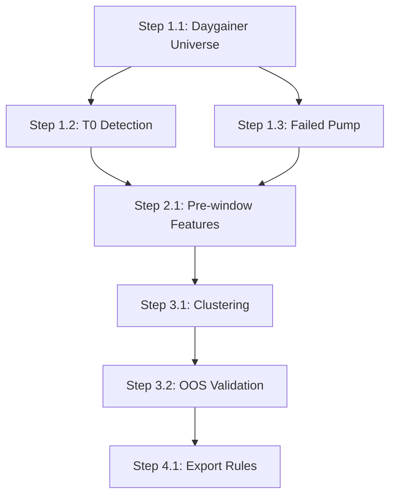

# Pre-Surge Pattern Discovery Pipeline v3.0 구현 계획서

> **작성일**: 2026-01-15 | **예상**: 12h  
> **기반**: [plan_v3.0.md](../backtest/plan_v3.0.md), [reflect01.md](../backtest/reflect/reflect01.md), [reflect02.md](../backtest/reflect/reflect02.md)

---

## 1. 목표

> **핵심 철학**: "전조를 정의하지 않고, 데이터가 전조를 뽑게 만든다"

**plan_v3.0.md의 10단계 파이프라인을 구현하여:**
1. Day Gainer(+75%) 정의 고정 및 데이터셋 구축
2. 급등 시작 시점(T0) 자동 탐지 → 앵커 정렬
3. Pre-window(T0 직전) 시계열 피처 추출
4. **Hard Negative** 구성 (Failed Pump: 시도했으나 실패)
5. **클러스터링** 기반 전조 패턴 자동 발견 (EDA + Contrastive/AutoEncoder)
6. OOS 검증 후 "스캐너 룰"로 변환

### vs 기존 3-Stage Plan

| 항목 | 3-Stage (reflect01/02) | v3.0 Pattern Discovery |
|------|------------------------|------------------------|
| 접근 | Supervised Classification | Unsupervised Clustering + Validation |
| 타깃 | has_attempt → is_success | 패턴 클러스터 멤버십 |
| 룰 도출 | RuleFit/SHAP | 클러스터 프로파일링 |
| 리드타임 | T0 기준 (이미 시작된 후) | T0 **이전** 패턴 탐색 |

---

## 2. 레이어 체크

> **참조**: [REFACTORING.md](../../refactor/REFACTORING.md)

- [x] 레이어 규칙 위반 없음 (독립 스크립트, `scripts/` 폴더)
- [x] 순환 의존성 없음 (백엔드 서비스 의존 없음)
- [x] DI Container 등록 필요: **아니오** (분석용 스크립트)

---

## 3. 기존 솔루션 검색 결과

| 솔루션 | 출처 | 채택 여부 | 사유 |
|--------|------|----------|------|
| **HDBSCAN** | PyPI (`hdbscan`) | ✅ 채택 | 밀도 기반 클러스터링, 노이즈 허용 |
| **scikit-learn KMeans** | PyPI | ⏸️ 대기 | HDBSCAN 결과 따라 보완 |
| **PyTorch/TensorFlow AutoEncoder** | PyPI | ❌ 미채택 | 과잉; 먼저 통계적 접근 |
| **ts-fresh** | PyPI | ⏸️ 검토 | 시계열 피처 자동 추출, 필요시 사용 |
| **Polars** | PyPI | ✅ 유지 | 대용량 분봉 처리 |
| **pandas-ta** | PyPI | ✅ 유지 | 기술적 지표 계산 |

> **결론**: 초기 구현은 통계적 피처 + HDBSCAN으로 시작. AutoEncoder는 Phase 2에서 검토.

---

## 4. 변경/생성 파일

### 신규 스크립트

| 파일 | 예상 라인 | 설명 |
|------|----------|------|
| `scripts/v3/define_daygainer_universe.py` | ~100 | Step 1: Daygainer 정의 고정 및 목록 생성 |
| `scripts/v3/detect_t0_anchor.py` | ~150 | Step 2: T0 (급등 시작 시점) 탐지 |
| `scripts/v3/extract_prewindow_features.py` | ~300 | Step 3-6: [T0-30m, T0-5m] 구간 형태 피처 추출 |
| `scripts/v3/build_hard_negatives.py` | ~150 | Step 4: Failed Pump 대조군 생성 |
| `scripts/v3/cluster_precursors.py` | ~250 | Step 7: 클러스터링 기반 패턴 발견 |
| `scripts/v3/validate_clusters_oos.py` | ~200 | Step 8: OOS 검증 및 성과 지표 |
| `scripts/v3/export_scanner_rules.py` | ~100 | Step 9-10: 클러스터 → 스캐너 룰 변환 |

### 출력 파일

| 파일 | 설명 |
|------|------|
| `data/backtest/v3/daygainer_universe.parquet` | Daygainer 목록 (2021-2025) |
| `data/backtest/v3/t0_events.parquet` | T0 이벤트 테이블 |
| `data/backtest/v3/prewindow_features.parquet` | [T0-30m, T0-5m] 피처 |
| `data/backtest/v3/hard_negatives.parquet` | Failed Pump 대조군 |
| `data/backtest/v3/cluster_labels.parquet` | 클러스터 라벨 |
| `data/backtest/v3/cluster_profiles.json` | 클러스터별 특성 요약 |
| `data/backtest/v3/scanner_rules.yaml` | 최종 스캐너 룰 |

---

## 5. 실행 단계

### Phase 1: 데이터 정비 (~3h)

#### Step 1.1: Daygainer Universe 정의 고정

```bash
python scripts/v3/define_daygainer_universe.py
```

**정의 (plan_v3.0.md 기준):**
- Universe: NASDAQ/NYSE/AMEX common stock (ETF/권리주/스플릿 이벤트 제외)
- R_day ≥ +75% (당일 high vs 전일 close)
- 기간: 2021-01-01 ~ 2025-12-31 (5년)
- 거래대금 ≥ $500k, 가격 ≥ $0.50

**출력**: `daygainer_universe.parquet` (~2,000건 예상)

---

#### Step 1.2: T0 (급등 시작 시점) 탐지

```bash
python scripts/v3/detect_t0_anchor.py
```

**T0 정의 (plan_v3.0.md Step 2):**

> T0 = 당일 intraday high가 전일 close 대비 **+10%**를 **처음** 돌파한 시각

```python
# 의사코드
for each daygainer (symbol, date):
    prev_close = daily_bars[date-1].close
    threshold = prev_close * 1.10  # +10%
    
    for minute in minute_bars[date]:
        if minute.high >= threshold:
            t0 = minute.timestamp
            break
```

**출력**: `t0_events.parquet` (symbol, trade_date, t0, prev_close, t0_price)

---

#### Step 1.3: Failed Pump (Hard Negative) 생성

```bash
python scripts/v3/build_hard_negatives.py
```

**Failed Pump 정의 (plan_v3.0.md Step 4):**

1. 동일 조건으로 T0 이벤트가 발생 (+10% 돌파)
2. 그러나 +75% Daygainer는 **아님**
3. HOD 대비 종가 -20% 이상 하락

```python
# 후보: +10% ~ +40% 사이에서 마감한 종목
is_failed_pump = (
    has_t0_event == 1
    AND is_daygainer == 0
    AND (hod - close) / hod >= 0.20
)
```

**샘플링**: Daygainer당 5개 Failed Pump 매칭 (같은 거래일 또는 ±2일)

**출력**: `hard_negatives.parquet`

---

### Phase 2: 피처 추출 (~3h)

#### Step 2.1: Pre-window 형태(Shape) 피처 추출

```bash
python scripts/v3/extract_prewindow_features.py
```

**관측창 (plan_v3.0.md Step 3, 6):**
- Window: **[T0-30분, T0-5분]** (25분 구간)
- T0 **이후** 데이터는 절대 사용 금지 (누수 방지)

**피처 목록 (plan_v3.0.md Step 6):**

| 카테고리 | 피처 | 설명 |
|----------|------|------|
| **Return Path** | `ret_path_60pt` | 리턴 시계열 60포인트로 리샘플링 |
| **Volume Path** | `vol_path_60pt` | 거래량 시계열 60포인트 |
| **Volatility Path** | `abs_ret_path_60pt` | |ret(t)| 시계열 |
| **Range Path** | `range_path_60pt` | (high-low)/close 시계열 |
| **통계 요약** | `ret_mean`, `ret_std`, `ret_skew`, `ret_kurt` | 윈도우 내 수익률 통계 |
| **거래량 요약** | `vol_mean`, `vol_std`, `vol_trend` | 거래량 추세 (선형 회귀 기울기) |
| **가격-거래량 상관** | `pv_corr` | 가격과 거래량 상관계수 |
| **VWAP 괴리** | `vwap_dist_start`, `vwap_dist_end` | 윈도우 시작/끝 VWAP 대비 위치 |
| **모멘텀** | `accel_price`, `accel_vol` | 가격/거래량 가속도 |

**시계열 피처 옵션:**
- Option A: 60포인트 리샘플링 (raw shape)
- Option B: 통계 요약만 (저차원)
- **권장**: Option B로 시작, 클러스터링 결과에 따라 Option A 검토

**출력**: `prewindow_features.parquet`

---

### Phase 3: 클러스터링 기반 패턴 발견 (~3h)

#### Step 3.1: 클러스터링 (HDBSCAN)

```bash
python scripts/v3/cluster_precursors.py
```

**알고리즘 (plan_v3.0.md Step 7):**

1. Positive 샘플 (Daygainer) 피처만 사용
2. 표준화 (StandardScaler)
3. **HDBSCAN** 클러스터링
   - `min_cluster_size=20`
   - `min_samples=5`
4. 클러스터별 특성 프로파일링

```python
import hdbscan

# Positive only clustering
X_pos = features[features.is_daygainer == 1]
clusterer = hdbscan.HDBSCAN(min_cluster_size=20, min_samples=5)
labels = clusterer.fit_predict(X_pos)
```

**출력:**
- `cluster_labels.parquet`: 각 샘플의 클러스터 라벨
- `cluster_profiles.json`: 클러스터별 중심/특성

---

#### Step 3.2: 클러스터 검증 (OOS)

```bash
python scripts/v3/validate_clusters_oos.py
```

**검증 지표 (plan_v3.0.md Step 8):**

| 지표 | 설명 | 목표 |
|------|------|------|
| **P(DayGainer \| cluster_k)** | 클러스터 k에 속할 때 성공 확률 | ≥ 60% |
| **리드타임 분포** | T0까지 남은 시간 분포 | 평균 ≥ 15분 |
| **알림 빈도** | 하루 평균 발생 횟수 | 10-50회 |
| **실패 시 드로다운** | 클러스터 k 실패 시 평균 손실 | ≤ -8% |

**분할:**
- Train: 2021-2024
- OOS Test: 2025

**Negative 멤버십 검증:**
- Hard Negative (Failed Pump)가 어떤 클러스터에 할당되는지 확인
- 클러스터별 FP 비율 계산

---

### Phase 4: 룰 추출 및 최종 산출 (~3h)

#### Step 4.1: 클러스터 → 스캐너 룰 변환

```bash
python scripts/v3/export_scanner_rules.py
```

**방법 (plan_v3.0.md Step 9-10):**

1. 검증 통과한 클러스터만 선택
2. 클러스터 중심 → "전조 프로필" 문장화
3. 멤버십 점수 함수 정의

```python
# 런타임 스캐너 로직
def check_precursor(current_window_features, cluster_profiles):
    for cluster_id, profile in cluster_profiles.items():
        score = cosine_similarity(current_window_features, profile)
        if score > threshold[cluster_id]:
            return Alert(cluster_id, score)
```

**출력 형식 (scanner_rules.yaml):**

```yaml
precursors:
  - id: "cluster_0"
    name: "Quiet Accumulation"
    description: "변동성 수축 중 거래량 점진적 증가"
    threshold: 0.72
    profile:
      ret_std: [0.002, 0.008]  # 범위
      vol_trend: [0.05, 0.20]  # 양수 (증가세)
    oos_metrics:
      precision: 0.65
      avg_lead_time_min: 18
      alerts_per_day: 12
```

---

## 6. 핵심 정의 요약

### Daygainer
```
R_day = max(high(D), close(D)) / close(D-1) - 1 >= +75%
AND dollar_volume >= $500k
AND price >= $0.50
```

### T0 Anchor
```
T0 = 당일 첫 번째로 high(t) >= close(D-1) * 1.10인 분봉 시각
```

### Pre-window
```
[T0 - 30분, T0 - 5분]  # 25분 구간
```

### Failed Pump
```
has_T0 = 1 AND is_daygainer = 0 AND drawdown_from_hod >= 20%
```

---

## 7. 검증

### 자동 검증

```bash
# 코드 스타일
ruff check scripts/v3/*.py

# 단위 테스트 (작성 예정)
pytest tests/backtest/test_v3_pipeline.py -v
```

### 데이터 무결성

```bash
# 누수 검증: T0 이후 데이터가 피처에 포함되지 않았는지 확인
python scripts/v3/validate_no_leakage.py
```

### 성과 기준

| 지표 | Phase | 목표 |
|------|-------|------|
| 클러스터 수 | 3 | 5-20개 |
| 클러스터 커버리지 | 3 | ≥ 70% (Daygainer 중 클러스터에 속한 비율) |
| OOS Precision (최상위 클러스터) | 3 | ≥ 60% |
| 평균 리드타임 | 3 | ≥ 15분 |
| Alerts/day | 4 | 20-50회 |

### 수동 검증

**사용자가 확인할 항목:**
1. `cluster_profiles.json` 내용 리뷰 → 클러스터가 해석 가능한지
2. `scanner_rules.yaml` 리뷰 → 룰이 운영에 적합한지
3. (선택) 특정 날짜 시뮬레이션 실행하여 알림 확인

---

## 8. 의존성 순서



**병렬 가능:**
- Step 1.2 / 1.3은 Step 1.1 완료 후 병렬 가능
- Step 3.1 / 3.2는 순차

---

## 9. 사전 체크리스트

- [x] 레이어 규칙 위반 없음 (독립 스크립트)
- [x] 순환 의존성 없음
- [x] DI Container 등록 필요: 아니오
- [x] 기존 1000줄+ 파일 수정: 해당 없음 (신규 스크립트)
- [x] 기존 솔루션 검색 완료

---

## 10. 제안 및 토론 사항

> [!IMPORTANT]
> **사용자 검토 필요**

### Q1: T0 임계값

현재 `+10%`로 설정. plan_v3.0.md에서는 10% 또는 15% 언급. 어느 값으로 시작할지?

- **+10%**: 더 많은 샘플, 더 이른 리드타임
- **+15%**: 더 적은 샘플, 노이즈 감소

### Q2: Pre-window 구간

현재 `[T0-30분, T0-5분]`. 대안: `[T0-15분, T0-3분]`

### Q3: 클러스터링 vs Supervised

plan_v3.0.md는 클러스터링 강조. 그러나 기존 3-Stage Plan(reflect02)의 RuleFit도 유지할지?

- **Option A**: v3.0만 진행 (클러스터링)
- **Option B**: v3.0 + 3-Stage 병행
- **Option C**: v3.0 결과를 3-Stage Stage0에 피처로 통합

### Q4: Late Join 허용 여부

기존 `scripts/build_d1_features.py`, `scripts/build_m_n_features.py` 등이 이미 있음. 이 계획과 별도로 유지? 또는 v3로 통합?

---

**문서 이력**

| 버전 | 일자 | 변경 내용 |
|------|------|----------|
| 1.0 | 2026-01-15 | 초안 (plan_v3.0.md 기반 10-step 파이프라인 설계) |
