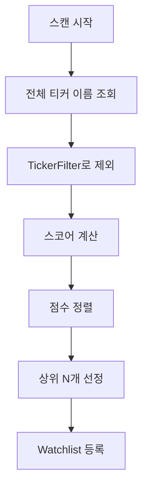

# 전체 유니버스 스캐닝 전략 변경 계획서

> **작성일**: 2026-01-10 04:25
> **우선순위**: 12 (Strategy) | **예상 소요**: 3-4h | **위험도**: 낮음
> **의존성**: 11-002 (DataRepository) 완료 후 진행 권장

---

## 0. 배경 및 동기

### 현재 방식

```
[Step 1] Universe Filter (500개)
    ├── 가격: $2~$10
    ├── 시가총액: $50M~$300M
    ├── Float: < 15M shares
    └── 평균 거래량: > 100K/day
         ↓
[Step 2] 스코어 계산 (500개)
         ↓
[Step 3] 상위 50개 Watchlist
```

### 문제점

1. **놓치는 종목**: Universe Filter 조건에 맞지 않는 잠재 종목 제외
2. **복잡한 로직**: Massive API `get_gainers_filtered()` + 필터 조건 유지보수
3. **점수 왜곡**: 500개 중 상위 vs 8000개 중 상위 → 상대 순위 차이

### 제안 방식

```
[Step 1] 전체 US 종목 스코어 계산 (8000개)
         ↓
[Step 2] 상위 N개 Watchlist 등록
```

---

## 1. 타당성 분석

### 1.1 성능 예측

| 단계 | 작업 | 시간 예측 |
|------|------|----------|
| 데이터 로드 | 8000 × 20일 일봉 (Parquet) | ~2초 |
| 지표 계산 | OBV, ATR, Tight Range 등 | ~20-30초 |
| 정렬 | 8000개 정렬 | <1초 |
| **총합** | | **~30초** |

### 1.2 메모리

| 항목 | 크기 |
|------|------|
| 8000 × 20일 OHLCV | ~50 MB |
| 스코어 결과 | ~1.6 MB |
| **총합** | ~52 MB (여유) |

### 1.3 API 호출

| 시나리오 | API 호출 |
|----------|----------|
| 모든 종목 로컬에 있음 | 0회 |
| 누락 종목 있음 (auto_fill) | 누락 수 × API 호출 |

> ⚠️ **주의**: 8000개 중 누락 많으면 Rate Limit 문제. 사전 데이터 수집 필요.

---

## 2. 설계

### 2.1 변경 전후 비교

```
# 현재
tickers = await massive.get_gainers_filtered(
    price_min=2, price_max=10,
    market_cap_min=50e6, market_cap_max=300e6,
    ...
)  # ~500개
scores = [calculate_score(t) for t in tickers]

# 변경 후
tickers = repo.get_all_tickers()  # ~8000개
scores = [calculate_score(t) for t in tickers]
watchlist = sorted(scores, key=lambda x: x['score'], reverse=True)[:50]
```

### 2.2 새로운 스캔 흐름



### 2.3 TickerFilter - 제외 티커 패턴

> 데이터 조회 **전에** 티커 이름만으로 제외 대상 필터링 → API/DB 호출 최소화

#### 자동 제외 패턴

| 패턴 | 유형 | 이유 |
|------|------|------|
| `W`, `WS` suffix | Warrant | 기초자산과 디커플링, 변동성 과잉 |
| `+` suffix | Preferred Stock | 유동성 낮음, 일반주와 특성 다름 |
| `R` suffix | Rights | 단기 존재, 희소 거래 |
| `U` suffix, `UNIT` contains | Units | SPAC 초기 복합증권 |

#### 설정 파일

```yaml
# backend/config/ticker_exclusions.yaml
patterns:
  - { type: suffix, value: "W" }      # Warrant
  - { type: suffix, value: "WS" }     # Warrant Series
  - { type: suffix, value: "+" }      # Preferred
  - { type: suffix, value: "R" }      # Rights
  - { type: suffix, value: "U" }      # Units
  - { type: contains, value: "UNIT" } # Units

manual_exclusions: []  # 수동 제외 티커
whitelist: []          # 패턴 예외 (제외 안함)
```

#### 구현 파일

- `backend/core/ticker_filter.py` - `TickerFilter` 클래스
- `backend/config/ticker_exclusions.yaml` - 설정 파일

### 2.4 옵션: Hybrid 방식

필터링 완전 제거가 부담스러우면 내장 필터로 단순화:

```python
# 스코어 계산 후 필터링 (선택적)
scores = [s for s in all_scores if s['price'] >= 2 and s['price'] <= 10]
```

---

## 3. 변경 대상 파일

| 파일 | 변경 내용 | 상태 |
|------|----------|------|
| `backend/config/ticker_exclusions.yaml` | **[NEW]** 제외 패턴 설정 | ⬜ 대기 |
| `backend/core/ticker_filter.py` | **[NEW]** TickerFilter 클래스 | ⬜ 대기 |
| `backend/core/scanner.py` | Universe Filter 제거, TickerFilter 적용 | ⬜ 대기 |
| `backend/core/realtime_scanner.py` | 동일 (필요시) | ⬜ 대기 |
| `backend/strategies/seismograph/strategy.py` | `get_universe_filter()` 정리 | ⬜ 대기 |

---

## 4. 실행 계획

### Step 1: 데이터 가용성 확인 (0.5h)

```python
# 현재 Parquet에 몇 개 티커 있는지 확인
repo = DataRepository(...)
tickers = repo.get_all_tickers()
print(f"Available tickers: {len(tickers)}")
```

- [ ] 8000개 이상 있으면 → 진행
- [ ] 부족하면 → 데이터 수집 (별도 작업)

### Step 2: Scanner 수정 (1-2h)

- [ ] `scanner.py` - `get_universe_filter()` 호출 제거
- [ ] `repo.get_all_tickers()` 사용
- [ ] 전체 스코어 계산 → 상위 N개 반환

### Step 3: Strategy 수정 (1h)

- [ ] `seismograph/strategy.py` - `get_universe_filter()` 제거 또는 빈 구현
- [ ] 관련 테스트 수정

### Step 4: 성능 검증 (0.5h)

```python
import time
start = time.time()
scores = scanner.scan_all()  # 전체 스캔
print(f"Scan time: {time.time() - start:.2f}s")
# 목표: < 60초
```

---

## 5. 검증 계획

### 5.1 자동화 테스트

```bash
pytest tests/test_scanner.py -v
pytest tests/test_strategy.py -v
```

### 5.2 수동 검증

1. **스캔 시간**: < 60초
2. **Watchlist 품질**: 상위 50개 종목 확인
3. **GUI 정상**: `python -m frontend` → Watchlist 표시

---

## 6. 롤백 계획

1. Git revert
2. Universe Filter 코드 복원
3. `get_gainers_filtered()` 호출 복원

---

## 7. 결정 필요 사항

> [!IMPORTANT]
> 1. **필터 완전 제거** vs **스코어 후 필터링** (Hybrid)?
> 2. **데이터 부족 시**: 사전 수집 vs auto_fill에 맡김?
> 3. **Watchlist 크기**: 현재 50개 유지 vs 조정?

---

## 8. 관련 문서

- [11-002_data_repository.md](file:///d:/Codes/Sigma9-0.1/docs/Plan/refactor/11-002_data_repository.md) - DataRepository (의존성)
- [seismograph.md](file:///d:/Codes/Sigma9-0.1/docs/context/strategy/seismograph.md) - 현재 스캐닝 전략
- [MPlan.md](file:///d:/Codes/Sigma9-0.1/.agent/Ref/MPlan.md) - Phase 1 Setup 전략

---

## 9. 실행 전 체크리스트

- [ ] 11-002 DataRepository 완료 확인
- [ ] 로컬 Parquet 티커 수 ≥ 5000개 확인
- [ ] `/IMP-execution` 워크플로우 따라 실행
