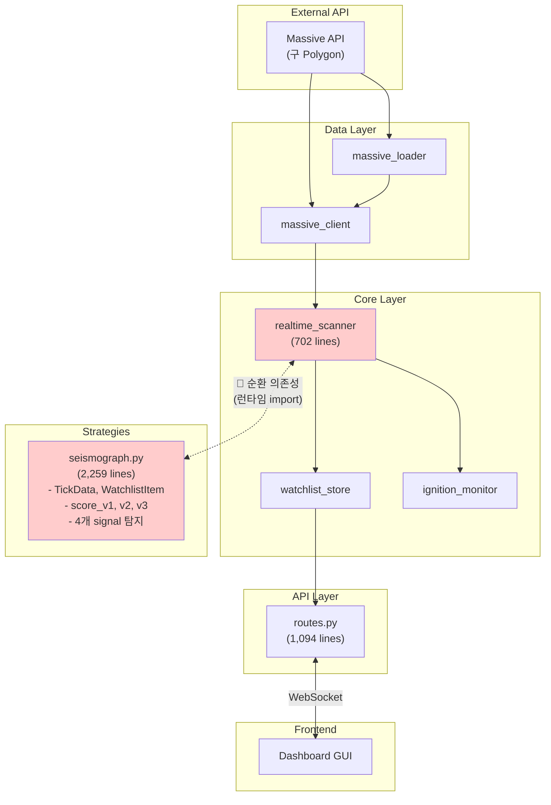
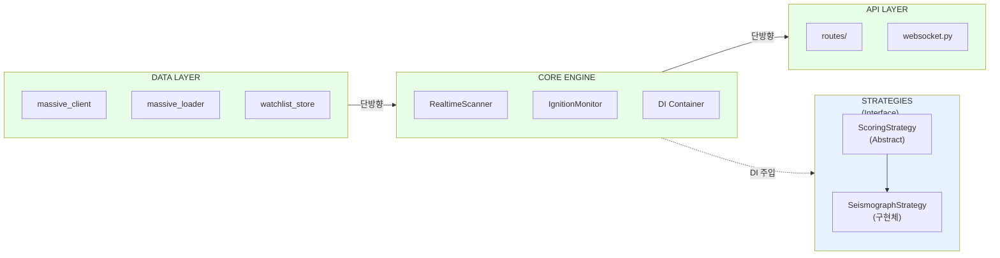

# Sigma9 리팩터링 가이드

> **버전**: v2.2 (2026-01-07)  
> **목적**: 리팩터링 품질 보장을 위한 자동화 체계  
> **최종 수정**: 2026-01-07 | 목차, Domain Migration 상태 추가

**관련 문서**:
- [운영 정책](./OPERATIONAL_POLICIES.md) - 장애 모드, 감사, 보안
- [아키텍처](./ARCHITECTURE.md) - 시스템 구조, 데이터 플로우
- [전략 문서](./STRATEGY.md) - MEP, Seismograph 전략

> [!NOTE]
> **Domain Migration 진행 중**: `Polygon → Massive` 명칭 변경 작업이 진행 중입니다.
> 본 문서의 일부 코드 예시에 `polygon_*` 명칭이 남아있을 수 있으며, 마이그레이션 완료 시 `massive_*`로 대체됩니다.

---

## 목차

1. [코드베이스 현황](#1-코드베이스-현황)
2. [리팩터링 우선순위](#2-리팩터링-우선순위)
3. [자동화 도구](#3-자동화-도구)
4. [리팩터링 도구 사용 정책](#4-리팩터링-도구-사용-정책)
5. [Dependency Injection 패턴](#5-dependency-injection-패턴)
6. [CI/CD GitHub Actions](#6-cicd-github-actions)
7. [Architecture Tests](#7-architecture-tests)
8. [PR 체크리스트](#8-pr-체크리스트)
9. [커밋 컨벤션](#9-커밋-컨벤션)
10. [설치 명령어](#10-설치-명령어)

---

## 1. 코드베이스 현황

### 1.1 모듈 구조

| 모듈 | 파일 수 | 핵심 역할 |
|------|---------|----------|
| **backend/core/** | 22 | 전략 엔진, 스캐너, 리스크 관리 |
| **backend/api/** | 3 | FastAPI REST/WebSocket |
| **backend/data/** | 7 | DB, Polygon API, Watchlist |
| **backend/strategies/** | 4 | Seismograph 전략 |
| **frontend/gui/** | 10 | PyQt6 대시보드 |
| **frontend/services/** | 5 | BackendClient, 어댑터 |

### 1.2 주요 문제점

> **라인 수 기준**: 2026-01-07 측정

| 파일 | 라인 수 | 문제 |
|------|---------|------|
| `seismograph.py` | 2,259 | God Class (9+ 책임) |
| `dashboard.py` | 2,565 | Monolithic GUI |
| `routes.py` | 1,094 | 15개 엔드포인트 혼재 |
| `realtime_scanner.py` | 702 | Singleton + 순환 의존성 |

### 1.3 순환 의존성

> 상세 데이터 플로우 다이어그램은 [섹션 1.5](#15-데이터-플로우-시각화) 참조

```
realtime_scanner.py ←→ seismograph.py  (런타임 import로 회피 중)
```

**런타임 Import 위치**:
```python
# backend/core/realtime_scanner.py (Line 94)
from backend.strategies.seismograph import SeismographStrategy

# backend/core/realtime_scanner.py (Line 338)
from backend.data.watchlist_store import load_watchlist, save_watchlist
```

### 1.4 Singleton Anti-Pattern

| 모듈 | 패턴 | 문제점 |
|------|------|--------|
| `realtime_scanner.py` | `_scanner_instance` | 테스트 어려움, 상태 오염 |
| `ignition_monitor.py` | `get_ignition_monitor()` | 의존성 주입 불가 |
| `backend_client.py` | `BackendClient.instance()` | 멀티 인스턴스 테스트 불가 |

### 1.5 데이터 플로우 시각화

#### 현재 데이터 플로우 (문제점)



**문제점 요약**:
- 🔴 `realtime_scanner` ↔ `seismograph` 순환 의존성 (런타임 import로 회피 중)
- 🔴 God Class: `seismograph.py` 2,259줄, 9+ 책임
- 🔴 Monolithic: `routes.py` 1,094줄, 15개 엔드포인트 혼재

#### 목표 데이터 플로우 (개선)



**개선 목표**:
- ✅ **단방향 의존성**: Data → Core → API
- ✅ **순환 없음**: 인터페이스 추출로 DIP 적용
- ✅ **DI Container**: 전역 싱글톤 제거, 테스트 용이성 확보

---

## 2. 리팩터링 우선순위

**총 예상 시간**: 22-31시간

| 순위 | 대상 | 예상 소요 | 위험도 |
|------|------|----------|--------|
| 1 | 인터페이스 추출 (순환 해소) | 2-3h | 낮음 |
| 2 | DI Container 도입 | 3-4h | 낮음 |
| 3 | `seismograph.py` 분리 | 6-8h | 중간 |
| 4 | `server.py` lifespan 분리 | 2-3h | 낮음 |
| 5 | `dashboard.py` 분리 | 6-8h | 중간 |
| 6 | `routes.py` 분할 | 2-3h | 낮음 |
| 7 | 데이터 모델 통합 | 1-2h | 낮음 |

### 2.1 seismograph.py 분리 제안

```
strategies/seismograph/
├── __init__.py          # SeismographStrategy (진입점)
├── models.py            # TickData, WatchlistItem
├── scoring/             # 점수 계산 모듈
│   ├── __init__.py
│   ├── v1.py            # Stage-based scoring
│   ├── v2.py            # Weighted intensity
│   └── v3.py            # Pinpoint algorithm
└── signals/             # 시그널 탐지 모듈
    ├── __init__.py
    ├── tight_range.py
    ├── obv_divergence.py
    ├── accumulation_bar.py
    └── volume_dryout.py
```

### 2.2 dashboard.py 분리 제안

```
gui/
├── dashboard.py              # 메인 윈도우 (조합자)
├── panels/
│   ├── watchlist_panel.py    # 워치리스트 테이블
│   ├── tier2_panel.py        # Hot Zone
│   ├── chart_panel.py        # 차트 컨테이너
│   └── log_panel.py          # 로그 패널
└── state/
    └── dashboard_state.py    # 중앙 상태 관리
```

### 2.3 routes.py 분할 제안

```
api/routes/
├── __init__.py           # 라우터 조합
├── status.py             # /status, /engine/*
├── watchlist.py          # /watchlist/*
├── scanner.py            # /scanner/*, /gainers/*
├── chart.py              # /chart/*
├── backtest.py           # /backtest/*
└── websocket.py          # WebSocket 핸들러
```

### 2.4 Model 중앙화 제안

현재 데이터클래스가 여러 모듈에 분산되어 있음. 단일 `models/` 디렉터리로 통합:

```
backend/models/
├── __init__.py
├── watchlist.py      # WatchlistItem, WatchlistState
├── tick.py           # TickData, TickBuffer
├── order.py          # OrderRequest, OrderResult
└── config.py         # EngineConfig, ScannerConfig
```

### 2.5 Core 모듈 그룹화 제안

현재 `backend/core/`에 22개 파일이 평면적으로 산재. 논리적 그룹으로 재구성:

```
backend/core/
├── scanning/         # scanner, ignition_monitor
├── tick/             # broadcaster, dispatcher
├── backtest/         # engine, report
├── trading/          # order_manager, risk_manager
├── analysis/         # technical_analysis, zscore
├── audit/            # decision_logger, failure_modes (← 운영 정책 참조)
└── interfaces/       # scoring.py (추상 클래스)
```

---

## 3. 자동화 도구

### 3.1 Ruff (Lint + Format)

```toml
# pyproject.toml
[tool.ruff]
target-version = "py310"
line-length = 100
exclude = [".venv", "__pycache__", "docs/references", "*.ipynb"]

[tool.ruff.format]
quote-style = "double"
indent-style = "space"
docstring-code-format = true

[tool.ruff.lint]
select = ["E", "W", "F", "I", "B", "C4", "UP", "SIM", "TCH", "RUF", "PTH", "PL"]
ignore = ["E501", "PLR0913"]

[tool.ruff.lint.per-file-ignores]
"tests/**/*.py" = ["S101", "PLR2004"]
"**/__init__.py" = ["F401"]

[tool.ruff.lint.isort]
combine-as-imports = true
known-first-party = ["backend", "frontend"]
section-order = ["future", "standard-library", "third-party", "first-party", "local-folder"]
```

### 3.2 mypy (Type Check)

```toml
[tool.mypy]
python_version = "3.10"
warn_return_any = true
disallow_untyped_defs = true
disallow_incomplete_defs = true
check_untyped_defs = true
no_implicit_optional = true
show_error_codes = true

[[tool.mypy.overrides]]
module = ["backend.strategies.seismograph", "frontend.gui.dashboard"]
disallow_untyped_defs = false  # 리팩터링 전까지 임시 완화

[[tool.mypy.overrides]]
module = ["ib_insync.*", "qfluentwidgets.*", "pandas_ta.*"]
ignore_missing_imports = true
```

### 3.3 import-linter (경계 규칙)

```toml
[tool.importlinter]
root_package = "."

# 규칙 1: Backend ↔ Frontend 분리
[[tool.importlinter.contracts]]
name = "Backend-Frontend Separation"
type = "independence"
modules = ["backend", "frontend"]

# 규칙 2: 레이어 의존성 방향
[[tool.importlinter.contracts]]
name = "Backend Layer Order"
type = "layers"
layers = ["backend.api", "backend.core", "backend.strategies", "backend.data", "backend.broker"]

# 규칙 3: Data 모듈은 비즈니스 로직 import 금지
[[tool.importlinter.contracts]]
name = "Data Layer Independence"
type = "forbidden"
source_modules = ["backend.data"]
forbidden_modules = ["backend.strategies", "backend.core.realtime_scanner"]

# 규칙 4: Strategies는 Core 인터페이스만 의존
[[tool.importlinter.contracts]]
name = "Strategy Dependency Control"
type = "forbidden"
source_modules = ["backend.strategies"]
forbidden_modules = ["backend.api", "backend.core.realtime_scanner"]
```

### 3.4 pydeps (의존성 시각화)

```bash
# 순환 의존성 검출
pydeps backend --only backend --show-cycles --no-output

# 모듈별 의존성 그래프 생성
pydeps backend.strategies.seismograph -o docs/diagrams/seismograph_deps.svg
```

### 3.5 Pre-commit Hooks

```yaml
# .pre-commit-config.yaml
repos:
  - repo: https://github.com/astral-sh/ruff-pre-commit
    rev: v0.4.4
    hooks:
      - id: ruff
        args: [--fix]
      - id: ruff-format

  - repo: https://github.com/pre-commit/mirrors-mypy
    rev: v1.10.0
    hooks:
      - id: mypy
        additional_dependencies: [types-PyYAML, pydantic]

  - repo: https://github.com/pre-commit/pre-commit-hooks
    rev: v4.6.0
    hooks:
      - id: trailing-whitespace
      - id: end-of-file-fixer
      - id: check-yaml
      - id: check-added-large-files
        args: ['--maxkb=500']
```

---

## 4. 리팩터링 도구 사용 정책

> [!IMPORTANT]
> 아래 도구는 **모든 리팩터링 PR에서 필수**로 실행해야 합니다.

| 도구 | 버전 | 실행 시점 | 강제 조건 |
|------|------|-----------|-----------|
| **import-linter** | 설치됨 | PR 전, 매 커밋 | `lint-imports` 실패 시 PR 머지 불가 |
| **pydeps** | 3.x | 신규 모듈 추가 시 | 순환 의존성 검출 시 리팩터링 필수 |
| **dependency-injector** | 4.x | 신규 서비스 생성 시 | 전역 싱글톤 사용 금지 |

### 사용 규칙

#### import-linter (경계 검증)
- **필수**: `lint-imports` 명령어를 모든 PR 전에 실행
- **실패 허용 안 됨**: 계층 위반 또는 순환 import 감지 시 즉시 수정
- **예외 신청**: `# import-linter: ignore` 주석과 함께 PR 설명에 명시

#### pydeps (의존성 분석)
- **신규 모듈 추가 시**: `pydeps --show-cycles` 실행 후 결과를 PR에 첨부
- **순환 감지 시**: 해당 PR에서 순환 해소 필수

#### dependency-injector (DI 컨테이너)
- **신규 서비스**: 반드시 `Container`에 등록 후 주입받아 사용
- **금지 패턴**: `get_*_instance()`, 전역 `_instance` 변수

---

## 5. Dependency Injection 패턴

### 5.0 인터페이스 추출 (순환 해소 선행 작업)

DI 도입 전, 순환 의존성 해소를 위해 **인터페이스 추출**이 선행되어야 함:

```python
# backend/core/interfaces/scoring.py
from abc import ABC, abstractmethod
from typing import Any

class ScoringStrategy(ABC):
    """Score 계산 인터페이스 - 순환 의존성 해소를 위한 DIP"""
    
    @abstractmethod
    def calculate_score(self, tick_data: Any, watchlist_item: Any) -> float:
        pass
```

**적용 방식**:
- `SeismographStrategy`가 위 인터페이스 구현
- `realtime_scanner`는 인터페이스에만 의존 (구현체 직접 import 안 함)
- DI Container가 런타임에 구현체 주입

### 5.1 현재 (Anti-pattern)

```python
# 전역 싱글톤
scanner = get_realtime_scanner()
```

### 5.2 개선 (DI Container)

```python
from dependency_injector import containers, providers

class Container(containers.DeclarativeContainer):
    db_client = providers.Singleton(DatabaseClient, url=config.db.url)
    
    scanner = providers.Singleton(
        RealtimeScanner,
        db=db_client,  # ← Dependency Injection
    )
```

**장점**: 테스트 시 Mock 교체 용이, 전역 상태 오염 방지, 객체 수명 명확화

---

## 6. CI/CD GitHub Actions

### 6.1 Lint & Format Check

```yaml
# .github/workflows/lint.yml
name: Lint & Format
on:
  push:
    branches: [main, develop]
  pull_request:
    branches: [main, develop]

jobs:
  lint:
    runs-on: ubuntu-latest
    steps:
      - uses: actions/checkout@v4
      - uses: actions/setup-python@v5
        with:
          python-version: "3.10"
      - run: pip install ruff mypy import-linter
      - run: ruff format --check .
      - run: ruff check .
      - run: mypy backend frontend
      - run: lint-imports
```

### 6.2 Architecture Tests

```yaml
# .github/workflows/architecture.yml
name: Architecture Tests
on:
  pull_request:
    branches: [main, develop]

jobs:
  arch-test:
    runs-on: ubuntu-latest
    steps:
      - uses: actions/checkout@v4
      - uses: actions/setup-python@v5
        with:
          python-version: "3.10"
      - run: pip install pytest
      - run: pytest tests/architecture/ -v
```

---

## 7. Architecture Tests

### 7.1 파일 크기 제한 테스트

```python
# tests/architecture/test_file_size.py
MAX_LINES = 500
EXCEPTIONS = {"backend/strategies/seismograph.py", "frontend/gui/dashboard.py"}

@pytest.mark.parametrize("filepath", get_python_files())
def test_file_size_limit(filepath):
    if relative in EXCEPTIONS:
        pytest.skip(f"Exception: {relative}")
    assert len(lines) <= MAX_LINES
```

### 7.2 God Class 방지 테스트

```python
# tests/architecture/test_class_size.py
MAX_METHODS = 30
MAX_CLASS_LINES = 400
EXCEPTIONS = {"SeismographStrategy", "Sigma9Dashboard"}
```

---

## 8. PR 체크리스트

### 기본 체크
- [ ] `ruff format` 통과
- [ ] `ruff check` 통과
- [ ] `mypy` 통과

### 리팩터링 체크
- [ ] `lint-imports` 통과 (순환 의존성 없음)
- [ ] Backend ↔ Frontend 분리 유지
- [ ] 신규 파일 ≤ 500 라인
- [ ] 신규 클래스 ≤ 30 메서드
- [ ] Singleton 대신 DI 사용

---

## 9. 커밋 컨벤션

```
<type>(<scope>): <description>

예시:
refactor(seismograph): extract score_v3 module
fix(dashboard): resolve watchlist flickering
feat(scanner): add realtime gainer detection
```

| Type | 설명 |
|------|------|
| `feat` | 새 기능 |
| `fix` | 버그 수정 |
| `refactor` | 리팩터링 |
| `perf` | 성능 개선 |
| `test` | 테스트 |
| `docs` | 문서 |
| `chore` | 빌드/도구 |

| Scope | 대상 |
|-------|------|
| `api` | backend/api/ |
| `core` | backend/core/ |
| `scanner` | realtime_scanner, ignition_monitor |
| `seismograph` | Seismograph 전략 |
| `dashboard` | frontend/gui/dashboard.py |
| `gui` | frontend/gui/ 전체 |

---

## 10. 설치 명령어

```bash
# 개발 도구 설치
pip install ruff mypy import-linter pre-commit pydeps dependency-injector

# Pre-commit 설정
pre-commit install

# 전체 검사
pre-commit run --all-files
lint-imports
pytest tests/architecture/ -v
```

*의존성 다이어그램: `docs/diagrams/backend_architecture.svg` 참조*  
*운영 정책 (장애 모드, 감사, 보안): [OPERATIONAL_POLICIES.md](./OPERATIONAL_POLICIES.md) 참조*

