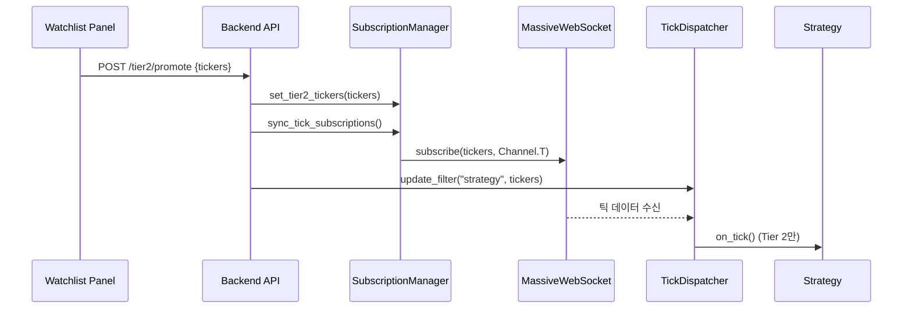

# Step 4.A.0.d: Tier 2 동적 틱 구독 계획

> **버전**: 1.0  
> **작성일**: 2026-01-02  
> **선행 조건**: Step 4.A.0.c 완료  

---

## 📋 문제 정의

### 현재 상태
```
서버 시작 → TickDispatcher에 전략 등록 (1회)
           → 모든 틱이 전략에 전달됨 (비효율)
```

### 문제점
1. Tier 2 승격 시 T채널 구독이 자동으로 갱신되지 않음
2. `SubscriptionManager`에 메서드 존재하나 **호출부 없음**
3. 불필요한 종목 틱까지 전략에 전달 (성능 저하)

---

## 🎯 목표 상태

```
Tier 2 승격 이벤트 발생
    ↓
1. SubscriptionManager.set_tier2_tickers() 호출
2. sync_tick_subscriptions() → T채널 구독 갱신
3. TickDispatcher 필터 업데이트 (Tier 2만 전략 전달)
```

---

## 📝 구현 계획

### 1. API 엔드포인트 추가

| 파일 | 변경 |
|------|------|
| `backend/api/routes.py` | `POST /api/tier2/promote` 엔드포인트 추가 |

```python
@router.post("/tier2/promote")
async def promote_to_tier2(tickers: List[str]):
    # 1. SubscriptionManager 업데이트
    # 2. T채널 구독
    # 3. TickDispatcher 필터 업데이트
```

---

### 2. SubscriptionManager 연동

| 파일 | 변경 |
|------|------|
| `backend/server.py` | Tier 2 변경 시 sync 호출 로직 추가 |

---

### 3. TickDispatcher 필터 업데이트

| 파일 | 변경 |
|------|------|
| `backend/core/tick_dispatcher.py` | 전략에 Tier 2 종목만 전달 |

- `update_filter("strategy", tier2_tickers)` 호출 추가

---

### 4. GUI → Backend 연동

| 파일 | 변경 |
|------|------|
| `frontend/services/rest_adapter.py` | `promote_to_tier2()` 메서드 추가 |
| `frontend/panels/watchlist_panel.py` | Tier 2 버튼 클릭 시 API 호출 |

---

## 📊 데이터 흐름



---

## ✅ 완료 조건

1. [ ] Tier 2 승격 API 동작
2. [ ] T채널 자동 구독/해제
3. [ ] 전략에 Tier 2 종목만 전달
4. [ ] GUI에서 Tier 2 승격 가능

---

## ⏱️ 예상 시간

| 작업 | 예상 시간 |
|------|----------|
| API 엔드포인트 | 15분 |
| SubscriptionManager 연동 | 10분 |
| TickDispatcher 필터 | 10분 |
| GUI 연동 | 20분 |
| **총계** | **55분** |
