# Data Flow 통합 문서

> **생성일**: 2026-01-16
> 
> `docs/_architecture` 내 모든 문서의 `### Data Flow` 섹션을 통합한 문서입니다.

---

## 목차

- **root/**
  - [🏗️ 대규모 아키텍처 문서화 프로젝트 계획서](#1)
- **backend/**
  - [__main__.py](#2)
- **backend/api/**
  - [websocket.py](#3)
- **backend/broker/**
  - [ibkr_connector.py](#4)
- **backend/**
  - [container.py](#5)
- **backend/core/**
  - [audit_logger.py](#6)
  - [backtest_engine.py](#7)
  - [backtest_report.py](#8)
  - [config_loader.py](#9)
  - [deduplicator.py](#10)
  - [divergence_detector.py](#11)
  - [double_tap.py](#12)
  - [event_sequencer.py](#13)
  - [ignition_monitor.py](#14)
- **backend/core/interfaces/**
  - [interfaces/scoring.py](#15)
- **backend/core/**
  - [mock_data.py](#16)
  - [order_manager.py](#17)
  - [realtime_scanner.py](#18)
  - [risk_manager.py](#19)
  - [scanner.py](#20)
  - [scheduler.py](#21)
  - [strategy_base.py](#22)
  - [strategy_loader.py](#23)
  - [subscription_manager.py](#24)
  - [technical_analysis.py](#25)
  - [tick_broadcaster.py](#26)
  - [tick_dispatcher.py](#27)
  - [ticker_filter.py](#28)
  - [trading_context.py](#29)
  - [trailing_stop.py](#30)
  - [zscore_calculator.py](#31)
- **backend/data/**
  - [data_repository.py](#32)
  - [database.py](#33)
  - [massive_client.py](#34)
- **backend/llm/**
  - [oracle.py](#35)
- **backend/**
  - [server.py](#36)
- **backend/strategies/seismograph/**
  - [seismograph/__init__.py](#37)
  - [strategy.py](#38)
- **frontend/**
  - [__main__.py](#39)
- **frontend/config/**
  - [loader.py](#40)
- **frontend/gui/chart/**
  - [chart_data_manager.py](#41)
  - [finplot_chart.py](#42)
- **frontend/gui/**
  - [chart_widget.py](#43)
  - [control_panel.py](#44)
  - [dashboard.py](#45)
- **frontend/gui/panels/**
  - [panels/__init__.py](#46)
  - [chart_panel.py](#47)
  - [log_panel.py](#48)
  - [oracle_panel.py](#49)
  - [position_panel.py](#50)
  - [resample_panel.py](#51)
  - [tier2_panel.py](#52)
  - [watchlist_panel.py](#53)
- **frontend/gui/**
  - [settings_dialog.py](#54)
- **frontend/gui/state/**
  - [dashboard_state.py](#55)
- **frontend/gui/**
  - [theme.py](#56)
  - [ticker_info_window.py](#57)
  - [watchlist_model.py](#58)
- **frontend/gui/widgets/**
  - [ticker_search_bar.py](#59)
  - [time_display_widget.py](#60)
- **frontend/gui/**
  - [window_effects.py](#61)
- **frontend/**
  - [main.py](#62)
- **frontend/services/**
  - [backend_client.py](#63)
  - [chart_data_service.py](#64)
  - [rest_adapter.py](#65)
  - [ws_adapter.py](#66)
- **root/**
  - [massive_rest_spec.json](#67)
  - [massive_websocket_spec.json](#68)
- **scripts/**
  - [analyze_daygainers.py](#69)
  - [build_control_group.py](#70)
  - [build_d1_features.py](#71)
  - [build_features_brute_force.py](#72)
  - [build_m_n_features.py](#73)
  - [check_minute_coverage.py](#74)
  - [download_target_minutes.py](#75)
  - [eda_features.py](#76)
  - [train_xgboost.py](#77)
- **tests/**
  - [test_double_tap.py](#78)
  - [test_ibkr_connector.py](#79)
  - [test_massive_loader.py](#80)
  - [test_score_v2.py](#81)
  - [test_score_v3.py](#82)
  - [test_strategies.py](#83)
  - [test_time_sync.py](#84)

---

## 📁 root/

### 1. 🏗️ 대규모 아키텍처 문서화 프로젝트 계획서
> 📄 `docs/_architecture/_plan.md`


---

## 📁 backend/

### 2. __main__.py
> 📄 `docs/_architecture/backend/__main__.md`


---

## 📁 backend/api/

### 3. websocket.py
> 📄 `docs/_architecture/backend/api/websocket.md`


---

## 📁 backend/broker/

### 4. ibkr_connector.py
> 📄 `docs/_architecture/backend/broker/ibkr_connector.md`


---

## 📁 backend/

### 5. container.py
> 📄 `docs/_architecture/backend/container.md`


---

## 📁 backend/core/

### 6. audit_logger.py
> 📄 `docs/_architecture/backend/core/audit_logger.md`


---

### 7. backtest_engine.py
> 📄 `docs/_architecture/backend/core/backtest_engine.md`


---

### 8. backtest_report.py
> 📄 `docs/_architecture/backend/core/backtest_report.md`

```mermaid
graph LR
    A["BacktestEngine"] -->|Trade 생성| B["BacktestReport"]
    B -->|metrics| C["CAGR, MDD, Sharpe, Win Rate"]
    B -->|equity_curve| D["시각화/분석"]
```



---

### 9. config_loader.py
> 📄 `docs/_architecture/backend/core/config_loader.md`


---

### 10. deduplicator.py
> 📄 `docs/_architecture/backend/core/deduplicator.md`


---

### 11. divergence_detector.py
> 📄 `docs/_architecture/backend/core/divergence_detector.md`

```mermaid
graph LR
    A["ZScoreCalculator"] -->|zenV, zenP| B["DivergenceDetector"]
    B -->|DivergenceSignal| C["Seismograph Strategy"]
    C -->|early alert| D["Ignition 전 조기 포착"]
```



---

### 12. double_tap.py
> 📄 `docs/_architecture/backend/core/double_tap.md`

```mermaid
graph TD
    A["1차 청산 이벤트"] -->|on_first_exit| B["DoubleTapManager"]
    B -->|3분 Cooldown| C["WATCHING 상태"]
    D["실시간 틱"] -->|update_market_data| C
    C -->|HOD 돌파| E["execute_reentry"]
    E -->|주문| F["OrderManager"]
```



---

### 13. event_sequencer.py
> 📄 `docs/_architecture/backend/core/event_sequencer.md`

```mermaid
graph LR
    A["Network (순서 역전)"] -->|event t=200| B["EventSequencer"]
    A -->|event t=100| B
    B -->|buffer 100ms| C["Ordered Events"]
    C -->|t=100, t=200| D["Processor"]
```



---

### 14. ignition_monitor.py
> 📄 `docs/_architecture/backend/core/ignition_monitor.md`

```mermaid
graph TD
    A["Massive API"] -->|1초 폴링| B["IgnitionMonitor"]
    B -->|현재가| C["SeismographStrategy"]
    C -->|Ignition Score| B
    B -->|broadcast| D["WebSocket"]
    D --> E["GUI Dashboard"]
```



---

## 📁 backend/core/interfaces/

### 15. interfaces/scoring.py
> 📄 `docs/_architecture/backend/core/interfaces/scoring.md`


---

## 📁 backend/core/

### 16. mock_data.py
> 📄 `docs/_architecture/backend/core/mock_data.md`


---

### 17. order_manager.py
> 📄 `docs/_architecture/backend/core/order_manager.md`


---

### 18. realtime_scanner.py
> 📄 `docs/_architecture/backend/core/realtime_scanner.md`


---

### 19. risk_manager.py
> 📄 `docs/_architecture/backend/core/risk_manager.md`


---

### 20. scanner.py
> 📄 `docs/_architecture/backend/core/scanner.md`


---

### 21. scheduler.py
> 📄 `docs/_architecture/backend/core/scheduler.md`

```mermaid
graph TD
    A["APScheduler"] -->|trigger| B["TradingScheduler"]
    B -->|09:15 ET| C["market_open_callback"]
    C --> D["Scanner.scan()"]
    B -->|16:30 ET| E["data_update_callback"]
    E --> F["DataRepository.update_daily()"]
```

---

### 22. strategy_base.py
> 📄 `docs/_architecture/backend/core/strategy_base.md`

```mermaid
graph LR
    A["StrategyBase (ABC)"] -->|implement| B["SeismographStrategy"]
    B -->|Signal| C["TradingEngine"]
    B -->|score| D["Scanner / IgnitionMonitor"]
```

---

### 23. strategy_loader.py
> 📄 `docs/_architecture/backend/core/strategy_loader.md`

```mermaid
graph LR
    A["strategies/"] -->|discover| B["StrategyLoader"]
    B -->|importlib| C["Python Module"]
    C -->|find class| D["StrategyBase subclass"]
    D -->|instance| E["Strategy Object"]
```

---

### 24. subscription_manager.py
> 📄 `docs/_architecture/backend/core/subscription_manager.md`

```mermaid
graph LR
    A["Watchlist 변경"] -->|sync| B["SubscriptionManager"]
    B -->|subscribe/unsubscribe| C["MassiveWebSocketClient"]
    C -->|AM/T data| D["TickBroadcaster"]
```

---

### 25. technical_analysis.py
> 📄 `docs/_architecture/backend/core/technical_analysis.md`

```mermaid
graph LR
    A["OHLCV Bars"] --> B["TechnicalAnalysis"]
    B -->|VWAP| C["Entry Decision"]
    B -->|ATR| D["DynamicStopLoss"]
    D --> E["Stop/Target Levels"]
```

---

### 26. tick_broadcaster.py
> 📄 `docs/_architecture/backend/core/tick_broadcaster.md`

```mermaid
graph LR
    A["Massive WebSocket"] -->|AM/T| B["TickBroadcaster"]
    B -->|format| C["ConnectionManager"]
    C -->|WebSocket| D["GUI Clients"]
    B -->|dispatch| E["TickDispatcher"]
    E --> F["Internal Subscribers"]
```

---

### 27. tick_dispatcher.py
> 📄 `docs/_architecture/backend/core/tick_dispatcher.md`

```mermaid
graph LR
    A["TickBroadcaster"] -->|dispatch| B["TickDispatcher"]
    B -->|filter: AAPL| C["Strategy"]
    B -->|filter: all| D["TrailingStop"]
    B -->|filter: TSLA| E["DoubleTap"]
```

---

### 28. ticker_filter.py
> 📄 `docs/_architecture/backend/core/ticker_filter.md`

```mermaid
graph LR
    A["Gainers API"] -->|tickers| B["TickerFilter"]
    B -->|valid| C["Scanner/Watchlist"]
    B -->|excluded| D["Discarded"]
```

---

### 29. trading_context.py
> 📄 `docs/_architecture/backend/core/trading_context.md`

```mermaid
graph LR
    A["GUI Ticker Selection"] -->|set| B["TradingContext"]
    B -->|notify| C["SubscriptionManager"]
    B -->|notify| D["IgnitionMonitor"]
    B -->|notify| E["Chart Service"]
```

---

### 30. trailing_stop.py
> 📄 `docs/_architecture/backend/core/trailing_stop.md`

```mermaid
graph LR
    A["TickDispatcher"] -->|price| B["TrailingStopManager"]
    B -->|update| C["TrailingStopEntry"]
    C -->|stop triggered| D["OrderManager"]
    D -->|sell| E["IBKRConnector"]
```

---

### 31. zscore_calculator.py
> 📄 `docs/_architecture/backend/core/zscore_calculator.md`

```mermaid
graph LR
    A["OHLCV Bars"] --> B["ZScoreCalculator"]
    B -->|zenV| C["Seismograph"]
    B -->|zenP| C
    C --> D["Divergence Detector"]
    D --> E["Early Alert"]
```

---

## 📁 backend/data/

### 32. data_repository.py
> 📄 `docs/_architecture/backend/data/data_repository.md`

```mermaid
graph TD
    A["Consumer (Scanner, Backtest, API)"] -->|get_daily_bars| B["DataRepository"]
    B -->|read| C["ParquetManager"]
    C -->|있으면| D["DataFrame 반환"]
    C -->|없으면| E["_fill_daily_gaps"]
    E -->|API 호출| F["MassiveClient"]
    F -->|저장| C
    C --> D
```

---

### 33. database.py
> 📄 `docs/_architecture/backend/data/database.md`

```mermaid
graph TD
    A["MassiveClient"] -->|API 응답| B["MarketDB"]
    B -->|upsert| C["SQLite DB"]
    D["DataRepository"] -->|조회| B
    B -->|SELECT| C
    C -->|결과| D
```

---

### 34. massive_client.py
> 📄 `docs/_architecture/backend/data/massive_client.md`

```mermaid
graph LR
    A["DataRepository"] -->|Gap Fill| B["MassiveClient"]
    B -->|HTTP| C["Massive.com API"]
    C -->|JSON| B
    B -->|DataFrame| A
```

---

## 📁 backend/llm/

### 35. oracle.py
> 📄 `docs/_architecture/backend/llm/oracle.md`

```mermaid
graph LR
    A["routes/llm.py"] -->|analyze request| B["LLMOracle"]
    B -->|route to| C["OpenAIProvider"]
    B -->|route to| D["AnthropicProvider"]
    B -->|route to| E["GoogleProvider"]
    C -->|response| A
    D -->|response| A
    E -->|response| A
```

---

## 📁 backend/

### 36. server.py
> 📄 `docs/_architecture/backend/server.md`

```mermaid
graph TD
    subgraph Startup
        A["__main__.py"] -->|uvicorn.run| B["server.py"]
        B -->|initialize_config| C["startup/config.py"]
        B -->|initialize_database| D["startup/database.py"]
        B -->|initialize_realtime| E["startup/realtime.py"]
    end
    
    subgraph Runtime
        F["WebSocket Client"] -->|/ws/feed| B
        B -->|broadcast| G["ws_manager"]
        B -->|include_router| H["api/routes"]
    end
    
    subgraph Shutdown
        B -->|shutdown_all| I["startup/shutdown.py"]
    end
```

---

## 📁 backend/strategies/seismograph/

### 37. seismograph/__init__.py
> 📄 `docs/_architecture/backend/strategies/seismograph/__init__.md`

```mermaid
graph TD
    A["외부 코드"] -->|import| B["seismograph/__init__.py"]
    B -->|re-export| C["SeismographStrategy"]
    B -->|re-export| D["TickData, WatchlistItem"]
```

---

### 38. strategy.py
> 📄 `docs/_architecture/backend/strategies/seismograph/strategy.md`

```mermaid
graph TD
    A["Daily Bars"] --> B["SeismographStrategy"]
    B -->|calculate_watchlist_score_v3| C["scoring/v3.py"]
    C --> D["Watchlist Score 0~100"]
    
    E["Tick Data"] --> B
    B -->|calculate_trigger_score| F["Ignition Score"]
```

---

## 📁 frontend/

### 39. __main__.py
> 📄 `docs/_architecture/frontend/__main__.md`

```mermaid
graph LR
    A["python -m frontend"] --> B["__main__.py"]
    B --> C["main.py::main()"]
```

---

## 📁 frontend/config/

### 40. loader.py
> 📄 `docs/_architecture/frontend/config/loader.md`

```mermaid
graph LR
    A["settings.yaml"] --> B["loader.py"]
    B --> C["theme.py"]
    B --> D["settings_dialog.py"]
    B --> E["backend_client.py"]
```

---

## 📁 frontend/gui/chart/

### 41. chart_data_manager.py
> 📄 `docs/_architecture/frontend/gui/chart/chart_data_manager.md`

```mermaid
graph LR
    A["FinplotChartWidget"] --> B["ChartDataManager"]
    B --> C["L1 Cache (Memory)"]
    B --> D["L2 Cache (SQLite) 향후"]
    E["ChartDataService"] --> B
```

---

### 42. finplot_chart.py
> 📄 `docs/_architecture/frontend/gui/chart/finplot_chart.md`

```mermaid
graph LR
    A["ChartPanel"] --> B["FinplotChartWidget"]
    B --> C["finplot"]
    C --> D["PyQtGraph"]
    E["ChartDataService"] --> A
    B -->|viewport_data_needed| F["Historical Loading"]
```

---

## 📁 frontend/gui/

### 43. chart_widget.py
> 📄 `docs/_architecture/frontend/gui/chart_widget.md`

```mermaid
graph LR
    A["ChartPanel"] --> B["ChartWidget"]
    B --> C["QWebEngineView"]
    C --> D["TradingView Lightweight Charts JS"]
    E["ChartDataService"] --> A
    B <--> F["ChartBridge"]
    F --> G["Python Handlers"]
```

---

### 44. control_panel.py
> 📄 `docs/_architecture/frontend/gui/control_panel.md`

```mermaid
graph LR
    A["Dashboard"] --> B["ControlPanel"]
    B --> C["StatusIndicator"]
    B --> D["TimeDisplayWidget"]
    B --> E["TickerSearchBar"]
    B -->|Signals| F["Dashboard Handlers"]
    F --> G["BackendClient"]
```

---

### 45. dashboard.py
> 📄 `docs/_architecture/frontend/gui/dashboard.md`

```mermaid
graph TD
    A["main.py"] --> B["Sigma9Dashboard"]
    B --> C["ControlPanel"]
    B --> D["WatchlistPanel"]
    B --> E["ChartPanel"]
    B --> F["PositionPanel"]
    B --> G["OraclePanel"]
    B --> H["LogPanel"]
    B --> I["BackendClient"]
    I --> J["REST/WebSocket"]
```

---

## 📁 frontend/gui/panels/

### 46. panels/__init__.py
> 📄 `docs/_architecture/frontend/gui/panels/__init__.md`

```mermaid
graph LR
    A["dashboard.py"] --> B["panels/__init__.py"]
    B --> C["WatchlistPanel"]
    B --> D["ChartPanel"]
    B --> E["PositionPanel"]
    B --> F["OraclePanel"]
    B --> G["LogPanel"]
```

---

### 47. chart_panel.py
> 📄 `docs/_architecture/frontend/gui/panels/chart_panel.md`

```mermaid
graph LR
    A["Dashboard"] --> B["ChartPanel"]
    B --> C["FinplotChartWidget"]
    D["ChartDataService"] --> B
    C --> E["Candlestick/VWAP/SMA"]
```

---

### 48. log_panel.py
> 📄 `docs/_architecture/frontend/gui/panels/log_panel.md`

```mermaid
graph LR
    A["BackendClient"] -->|log_message| B["Dashboard"]
    B --> C["LogPanel.log()"]
    C --> D["QTextEdit"]
```

---

### 49. oracle_panel.py
> 📄 `docs/_architecture/frontend/gui/panels/oracle_panel.md`

```mermaid
graph LR
    A["Dashboard"] --> B["OraclePanel"]
    B -->|why_clicked| C["LLM API"]
    C --> D["set_result()"]
    D --> E["QTextEdit"]
```

---

### 50. position_panel.py
> 📄 `docs/_architecture/frontend/gui/panels/position_panel.md`

```mermaid
graph LR
    A["BackendClient"] -->|positions_updated| B["Dashboard"]
    B --> C["PositionPanel"]
    C --> D["set_pnl()"]
    C --> E["add_position()"]
```

---

### 51. resample_panel.py
> 📄 `docs/_architecture/frontend/gui/panels/resample_panel.md`

```mermaid
graph LR
    A["SettingsDialog"] --> B["ResamplePanel"]
    B --> C["ResampleWorker"]
    C --> D["ParquetManager.resample_all()"]
    D --> E["Parquet Files"]
```

---

### 52. tier2_panel.py
> 📄 `docs/_architecture/frontend/gui/panels/tier2_panel.md`

```mermaid
graph LR
    A["BackendClient"] -->|ignition_updated| B["Dashboard"]
    B --> C["Tier2Panel"]
    C --> D["add_row() / set_row_data()"]
    D --> E["QTableWidget"]
```

---

### 53. watchlist_panel.py
> 📄 `docs/_architecture/frontend/gui/panels/watchlist_panel.md`

```mermaid
graph LR
    A["Dashboard"] --> B["WatchlistPanel"]
    B --> C["Tier2Panel"]
    B --> D["WatchlistModel"]
    D --> E["QSortFilterProxyModel"]
    E --> F["QTableView"]
```

---

## 📁 frontend/gui/

### 54. settings_dialog.py
> 📄 `docs/_architecture/frontend/gui/settings_dialog.md`

```mermaid
graph LR
    A["Dashboard"] --> B["SettingsDialog"]
    B --> C["settings.yaml"]
    B --> D["ParquetManager"]
    B --> E["Local Server (subprocess)"]
```

---

## 📁 frontend/gui/state/

### 55. dashboard_state.py
> 📄 `docs/_architecture/frontend/gui/state/dashboard_state.md`

```mermaid
graph TD
    A["Dashboard"] --> B["DashboardState"]
    B -->|ticker_changed| C["ChartPanel"]
    B -->|ticker_changed| D["TickerSearchBar"]
    B -->|tier2_updated| E["Tier2Panel"]
    B -->|log_message| F["LogPanel"]
```

---

## 📁 frontend/gui/

### 56. theme.py
> 📄 `docs/_architecture/frontend/gui/theme.md`

```mermaid
graph LR
    A["settings.yaml"] --> B["ThemeManager"]
    B --> C["get_color()"]
    B --> D["get_stylesheet()"]
    B --> E["get_button_style()"]
    C --> F["All GUI Widgets"]
    D --> F
    E --> F
```

---

### 57. ticker_info_window.py
> 📄 `docs/_architecture/frontend/gui/ticker_info_window.md`

```mermaid
graph LR
    A["Dashboard"] -->|더블클릭| B["TickerInfoWindow"]
    B -->|REST| C["Backend /api/ticker-info"]
    C --> D["InfoCard, DetailTable, ListSection"]
```

---

### 58. watchlist_model.py
> 📄 `docs/_architecture/frontend/gui/watchlist_model.md`

```mermaid
graph LR
    A["BackendClient"] -->|watchlist_updated| B["Dashboard"]
    B --> C["WatchlistModel.update_all()"]
    C --> D["QSortFilterProxyModel"]
    D --> E["QTableView"]
```

---

## 📁 frontend/gui/widgets/

### 59. ticker_search_bar.py
> 📄 `docs/_architecture/frontend/gui/widgets/ticker_search_bar.md`

```mermaid
graph LR
    A["User Input"] --> B["TickerSearchBar"]
    B -->|ticker_selected| C["Dashboard"]
    C --> D["DashboardState.select_ticker()"]
    D -->|ticker_changed| B
```

---

### 60. time_display_widget.py
> 📄 `docs/_architecture/frontend/gui/widgets/time_display_widget.md`

```mermaid
graph LR
    A["WebSocket"] -->|heartbeat| B["Dashboard"]
    B --> C["TimeDisplayWidget.update_from_heartbeat()"]
    C --> D["US Time Label"]
    C --> E["KR Time Label"]
    C --> F["Latency Labels"]
```

---

## 📁 frontend/gui/

### 61. window_effects.py
> 📄 `docs/_architecture/frontend/gui/window_effects.md`

```mermaid
graph LR
    A["CustomWindow"] --> B["WindowsEffects"]
    B --> C["user32.dll"]
    B --> D["dwmapi.dll"]
    C --> E["Acrylic/Mica Effect"]
    D --> E
```

---

## 📁 frontend/

### 62. main.py
> 📄 `docs/_architecture/frontend/main.md`

```mermaid
graph TD
    A["__main__.py"] --> B["main.py::main()"]
    B --> C["QApplication 생성"]
    C --> D["Sigma9Dashboard 생성"]
    D --> E["window.show()"]
    E --> F["app.exec() 이벤트 루프"]
```

---

## 📁 frontend/services/

### 63. backend_client.py
> 📄 `docs/_architecture/frontend/services/backend_client.md`

```mermaid
graph LR
    A["dashboard.py"] --> B["BackendClient"]
    B --> C["RestAdapter"]
    B --> D["WsAdapter"]
    C --> E["Backend REST API"]
    D --> F["Backend WebSocket"]
```

---

### 64. chart_data_service.py
> 📄 `docs/_architecture/frontend/services/chart_data_service.md`

```mermaid
graph LR
    A["dashboard.py"] --> B["ChartDataService"]
    B --> C["DataRepository"]
    B --> D["ParquetManager"]
    C --> E["Parquet Files"]
    D --> E
    B --> F["chart_widget.py"]
```

---

### 65. rest_adapter.py
> 📄 `docs/_architecture/frontend/services/rest_adapter.md`

```mermaid
graph LR
    A["BackendClient"] --> B["RestAdapter"]
    B --> C["httpx.AsyncClient"]
    C --> D["Backend FastAPI Server"]
    D --> E["/api/status"]
    D --> F["/api/watchlist"]
    D --> G["/api/control"]
```

---

### 66. ws_adapter.py
> 📄 `docs/_architecture/frontend/services/ws_adapter.md`

```mermaid
graph LR
    A["BackendClient"] --> B["WsAdapter"]
    B <--> C["websockets"]
    C <--> D["Backend WebSocket /ws/feed"]
    D --> E["LOG/TICK/BAR/WATCHLIST/..."]
    B --> F["PyQt Signals"]
    F --> G["dashboard.py UI"]
```

---

## 📁 root/

### 67. massive_rest_spec.json
> 📄 `docs/_architecture/root/massive_rest_spec.md`

```mermaid
graph LR
    A["massive_rest_spec.json"] -->|API 명세| B["massive_client.py"]
    B -->|HTTP 요청| C["Massive.com API"]
    C -->|응답| D["MarketDB / Parquet"]
```

---

### 68. massive_websocket_spec.json
> 📄 `docs/_architecture/root/massive_websocket_spec.md`

```mermaid
graph LR
    A["massive_websocket_spec.json"] -->|스펙 참조| B["massive_ws_client.py"]
    B -->|WSS 연결| C["Massive.com WS"]
    C -->|스트림| D["tick_dispatcher.py"]
    D -->|틱 데이터| E["Strategy Engine"]
```

---

## 📁 scripts/

### 69. analyze_daygainers.py
> 📄 `docs/_architecture/scripts/analyze_daygainers.md`

```mermaid
graph LR
    A["data/parquet/daily/all_daily.parquet"] --> B["analyze_daygainers.py"]
    B --> C["scripts/daygainers_50plus.csv"]
    B --> D["scripts/daygainers_75plus.csv"]
    B --> E["scripts/daygainers_100plus.csv"]
    D --> F["build_control_group.py"]
```

---

### 70. build_control_group.py
> 📄 `docs/_architecture/scripts/build_control_group.md`

```mermaid
graph TD
    A["analyze_daygainers.py"] -->|daygainers_75plus.csv| B["build_control_group.py"]
    C["all_daily.parquet"] --> B
    D["1m/*.parquet"] -->|옵션| B
    B --> E["control_groups.csv"]
    E --> F["build_d1_features.py"]
```

---

### 71. build_d1_features.py
> 📄 `docs/_architecture/scripts/build_d1_features.md`

```mermaid
graph TD
    A["build_control_group.py"] -->|control_groups.csv| B["build_d1_features.py"]
    C["all_daily.parquet"] --> B
    B --> D["d1_features.parquet"]
    D --> E["build_features_brute_force.py"]
```

---

### 72. build_features_brute_force.py
> 📄 `docs/_architecture/scripts/build_features_brute_force.md`

```mermaid
graph TD
    A["build_d1_features.py"] -->|d1_features.parquet| B["build_features_brute_force.py"]
    C["all_daily.parquet"] --> B
    B --> D["d1_features_extended.parquet"]
    D --> E["train_xgboost.py"]
    D --> F["eda_features.py"]
```

---

### 73. build_m_n_features.py
> 📄 `docs/_architecture/scripts/build_m_n_features.md`

```mermaid
graph TD
    A["check_minute_coverage.py"] -->|coverage_report| B["build_m_n_features.py"]
    C["d1_features.parquet"] --> B
    D["1m/*.parquet"] --> B
    B --> E["m_n_features.parquet"]
    E --> F["merge & train"]
```

---

### 74. check_minute_coverage.py
> 📄 `docs/_architecture/scripts/check_minute_coverage.md`

```mermaid
graph TD
    A["build_control_group.py"] -->|control_groups.csv| B["check_minute_coverage.py"]
    C["1m/*.parquet"] --> B
    B --> D["minute_coverage_report.csv"]
    D --> E["build_m_n_features.py"]
```

---

### 75. download_target_minutes.py
> 📄 `docs/_architecture/scripts/download_target_minutes.md`

```mermaid
graph LR
    A["control_groups.csv"] --> B["download_target_minutes.py"]
    C["MASSIVE API"] --> B
    B --> D["1m/{ticker}.parquet"]
    D --> E["check_minute_coverage.py"]
```

---

### 76. eda_features.py
> 📄 `docs/_architecture/scripts/eda_features.md`

```mermaid
graph LR
    A["d1_features_extended.parquet"] --> M["merge"]
    B["m_n_features.parquet"] --> M
    M --> C["merged_features.parquet"]
    C --> D["eda_features.py"]
    D --> E["eda_feature_comparison.csv"]
```

---

### 77. train_xgboost.py
> 📄 `docs/_architecture/scripts/train_xgboost.md`

```mermaid
graph LR
    A["d1_features_extended.parquet"] --> B["train_xgboost.py"]
    C["m_n_features.parquet"] --> B
    B --> D["feature_importance.csv"]
    B --> E["shap_summary.png"]
    B --> F["ml_report.json"]
```

---

## 📁 tests/

### 78. test_double_tap.py
> 📄 `docs/_architecture/tests/test_double_tap.md`

```mermaid
graph LR
    A["test_double_tap.py"] -->|TrailingStopOrder| B["trailing_stop.py"]
    A -->|DoubleTapEntry| C["double_tap.py"]
    B -->|ACTIVATED/TRIGGERED| A
    C -->|COOLDOWN/WATCHING/TRIGGERED| A
```

---

### 79. test_ibkr_connector.py
> 📄 `docs/_architecture/tests/test_ibkr_connector.md`

```mermaid
graph LR
    A["test_ibkr_connector.py"] -->|IBKRConnector| B["ibkr_connector.py"]
    B -->|connected signal| A
    B -->|price_update signal| A
    B -->|error signal| A
```

---

### 80. test_massive_loader.py
> 📄 `docs/_architecture/tests/test_massive_loader.md`

```mermaid
graph LR
    A["test_massive_loader.py"] -->|MassiveLoader| B["massive_loader.py"]
    B -->|get_sync_status| A
    B -->|update_market_data| A
    C["Mock DB"] -->|get_latest_date| B
    D["Mock Client"] -->|fetch_grouped_daily| B
```

---

### 81. test_score_v2.py
> 📄 `docs/_architecture/tests/test_score_v2.md`

```mermaid
graph LR
    A["test_score_v2.py"] -->|get_daily_bars| B["MarketDB"]
    B -->|bars| A
    A -->|calculate_score| C["SeismographStrategy"]
    C -->|score_v1, score_v2| D["test_output.txt"]
```

---

### 82. test_score_v3.py
> 📄 `docs/_architecture/tests/test_score_v3.md`

```mermaid
graph LR
    A["test_score_v3.py"] -->|get_daily_bars| B["MarketDB"]
    B -->|60일 bars| A
    A -->|calculate_score| C["SeismographStrategy"]
    C -->|score_v1, v2, v3| D["stdout"]
```

---

### 83. test_strategies.py
> 📄 `docs/_architecture/tests/test_strategies.md`

```mermaid
graph LR
    A["test_strategies.py"] -->|Signal| B["strategy_base.py"]
    A -->|MockPriceFeed| C["mock_data.py"]
    A -->|RandomWalkerStrategy| D["random_walker.py"]
    A -->|StrategyLoader| E["strategy_loader.py"]
    C -->|tick data| D
    D -->|Signal| A
```

---

### 84. test_time_sync.py
> 📄 `docs/_architecture/tests/test_time_sync.md`

```mermaid
graph LR
    A["test_time_sync.py"] -->|TickData| B["models/tick.py"]
    A -->|is_duplicate| C["deduplicator.py"]
    A -->|push/flush| D["event_sequencer.py"]
    D -->|ordered events| A
```

---
