# Sigma9 시스템 Data Flow 통합 다이어그램

> **생성일**: 2026-01-16
> 
> `docs/_architecture/Full_DataFlow.md` 기반 시각화 문서

---

## 1. 전체 시스템 아키텍처 개요

```mermaid
flowchart TB
    subgraph External["🌐 External Services"]
        IBKR["IB Gateway/TWS"]
        MASSIVE_API["Massive.com REST API"]
        MASSIVE_WS["Massive.com WebSocket"]
        LLM_API["LLM Providers<br/>(OpenAI/Anthropic/Google)"]
    end

    subgraph Backend["⚙️ Backend Server (FastAPI)"]
        direction TB
        SERVER["server.py<br/>FastAPI App"]
        CONTAINER["container.py<br/>DI Container"]
        
        subgraph Core["📦 Core Engine"]
            SCANNER["Scanner<br/>Pre-market Scan"]
            RT_SCANNER["RealtimeScanner<br/>1초 폴링"]
            IGNITION["IgnitionMonitor<br/>Trigger Score"]
            SCHEDULER["TradingScheduler<br/>APScheduler"]
        end
        
        subgraph Strategy["🎯 Strategy"]
            SEISMO["SeismographStrategy<br/>v3.0"]
            ZSCORE["ZScoreCalculator"]
            DIVERGE["DivergenceDetector"]
        end
        
        subgraph Trading["💰 Trading"]
            ORDER_MGR["OrderManager"]
            RISK_MGR["RiskManager"]
            TRAILING["TrailingStopManager"]
            DOUBLE_TAP["DoubleTapManager"]
        end
        
        subgraph Data["💾 Data Layer"]
            DATA_REPO["DataRepository"]
            PARQUET["ParquetManager"]
            DB["MarketDB (SQLite)"]
            MASSIVE_CLIENT["MassiveClient"]
        end
        
        subgraph Broker["🏦 Broker"]
            IBKR_CONN["IBKRConnector"]
        end
        
        subgraph Realtime["📡 Realtime"]
            WS_MGR["ConnectionManager"]
            TICK_BROAD["TickBroadcaster"]
            TICK_DISP["TickDispatcher"]
            SUB_MGR["SubscriptionManager"]
        end
    end

    subgraph Frontend["🖥️ Frontend GUI (PyQt6)"]
        direction TB
        DASHBOARD["Sigma9Dashboard"]
        
        subgraph Panels["📊 Panels"]
            WATCHLIST_P["WatchlistPanel"]
            CHART_P["ChartPanel"]
            POSITION_P["PositionPanel"]
            ORACLE_P["OraclePanel"]
            LOG_P["LogPanel"]
            TIER2_P["Tier2Panel"]
        end
        
        subgraph Services["🔌 Services"]
            BACKEND_CLIENT["BackendClient"]
            REST_ADAPTER["RestAdapter"]
            WS_ADAPTER["WsAdapter"]
            CHART_SVC["ChartDataService"]
        end
        
        subgraph State["📋 State"]
            DASH_STATE["DashboardState"]
            WATCHLIST_MODEL["WatchlistModel"]
        end
    end

    %% External connections
    MASSIVE_API --> MASSIVE_CLIENT
    MASSIVE_WS --> TICK_BROAD
    IBKR --> IBKR_CONN
    LLM_API --> ORACLE_P

    %% Backend internal
    SERVER --> CONTAINER
    CONTAINER --> Core
    CONTAINER --> Data
    CONTAINER --> Strategy
    
    MASSIVE_CLIENT --> DATA_REPO
    DATA_REPO --> PARQUET
    DATA_REPO --> DB
    
    SCANNER --> SEISMO
    RT_SCANNER --> SEISMO
    SEISMO --> ZSCORE
    SEISMO --> DIVERGE
    
    IGNITION --> SEISMO
    SCHEDULER --> SCANNER
    
    TICK_BROAD --> TICK_DISP
    TICK_DISP --> SEISMO
    TICK_DISP --> TRAILING
    TICK_DISP --> DOUBLE_TAP
    
    SUB_MGR --> MASSIVE_WS
    
    ORDER_MGR --> IBKR_CONN
    RISK_MGR --> IBKR_CONN
    TRAILING --> ORDER_MGR
    DOUBLE_TAP --> ORDER_MGR
    
    RT_SCANNER --> WS_MGR
    IGNITION --> WS_MGR

    %% Frontend connections
    DASHBOARD --> Panels
    DASHBOARD --> Services
    DASHBOARD --> State

    BACKEND_CLIENT --> REST_ADAPTER
    BACKEND_CLIENT --> WS_ADAPTER
    REST_ADAPTER --> SERVER
    WS_ADAPTER --> WS_MGR

    CHART_SVC --> CHART_P
    WATCHLIST_MODEL --> WATCHLIST_P
    DASH_STATE --> TIER2_P
```

---

## 2. 데이터 파이프라인 (Data Pipeline)

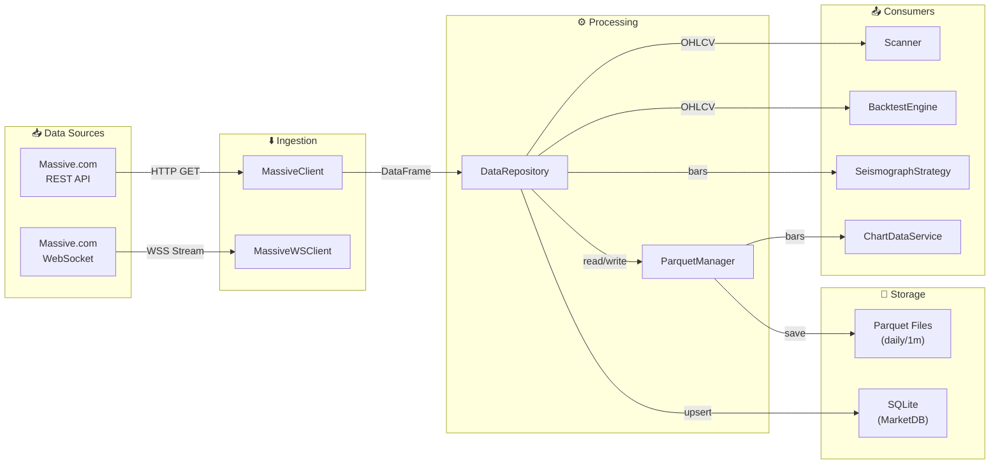

---

## 3. 실시간 트레이딩 흐름 (Realtime Trading Flow)

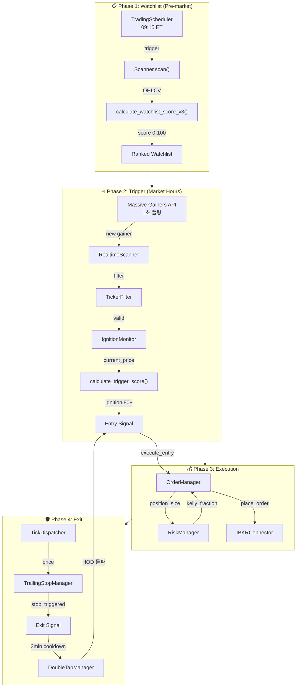

---

## 4. Frontend ↔ Backend 통신 흐름

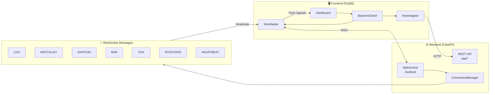

---

## 5. 전략 점수 계산 흐름 (Strategy Scoring)

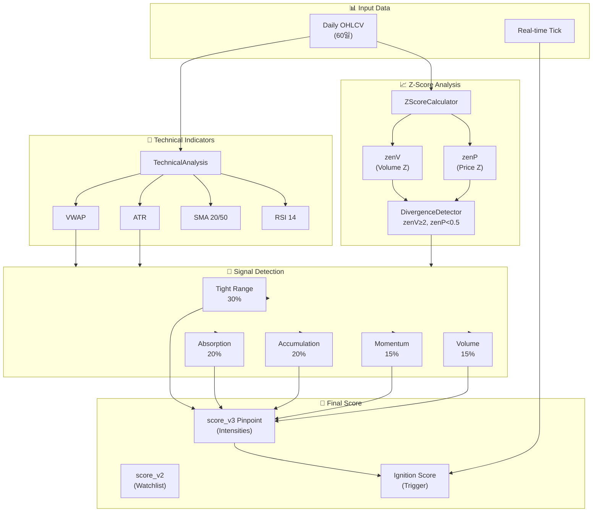

---

## 6. 리서치 스크립트 파이프라인 (R-3/R-4)

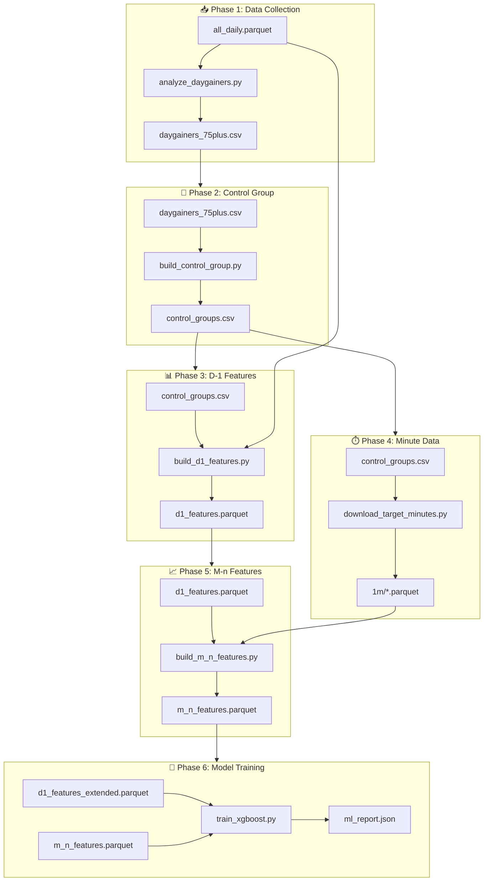

---

## 7. DI 컨테이너 의존성 그래프

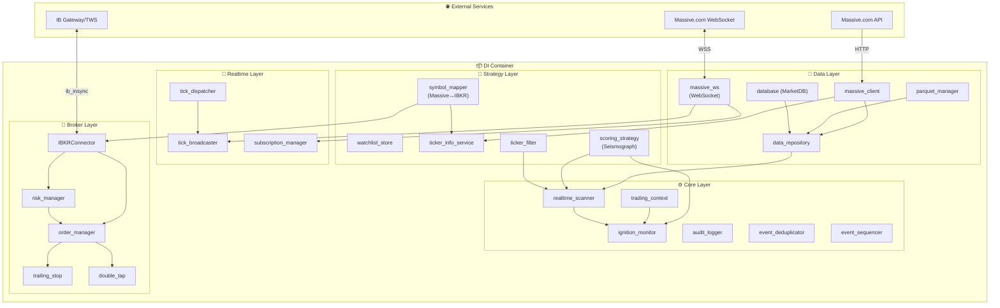

---

## 8. GUI 컴포넌트 계층 구조

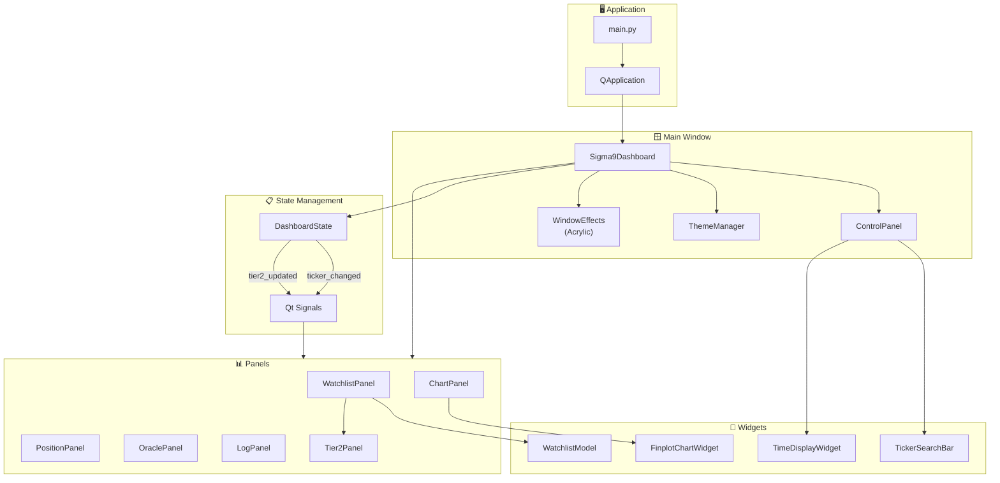

---

## 📊 범례 (Legend)

| 기호 | 의미 |
|-----|------|
| 📥 | 데이터 입력 |
| 📤 | 데이터 출력 |
| ⚙️ | 처리/엔진 |
| 💾 | 스토리지 |
| 📡 | 실시간/통신 |
| 🎯 | 전략/분석 |
| 💰 | 트레이딩 |
| 🖥️ | UI/Frontend |
| 📦 | 컨테이너/DI |
| 🌐 | 외부 서비스 |

---

## 9. 클래스 다이어그램 (상속 관계)

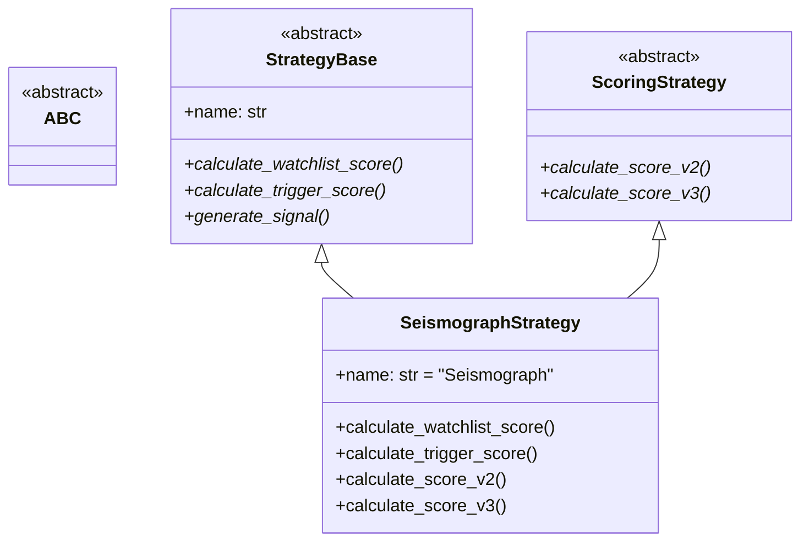

---

## 10. Broker Layer 의존성 체인

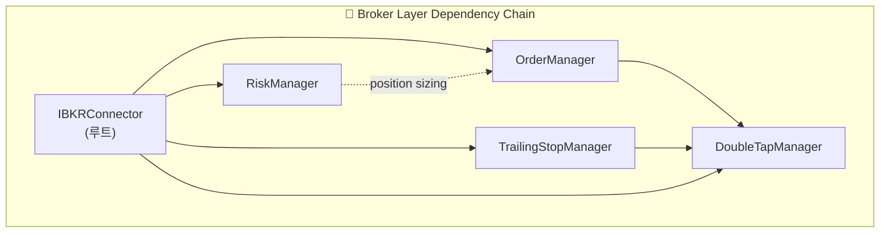

---

## 11. Services Layer 통신 구조

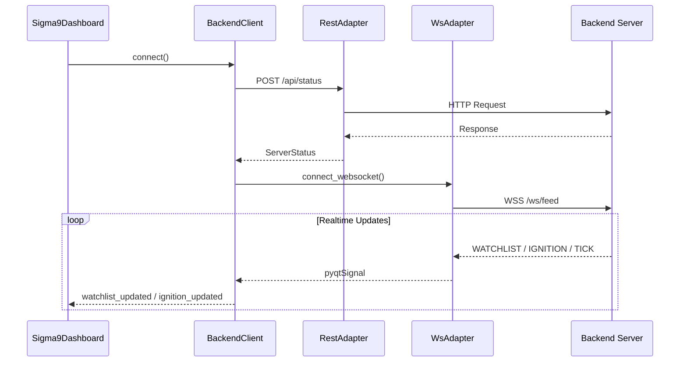

