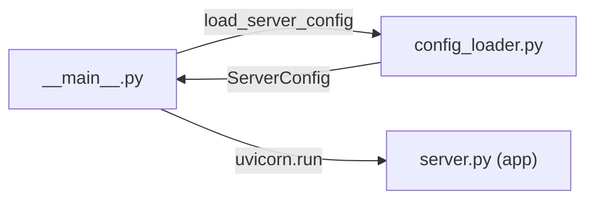

# __main__.py

## 기본 정보

| 항목 | 값 |
|------|---|
| **경로** | `backend/__main__.py` |
| **역할** | `python -m backend` 실행 시 진입점 - Uvicorn으로 FastAPI 서버 시작 |
| **라인 수** | 44 |
| **바이트** | 1,116 |

## 함수 목록

| 함수명 | 시그니처 | 설명 |
|--------|----------|------|
| `main` | `() -> None` | 서버 메인 진입점, config 로드 후 Uvicorn 실행 |

## 🔗 외부 연결 (Connections)

### Imports From (이 파일이 가져오는 것)
| 파일 | 가져오는 항목 |
|------|--------------|
| `backend/core/config_loader.py` | `load_server_config()` |
| `uvicorn` (외부) | `uvicorn.run()` |

### Imported By (이 파일을 가져가는 것)
| 파일 | 사용 목적 |
|------|----------|
| (없음) | CLI 진입점으로 직접 실행됨 |

### Calls To (이 파일이 호출하는 외부 함수)
| 대상 파일 | 호출 함수 |
|----------|----------|
| `backend/core/config_loader.py` | `load_server_config()` |
| (외부) `uvicorn` | `uvicorn.run("backend.server:app", ...)` |

### Data Flow


## 실행 방법

```bash
# 기본 실행
python -m backend

# 환경변수로 포트 오버라이드
SIGMA9_SERVER_PORT=9000 python -m backend
```

## 외부 의존성
- `uvicorn` - ASGI 서버
