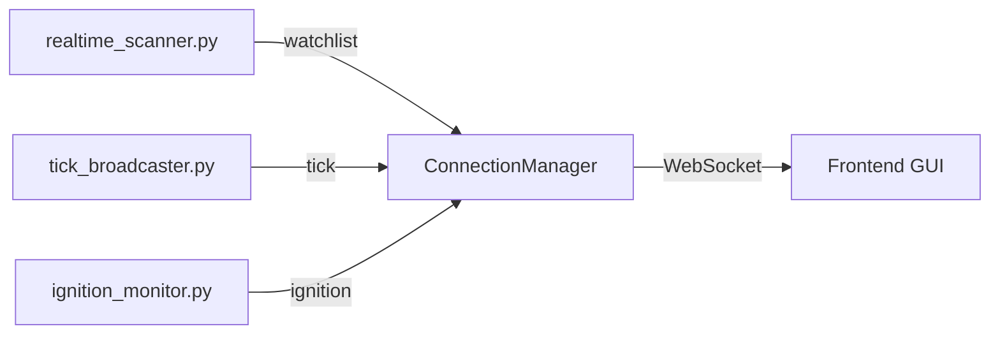

# websocket.py

## 기본 정보

| 항목 | 값 |
|------|---|
| **경로** | `backend/api/websocket.py` |
| **역할** | 실시간 데이터 스트리밍을 위한 WebSocket 연결 관리자 |
| **라인 수** | 303 |

---

## 클래스

### `MessageType(Enum)`
> WebSocket 메시지 타입 정의

| 값 | 설명 |
|----|------|
| `LOG` | 서버 로그 |
| `TICK` | 틱 데이터 (JSON) |
| `BAR` | 바(캔들) 데이터 |
| `TRADE` | 거래 이벤트 |
| `WATCHLIST` | Watchlist 업데이트 |
| `STATUS` | 상태 변경 |
| `IGNITION` | Ignition Score 업데이트 |
| `ERROR` | 에러 |
| `PONG` | Ping 응답 |

### `ConnectionManager`
> 다중 클라이언트 WebSocket 연결 관리

| 메서드 | 시그니처 | 설명 |
|--------|----------|------|
| `__init__` | `(self)` | 초기화, active_connections 리스트 생성 |
| `connect` | `(websocket: WebSocket)` | 새 클라이언트 연결 수락 |
| `disconnect` | `(websocket: WebSocket)` | 클라이언트 연결 해제 |
| `connection_count` | `(self) -> int` | 현재 연결된 클라이언트 수 |
| `_json_serializer` | `(obj)` | numpy 타입 등 커스텀 JSON 직렬화 |
| `_send_to_client` | `(websocket, msg_type, data)` | 단일 클라이언트에 메시지 전송 |
| `broadcast` | `(message: str)` | 모든 클라이언트에 원시 메시지 전송 |
| `broadcast_typed` | `(msg_type, data)` | 타입 지정 메시지 브로드캐스트 |
| `broadcast_log` | `(log_entry: str)` | 로그 메시지 브로드캐스트 |
| `broadcast_tick` | `(ticker, price, volume, timestamp)` | 틱 데이터 브로드캐스트 |
| `broadcast_trade` | `(event, order_id, ticker, **details)` | 거래 이벤트 브로드캐스트 |
| `broadcast_watchlist` | `(items, event_time_ms, event_latency_ms)` | Watchlist 업데이트 브로드캐스트 |
| `broadcast_status` | `(event, **data)` | 상태 변경 브로드캐스트 |
| `broadcast_bar` | `(ticker, timeframe, bar)` | 바 데이터 브로드캐스트 |
| `broadcast_ignition` | `(ticker, score, passed_filter, reason)` | Ignition Score 브로드캐스트 |

---

## 🔗 외부 연결 (Connections)

### Imports From (이 파일이 가져오는 것)
| 파일 | 가져오는 항목 |
|------|--------------|
| `fastapi` | `WebSocket` |
| `loguru` | `logger` |

### Imported By (이 파일을 가져가는 것)
| 파일 | 사용 목적 |
|------|----------|
| `backend/server.py` | WebSocket 엔드포인트 등록 |
| `backend/core/realtime_scanner.py` | Watchlist 브로드캐스트 |
| `backend/core/tick_broadcaster.py` | 틱 데이터 브로드캐스트 |
| `backend/core/ignition_monitor.py` | Ignition Score 브로드캐스트 |
| `backend/startup/realtime.py` | 실시간 연결 초기화 |

### Data Flow


---

## 외부 의존성
- `fastapi`
- `loguru`
- `json`
- (내장) `enum`, `typing`

---

## 글로벌 인스턴스
```python
manager = ConnectionManager()  # 싱글톤 인스턴스
```
