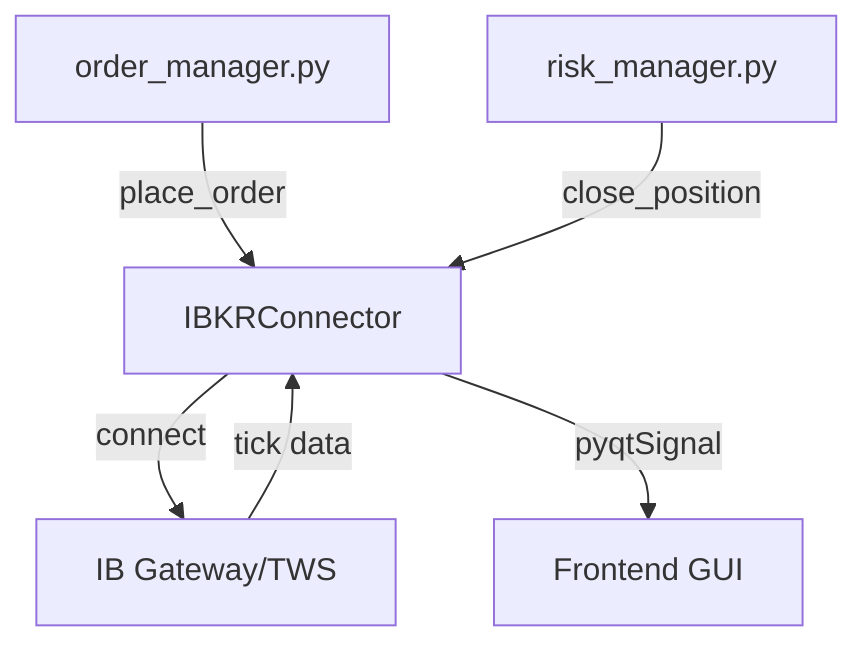

# ibkr_connector.py

## 기본 정보

| 항목 | 값 |
|------|---|
| **경로** | `backend/broker/ibkr_connector.py` |
| **역할** | IB Gateway/TWS 연결 관리 및 주문 실행 |
| **라인 수** | 1,344 |

---

## 클래스

### `IBKRConnector(QThread)`
> IBKR 연결 커넥터 - 백그라운드 스레드에서 IB Gateway 연결 및 시장 데이터 수신

#### PyQt Signals
| 시그널 | 타입 | 설명 |
|--------|------|------|
| `connected` | `pyqtSignal()` | IB Gateway 연결 성공 |
| `disconnected` | `pyqtSignal()` | 연결 해제 |
| `error` | `pyqtSignal(str)` | 오류 발생 |
| `account_update` | `pyqtSignal(dict)` | 계좌 정보 업데이트 |
| `order_filled` | `pyqtSignal(dict)` | 주문 체결 |
| `tick_received` | `pyqtSignal(dict)` | 틱 데이터 수신 |

#### 메서드
| 메서드 | 시그니처 | 설명 |
|--------|----------|------|
| `__init__` | `(parent=None)` | 초기화, .env에서 설정 로드 |
| `run` | `(self)` | 스레드 메인 루프: 연결 시도 및 이벤트 루프 유지 |
| `_fetch_account_info` | `(self)` | 계좌 정보 조회 및 GUI 전달 |
| `_disconnect` | `(self)` | 연결 안전 해제 |
| `stop` | `(self)` | 연결 중지 및 스레드 종료 |
| `is_connected` | `(self) -> bool` | 연결 상태 반환 |
| `get_ib` | `(self) -> IB` | ib_insync IB 객체 반환 |
| `place_market_order` | `(symbol, qty, action) -> int` | 시장가 주문 |
| `place_stop_order` | `(symbol, qty, stop_price, action, oca_group)` | 스탑 주문 |
| `place_limit_order` | `(symbol, qty, limit_price, action, tif, oca_group)` | 지정가 주문 |
| `place_oca_group` | `(symbol, qty, entry_price, stop_loss_pct, profit_target_pct)` | OCA 그룹 주문 |
| `subscribe_tick` | `(ticker)` | 실시간 틱 구독 |
| `unsubscribe_tick` | `(ticker)` | 틱 구독 해제 |
| `get_positions` | `(self)` | 현재 포지션 조회 |
| `cancel_all_orders` | `(self)` | 모든 주문 취소 |
| `close_all_positions` | `(self)` | 모든 포지션 청산 |

---

## 🔗 외부 연결 (Connections)

### Imports From (이 파일이 가져오는 것)
| 파일/라이브러리 | 가져오는 항목 |
|----------------|--------------|
| `ib_insync` | `IB`, `Stock`, `MarketOrder`, `StopOrder`, `LimitOrder`, `Trade` |
| `PyQt6.QtCore` | `QThread`, `pyqtSignal` |
| `dotenv` | `load_dotenv` |
| `loguru` | `logger` |

### Imported By (이 파일을 가져가는 것)
| 파일 | 사용 목적 |
|------|----------|
| `backend/server.py` | IBKR 커넥터 초기화 (`app_state.ibkr`) |
| `backend/core/order_manager.py` | 주문 실행 |
| `backend/core/risk_manager.py` | 포지션 청산 |
| `backend/core/subscription_manager.py` | 틱 구독 관리 |
| `backend/api/routes/status.py` | 연결 상태 조회 |
| `tests/test_ibkr_connector.py` | 유닛 테스트 |

### Calls To (이 파일이 호출하는 외부 함수)
| 대상 | 호출 |
|------|------|
| `ib_insync.IB` | `connect()`, `disconnect()`, `placeOrder()`, `cancelOrder()` |

### Data Flow


---

## 외부 의존성
- `ib_insync` (IBKR API 래퍼)
- `PyQt6` (QThread 기반)
- `python-dotenv` (환경 변수)
- `loguru`

---

## 환경 변수
```
IBKR_HOST=127.0.0.1
IBKR_PORT=7497
IBKR_CLIENT_ID=1
```
