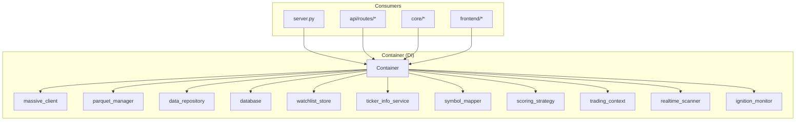

# container.py

## 기본 정보

| 항목 | 값 |
|------|---|
| **경로** | `backend/container.py` |
| **역할** | DI(의존성 주입) Container - 모든 핵심 서비스의 생명주기 및 의존성 관리 |
| **라인 수** | 520 |
| **바이트** | 25,000+ |

## 클래스

### `Container`
> `dependency-injector` 라이브러리 기반 Declarative Container
> Singleton Anti-Pattern 제거 및 테스트 용이성 확보

#### 계층 구조
```
Container
├── Config (Configuration)
├── Data Layer
│   ├── massive_client (MassiveClient)
│   ├── parquet_manager (ParquetManager)
│   ├── data_repository (DataRepository)
│   └── database (MarketDB)
├── Strategy Layer
│   ├── watchlist_store (WatchlistStore)
│   ├── ticker_info_service (TickerInfoService)
│   ├── symbol_mapper (SymbolMapper)
│   └── scoring_strategy (SeismographStrategy)
├── Core Layer
│   ├── trading_context (TradingContext)
│   ├── realtime_scanner (RealtimeScanner)
│   ├── ignition_monitor (IgnitionMonitor)
│   ├── audit_logger (AuditLogger)
│   ├── event_deduplicator (EventDeduplicator)
│   └── event_sequencer (EventSequencer)
└── Broker Layer [02-001]
    ├── ibkr_connector (IBKRConnector)
    ├── order_manager (OrderManager)
    ├── risk_manager (RiskManager)
    ├── trailing_stop_manager (TrailingStopManager)
    └── double_tap_manager (DoubleTapManager)
```

#### Providers

| Provider | 타입 | 팩토리 메서드 | 설명 |
|----------|------|--------------|------|
| `config` | Configuration | - | 외부 설정 주입 |
| `ws_manager` | Object | - | WebSocket 매니저 (외부 주입) |
| `massive_client` | Singleton | `_create_massive_client` | Massive API 클라이언트 |
| `parquet_manager` | Singleton | `_create_parquet_manager` | Parquet I/O 관리자 |
| `data_repository` | Singleton | `_create_data_repository` | 통합 데이터 접근 레이어 |
| `database` | Singleton | `_create_database` | MarketDB (SQLite) |
| `watchlist_store` | Singleton | `_create_watchlist_store` | Watchlist JSON 저장소 |
| `ticker_info_service` | Singleton | `_create_ticker_info_service` | 티커 정보 서비스 |
| `symbol_mapper` | Singleton | `_create_symbol_mapper` | 심볼 매핑 (Massive ↔ IBKR) |
| `scoring_strategy` | Singleton | `_create_scoring_strategy` | Seismograph 스코어링 전략 |
| `trading_context` | Singleton | `_create_trading_context` | 활성 티커 컨텍스트 |
| `realtime_scanner` | Singleton | `_create_realtime_scanner` | 실시간 스캐너 |
| `ignition_monitor` | Singleton | `_create_ignition_monitor` | 점화 스코어 모니터 |
| `audit_logger` | Singleton | `_create_audit_logger` | 감사 로거 |
| `event_deduplicator` | Factory | `_create_event_deduplicator` | 이벤트 중복 제거 |
| `event_sequencer` | Factory | `_create_event_sequencer` | 이벤트 순서 보장 |
| `ibkr_connector` | Singleton | `_create_ibkr_connector` | IBKR 브로커 연결 [02-001] |
| `order_manager` | Singleton | `_create_order_manager` | 주문 관리 [02-001] |
| `risk_manager` | Singleton | `_create_risk_manager` | 리스크 관리 [02-001] |
| `trailing_stop_manager` | Singleton | `_create_trailing_stop_manager` | Trailing Stop [02-001] |
| `double_tap_manager` | Singleton | `_create_double_tap_manager` | 재진입 관리 [02-001] |

## 함수 목록

| 함수명 | 시그니처 | 설명 |
|--------|----------|------|
| `get_container` | `() -> Container` | 전역 Container 인스턴스 반환 (FastAPI Depends용) |

## 전역 객체

| 객체 | 타입 | 설명 |
|------|------|------|
| `container` | `Container` | 전역 DI Container 인스턴스 |

## 🔗 외부 연결 (Connections)

### Imports From (이 파일이 가져오는 것)
> 📌 지연 Import 패턴 사용 - 팩토리 메서드 내에서 import

| 파일 | 가져오는 항목 | Import 위치 |
|------|--------------|-------------|
| `backend/data/massive_client.py` | `MassiveClient` | `_create_massive_client()` |
| `backend/data/parquet_manager.py` | `ParquetManager` | `_create_parquet_manager()` |
| `backend/data/data_repository.py` | `DataRepository` | `_create_data_repository()` |
| `backend/data/flush_policy.py` | `create_flush_policy()` | `_create_data_repository()` |
| `backend/data/database.py` | `MarketDB` | `_create_database()` |
| `backend/data/watchlist_store.py` | `WatchlistStore` | `_create_watchlist_store()` |
| `backend/data/ticker_info_service.py` | `TickerInfoService` | `_create_ticker_info_service()` |
| `backend/data/symbol_mapper.py` | `SymbolMapper` | `_create_symbol_mapper()` |
| `backend/strategies/seismograph/__init__.py` | `SeismographStrategy` | `_create_scoring_strategy()` |
| `backend/core/trading_context.py` | `TradingContext` | `_create_trading_context()` |
| `backend/core/realtime_scanner.py` | `RealtimeScanner` | `_create_realtime_scanner()` |
| `backend/core/ignition_monitor.py` | `IgnitionMonitor` | `_create_ignition_monitor()` |
| `backend/core/audit_logger.py` | `AuditLogger` | `_create_audit_logger()` |
| `backend/core/deduplicator.py` | `EventDeduplicator` | `_create_event_deduplicator()` |
| `backend/core/event_sequencer.py` | `EventSequencer` | `_create_event_sequencer()` |
| `backend/broker/ibkr_connector.py` | `IBKRConnector` | `_create_ibkr_connector()` [02-001] |
| `backend/core/order_manager.py` | `OrderManager` | `_create_order_manager()` [02-001] |
| `backend/core/risk_manager.py` | `RiskManager` | `_create_risk_manager()` [02-001] |
| `backend/core/trailing_stop.py` | `TrailingStopManager` | `_create_trailing_stop_manager()` [02-001] |
| `backend/core/double_tap.py` | `DoubleTapManager` | `_create_double_tap_manager()` [02-001] |

### Imported By (이 파일을 가져가는 것)
| 파일 | 사용 목적 |
|------|----------|
| `backend/server.py` | `container.trading_context()` 접근 |
| `backend/startup/config.py` | `container.config.from_dict()` 설정 주입 |
| `backend/core/scanner.py` | `container.data_repository()` 접근 |
| `backend/core/backtest_engine.py` | `container.data_repository()` 접근 |
| `backend/api/routes/zscore.py` | `container.data_repository()` 접근 |
| `backend/api/routes/watchlist.py` | `container.watchlist_store()` 접근 |
| `backend/api/routes/scanner.py` | `container.realtime_scanner()` 접근 |
| `backend/api/routes/ignition.py` | `container.ignition_monitor()` 접근 |
| `backend/api/routes/chart.py` | `container.data_repository()` 접근 |
| `frontend/services/chart_data_service.py` | `container.data_repository()` 접근 |
| `frontend/gui/ticker_info_window.py` | `get_container().ticker_info_service()` |
| `frontend/gui/dashboard.py` | `get_container()` 접근 |

### Data Flow


## 사용 예시

```python
# 일반 사용
from backend.container import container

scanner = container.realtime_scanner()
data_repo = container.data_repository()

# 설정 주입
container.config.from_dict({"api_key": "xxx"})

# 테스트용 Mock 주입
from unittest.mock import Mock
with container.realtime_scanner.override(Mock()):
    test_function()  # Mock이 주입됨
```

## 리팩터링 히스토리

| 버전 | 변경 내용 |
|------|----------|
| [02-001] | DI Container 도입, Singleton Anti-Pattern 제거 |
| [02-004] | WatchlistStore 싱글톤 → Container 관리 |
| [02-005] | SymbolMapper 싱글톤 → Container 관리 |
| [09-009] | TradingContext 추가 |
| [11-002] | DataRepository, ParquetManager 추가 |
| [15-001] | TickerInfoService 추가 |
| [02-001] | Broker Layer DI 통합 (5개 Provider 추가) |

## 외부 의존성
- `dependency-injector` - DI 프레임워크
