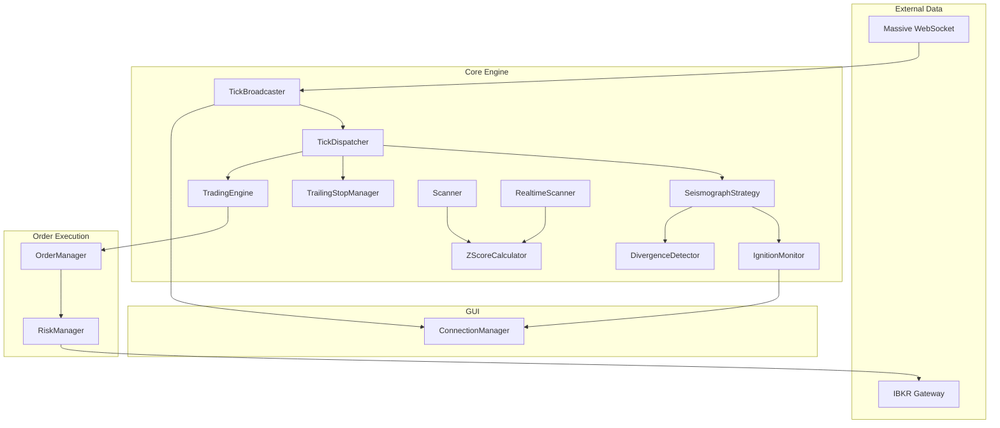

# backend/core/ - 핵심 비즈니스 로직 모듈

> **파일 수**: 26개 (+ interfaces/ 2개)  
> **역할**: 트레이딩 시스템의 핵심 엔진, 전략, 스캐너, 리스크 관리, 기술 분석

---

## 📁 파일 목록 및 역할

| 파일명 | 주요 클래스 | 역할 |
|--------|-------------|------|
| `__init__.py` | - | StrategyBase, Signal, MockPriceFeed 내보내기 |
| `audit_logger.py` | `AuditLogger` | JSONL 형식 의사결정 감사 로깅 |
| `backtest_engine.py` | `BacktestEngine`, `BacktestConfig` | 히스토리 데이터 기반 백테스팅 엔진 |
| `backtest_report.py` | `BacktestReport`, `Trade` | 백테스트 결과 리포트 및 성과 메트릭 |
| `config_loader.py` | `ServerConfig`, `ClientConfig` + 15개 dataclass | YAML 설정 파일 로더 |
| `deduplicator.py` | `EventDeduplicator` | 실시간 이벤트 중복 제거 (시간 윈도우) |
| `divergence_detector.py` | `DivergenceDetector`, `DivergenceSignal` | zenV-zenP Divergence 탐지 (매집 패턴) |
| `double_tap.py` | `DoubleTapManager`, `DoubleTapEntry` | 1차 청산 후 재진입 로직 관리 |
| `event_sequencer.py` | `EventSequencer`, `SequencedEvent` | 비순차 이벤트 시간순 정렬 (버퍼링) |
| `ignition_monitor.py` | `IgnitionMonitor` | 실시간 Ignition Score 모니터링 (1초 폴링) |
| `mock_data.py` | `MockPriceFeed`, `MockFeedConfig` | IBKR 없이 테스트용 가상 데이터 생성 |
| `order_manager.py` | `OrderManager`, `OrderRecord`, `Position` | 주문 상태 관리 및 추적 |
| `realtime_scanner.py` | `RealtimeScanner` | 실시간 급등 종목 스캐너 (1초 폴링) |
| `risk_manager.py` | `RiskManager`, `DailyPnL` | 리스크 관리, Kill Switch, 포지션 사이징 |
| `scanner.py` | `Scanner` | DataRepository 기반 Watchlist 생성 오케스트레이터 |
| `scheduler.py` | `TradingScheduler` | APScheduler 기반 작업 스케줄러 |
| `strategy_base.py` | `StrategyBase` (ABC), `Signal` | 전략 추상 인터페이스 |
| `strategy_loader.py` | `StrategyLoader` | 전략 플러그인 동적 로더 |
| `subscription_manager.py` | `SubscriptionManager` | Watchlist ↔ Massive WebSocket 구독 동기화 |
| `technical_analysis.py` | `TechnicalAnalysis`, `DynamicStopLoss` | 기술 지표 계산 (VWAP, ATR, SMA, EMA, RSI) |
| `tick_broadcaster.py` | `TickBroadcaster` | Massive → GUI WebSocket 브로드캐스터 |
| `tick_dispatcher.py` | `TickDispatcher` | 틱 데이터 중앙 배포자 (구독자 패턴) |
| `ticker_filter.py` | `TickerFilter` | Warrant/Preferred Stock 제외 필터 |
| `trading_context.py` | `TradingContext` | 활성 티커 Source of Truth |
| `trailing_stop.py` | `TrailingStopManager`, `TrailingStopOrder` | IBKR 네이티브 Trailing Stop 관리 |
| `zscore_calculator.py` | `ZScoreCalculator`, `ZScoreResult`, `DailyStats` | Volume/Price Z-Score 계산 |

---

## 📁 interfaces/ 하위 디렉토리

| 파일명 | 주요 클래스 | 역할 |
|--------|-------------|------|
| `__init__.py` | - | 패키지 초기화 |
| `scoring.py` | `ScoringStrategy` (ABC) | 점수 계산 전략 인터페이스 (DIP 적용) |

---

## 🏗️ 주요 클래스 상세

### 1. 백테스팅 그룹

```
BacktestEngine
├── BacktestConfig (dataclass)
├── run() → BacktestReport
└── 의존: DataRepository, StrategyBase

BacktestReport
├── Trade[] (거래 기록)
├── 메트릭: win_rate, CAGR, MDD, Sharpe Ratio
└── equity_curve: Dict[str, float]
```

### 2. 전략 프레임워크

```
StrategyBase (ABC)
├── name, version, description (메타정보)
├── calculate_watchlist_score() → Phase 1
├── calculate_trigger_score() → Phase 2
├── on_tick() / on_bar() → Signal 생성
└── get_anti_trap_filter() → 함정 방지

Signal (dataclass)
├── action: BUY | SELL | HOLD
├── ticker, price, qty
├── confidence: 0.0 ~ 1.0
└── metadata: Dict

StrategyLoader
├── discover_strategies() → 전략 탐색
├── load_strategy(name) → StrategyBase
└── reload_strategy(name) → Hot Reload
```

### 3. 실시간 스캐너 그룹

```
Scanner (일일 스캔)
├── run_daily_scan() → Watchlist
└── 의존: DataRepository, TickerFilter

RealtimeScanner (실시간 스캔)
├── start() / stop()
├── _poll_gainers() → Massive API 호출
├── _handle_new_gainer() → 신규 종목 처리
└── 의존: MassiveClient, ScoringStrategy, TickerFilter
```

### 4. 주문 및 리스크 관리

```
OrderManager
├── execute_entry() → 진입 주문
├── execute_oca_exit() → OCA 청산 그룹
└── 의존: IBKRConnector

RiskManager
├── calculate_position_size() → Kelly Criterion
├── check_daily_limit() / check_weekly_limit()
├── kill_switch(reason) → 긴급 청산
└── 의존: IBKRConnector, RiskConfig

TrailingStopManager
├── create_trailing() → IBKR 네이티브 Trailing
└── 의존: IBKRConnector
```

### 5. 데이터 흐름 관리

```
TickDispatcher (중앙 배포)
├── register(name, callback, tickers)
├── dispatch(tick) → 모든 구독자에게 배포
└── 구독자: Strategy, TradingEngine, TrailingStop, GUI

TickBroadcaster
├── Massive → GUI WebSocket
└── _on_bar() / _on_tick()

SubscriptionManager
├── sync_watchlist() → AM 채널 동기화
├── sync_tick_subscriptions() → T 채널 동기화
└── 의존: MassiveWebSocketClient
```

### 6. 기술 지표 및 계산

```
TechnicalAnalysis (정적 메서드)
├── calculate_vwap()
├── calculate_atr()
├── calculate_sma() / calculate_ema()
└── calculate_rsi()

ZScoreCalculator
├── calculate(ticker, daily_bars) → ZScoreResult
├── build_cache() → DailyStats (장 시작 전)
└── calculate_projected_zenV/zenP() → 장중 실시간

DivergenceDetector
├── check(ticker, zenV, zenP) → DivergenceSignal
└── 조건: zenV >= 2.0 AND zenP < 0.5
```

---

## 🔄 데이터 흐름 다이어그램



---

## ⚙️ config_loader.py 설정 클래스 목록

### 서버 설정 (ServerConfig)
| 클래스 | 역할 |
|--------|------|
| `ServerNetworkConfig` | 호스트, 포트, 워커 수 |
| `IBKRConfig` | IBKR 연결 (host, port, client_id) |
| `DatabaseConfig` | SQLite 경로, WAL 모드 |
| `MarketDataConfig` | 시장 데이터 DB, 초기 로드 일수 |
| `MassiveConfig` | Massive API 설정 |
| `StrategyConfig` | 기본 전략, Hot Reload |
| `RiskConfig` | 리스크 한도 (일일/주간 손실, Kelly) |
| `SchedulerConfig` | 스케줄러 (시간대, 스캔 시간) |
| `LoggingConfig` | 로깅 설정 |
| `LLMConfig` | LLM Oracle 설정 |

### 클라이언트 설정 (ClientConfig)
| 클래스 | 역할 |
|--------|------|
| `ClientServerConfig` | 서버 연결 (host, port, ws_path) |
| `ConnectionConfig` | 재연결, 타임아웃 |
| `GUIConfig` | 테마, 윈도우 설정 |
| `ChartConfig` | 차트 기본 설정 |
| `ClientLoggingConfig` | 클라이언트 로깅 |

---

## 📊 외부 의존성

| 패키지 | 사용처 |
|--------|--------|
| `loguru` | 모든 파일 (로깅) |
| `numpy` | technical_analysis, zscore_calculator |
| `pandas` | backtest_engine, scanner |
| `pydantic` | backtest_report (선택적) |
| `apscheduler` | scheduler.py |
| `yaml` | config_loader |
| `ib_insync` | order_manager, trailing_stop (간접) |

---

## 🔗 파일 간 주요 연결

### Imports From (핵심)
```
strategy_base.py → Signal, StrategyBase
  ↳ 사용: strategy_loader, backtest_engine, scanner

config_loader.py → ServerConfig, RiskConfig, ...
  ↳ 사용: startup/config, risk_manager, scheduler

zscore_calculator.py → ZScoreResult, DailyStats
  ↳ 사용: scanner, realtime_scanner, divergence_detector

interfaces/scoring.py → ScoringStrategy (ABC)
  ↳ 구현: SeismographStrategy
  ↳ 사용: realtime_scanner (DIP)
```

### Internal Data Flow
```
MassiveWebSocket → TickBroadcaster → TickDispatcher
  ├─→ Strategy.on_tick() → Ignition Score
  ├─→ TrailingStopManager (IBKR 네이티브)
  └─→ ConnectionManager.broadcast_tick() → GUI
```
