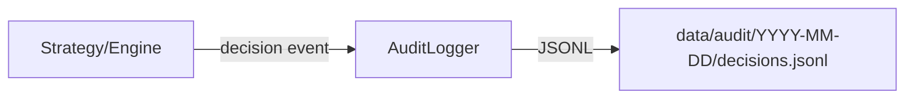

# audit_logger.py

## 기본 정보
| 항목 | 값 |
|------|---|
| **경로** | `backend/core/audit_logger.py` |
| **역할** | 트레이딩 의사결정의 완전한 재현성(Reproducibility) 보장을 위한 JSONL 감사 로깅 |
| **라인 수** | 254 |
| **바이트** | 9,090 |

---

## 클래스

### `AuditLogger`
> 의사결정 감사 로거 - 트레이딩 시스템의 "블랙박스" 역할

| 메서드 | 시그니처 | 설명 |
|--------|----------|------|
| `__init__` | `(log_dir: str = "data/audit", strategy_version: str = "2.0.0")` | 로거 초기화, 디렉토리 생성 |
| `log_decision` | `(ticker: str, decision: str, context: Dict, event_time: Optional[datetime], signals: Optional[Dict], config_snapshot: Optional[Dict]) -> None` | 의사결정 기록 (JSONL) |
| `log_ignition` | `(ticker: str, score: float, passed_filter: bool, filter_reason: str, event_time: Optional[datetime]) -> None` | Ignition Score 이벤트 기록 (Phase 2 편의 메서드) |
| `close` | `() -> None` | 로그 파일 핸들 종료 |
| `_get_log_file_path` | `(date_str: str) -> Path` | 일별 로그 파일 경로 반환 |
| `_ensure_file_handle` | `() -> None` | 날짜별 파일 핸들 관리 |
| `_serialize_context` | `(context: Dict) -> Dict` | numpy/datetime 타입 JSON 직렬화 |
| `__enter__` / `__exit__` | Context Manager | with 문 지원 |

---

## 🔗 외부 연결 (Connections)

### Imports From (이 파일이 가져오는 것)
| 파일 | 가져오는 항목 |
|------|--------------|
| `loguru` | `logger` |

> **Note**: 이 파일은 다른 내부 모듈에 의존하지 않음 (독립적)

### Imported By (이 파일을 가져가는 것)
| 파일 | 사용 목적 |
|------|----------|
| (분석 필요) | 전략 모듈에서 의사결정 기록 시 사용 |

### Data Flow


### 로그 레코드 구조
```json
{
  "event_time": "ISO8601",
  "log_time": "ISO8601",
  "ticker": "AAPL",
  "decision": "BUY|SELL|HOLD|FILTER_REJECTED",
  "context": {"ignition_score": 85, "price": 150.25},
  "signals": {"volume_burst": 0.95},
  "strategy_version": "2.0.0",
  "config_snapshot": {}
}
```

---

## 외부 의존성
| 패키지 | 사용 목적 |
|--------|----------|
| `json` | JSONL 직렬화 |
| `datetime` | 시간 처리 |
| `pathlib` | 경로 관리 |
| `loguru` | 로깅 |
