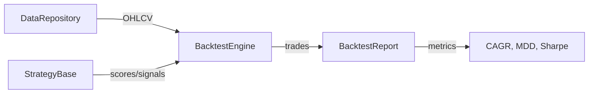

# backtest_engine.py

## 기본 정보
| 항목 | 값 |
|------|---|
| **경로** | `backend/core/backtest_engine.py` |
| **역할** | 히스토리 데이터 기반 백테스팅 엔진 - 전략 시뮬레이션 실행 |
| **라인 수** | 658 |
| **바이트** | 30,509 |

---

## 클래스

### `BacktestConfig` (dataclass)
> 백테스트 설정 파라미터

| 필드 | 타입 | 기본값 | 설명 |
|------|------|--------|------|
| `initial_capital` | `float` | 100,000.0 | 초기 자본금 (USD) |
| `position_size_pct` | `float` | 10.0 | 포지션 크기 (계좌 대비 %) |
| `max_positions` | `int` | 5 | 최대 동시 보유 포지션 수 |
| `stop_loss_pct` | `float` | -5.0 | 손절 기준 (%) |
| `profit_target_pct` | `float` | 8.0 | 익절 기준 (%) |
| `time_stop_days` | `int` | 3 | 시간 기반 청산 (일) |
| `entry_stage` | `int` | 4 | 진입 가능 Stage |
| `min_score` | `float` | 80.0 | 최소 진입 점수 |

---

### `BacktestEngine`
> 백테스트 실행 엔진 - DataRepository 기반

| 메서드 | 시그니처 | 설명 |
|--------|----------|------|
| `__init__` | `(data_repository=None, config: Optional[BacktestConfig]=None, db_path: str=None)` | 엔진 초기화 |
| `initialize` | `() -> None` | 데이터 소스 초기화 |
| `close` | `() -> None` | 리소스 정리 |
| `run` | `(strategy, tickers: List[str], start_date: str, end_date: str) -> BacktestReport` | 백테스트 실행 |
| `_load_all_data` | `(tickers, start_date, end_date) -> Dict[str, DataFrame]` | 전체 히스토리 데이터 로드 |
| `_check_entries` | `(strategy, current_date, tickers, all_data) -> None` | 진입 기회 탐색 |
| `_check_exits` | `(current_date, all_data) -> None` | 청산 조건 체크 |
| `_close_all_positions` | `(date, all_data, reason) -> None` | 전 포지션 강제 청산 |
| `_generate_date_range` | `(start_date, end_date) -> List[str]` | 거래일 범위 생성 |
| `_update_equity` | `(current_date, all_data) -> None` | 자산가치 업데이트 |

---

## 🔗 외부 연결 (Connections)

### Imports From (이 파일이 가져오는 것)
| 파일 | 가져오는 항목 |
|------|--------------|
| `backend/core/backtest_report.py` | `BacktestReport`, `Trade` |
| `loguru` | `logger` |
| `pandas` | DataFrame 처리 |

### Imported By (이 파일을 가져가는 것)
| 파일 | 사용 목적 |
|------|----------|
| `tests/test_backtest*.py` | 백테스트 테스트 |
| `scripts/` | 백테스트 스크립트 |

### Calls To (이 파일이 호출하는 외부 함수)
| 대상 파일 | 호출 함수 |
|----------|----------|
| `DataRepository` | `get_daily_bars()` |
| `StrategyBase` | `calculate_watchlist_score()`, `on_bar()` |
| `BacktestReport` | `add_trade()`, `get_open_trades()` |

### Data Flow

---

## 외부 의존성
| 패키지 | 사용 목적 |
|--------|----------|
| `pandas` | DataFrame 처리 |
| `loguru` | 로깅 |
| `sys`, `pathlib` | 경로 관리 |
