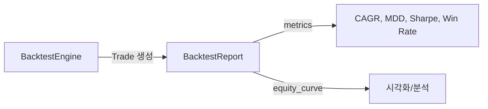

# backtest_report.py

## 기본 정보
| 항목 | 값 |
|------|---|
| **경로** | `backend/core/backtest_report.py` |
| **역할** | 백테스트 결과 리포트 및 성과 메트릭 계산 |
| **라인 수** | 430 |
| **바이트** | 16,161 |

---

## 클래스

### `Trade` (dataclass)
> 개별 거래 기록

| 필드 | 타입 | 설명 |
|------|------|------|
| `ticker` | `str` | 종목 심볼 |
| `entry_date` | `str` | 진입 날짜 |
| `entry_price` | `float` | 진입 가격 |
| `shares` | `int` | 주식 수 |
| `exit_date` | `Optional[str]` | 청산 날짜 |
| `exit_price` | `Optional[float]` | 청산 가격 |
| `exit_reason` | `Optional[str]` | 청산 사유 |
| `pnl_pct` | `Optional[float]` | 손익률 (%) |

| 메서드 | 시그니처 | 설명 |
|--------|----------|------|
| `close` | `(exit_date, exit_price, exit_reason) -> float` | 거래 청산, 손익률 반환 |
| `is_closed` | `() -> bool` | 청산 여부 |
| `is_winner` | `() -> bool` | 수익 거래 여부 |
| `to_dict` | `() -> dict` | 딕셔너리 변환 |

---

### `BacktestReport`
> 백테스트 결과 리포트 - 전체 성과 메트릭 관리

| 속성 | 타입 | 설명 |
|------|------|------|
| `start_date` | `str` | 시작일 |
| `end_date` | `str` | 종료일 |
| `initial_capital` | `float` | 초기 자본 |
| `trades` | `List[Trade]` | 거래 목록 |
| `equity_curve` | `Dict[str, float]` | 자산 곡선 |

| 메서드 | 시그니처 | 설명 |
|--------|----------|------|
| `add_trade` | `(trade: Trade) -> None` | 거래 추가 |
| `get_open_trades` | `() -> List[Trade]` | 미청산 거래 조회 |
| `get_closed_trades` | `() -> List[Trade]` | 청산 거래 조회 |
| `total_trades` | `@property -> int` | 총 거래 횟수 |
| `winning_trades` | `@property -> int` | 수익 거래 수 |
| `losing_trades` | `@property -> int` | 손실 거래 수 |
| `win_rate` | `@property -> float` | 승률 (%) |
| `total_pnl_pct` | `@property -> float` | 총 손익률 (%) |
| `avg_pnl_pct` | `@property -> float` | 평균 손익률 (%) |
| `avg_win_pct` | `@property -> float` | 평균 수익률 (%) |
| `avg_loss_pct` | `@property -> float` | 평균 손실률 (%) |
| `profit_factor` | `@property -> float` | Profit Factor |
| `calculate_cagr` | `() -> float` | CAGR 계산 |
| `calculate_max_drawdown` | `() -> float` | MDD 계산 |
| `calculate_sharpe_ratio` | `(risk_free_rate) -> float` | Sharpe Ratio |
| `calculate_avg_holding_days` | `() -> float` | 평균 보유 기간 |
| `get_summary` | `() -> dict` | 성과 요약 |
| `print_summary` | `() -> None` | 성과 출력 |
| `to_dict` | `() -> dict` | JSON 저장용 딕셔너리 |

---

## 🔗 외부 연결 (Connections)

### Imports From (이 파일이 가져오는 것)
| 파일 | 가져오는 항목 |
|------|--------------|
| `datetime` | 시간 처리 |
| `typing` | 타입 힌트 |

### Imported By (이 파일을 가져가는 것)
| 파일 | 사용 목적 |
|------|----------|
| `backend/core/backtest_engine.py` | `Trade`, `BacktestReport` |

### Data Flow

---

## 외부 의존성
| 패키지 | 사용 목적 |
|--------|----------|
| `datetime` | 날짜/시간 처리 |
| `typing` | 타입 힌트 |
