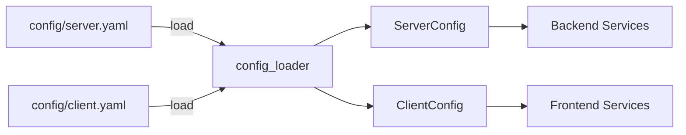

# config_loader.py

## 기본 정보
| 항목 | 값 |
|------|---|
| **경로** | `backend/core/config_loader.py` |
| **역할** | YAML 설정 파일을 Python dataclass 객체로 로드하는 유틸리티 |
| **라인 수** | 421 |
| **바이트** | 12,770 |

---

## 클래스 (총 15개 dataclass)

### 서버 설정 그룹

#### `ServerNetworkConfig`
| 필드 | 타입 | 기본값 | 설명 |
|------|------|--------|------|
| `host` | `str` | "0.0.0.0" | 바인드 호스트 |
| `port` | `int` | 8000 | 서버 포트 |
| `debug` | `bool` | True | 디버그 모드 |
| `reload` | `bool` | True | 핫 리로드 |
| `workers` | `int` | 1 | 워커 수 |

#### `IBKRConfig`
| 필드 | 타입 | 기본값 | 설명 |
|------|------|--------|------|
| `host` | `str` | "127.0.0.1" | IBKR Gateway 호스트 |
| `port` | `int` | 7497 | TWS/Gateway 포트 |
| `client_id` | `int` | 1 | 클라이언트 ID |
| `readonly` | `bool` | False | 읽기 전용 모드 |
| `timeout` | `int` | 30 | 연결 타임아웃 |
| `auto_connect` | `bool` | True | 자동 연결 |
| `auto_reconnect` | `bool` | True | 자동 재연결 |

#### `DatabaseConfig`
| 필드 | 타입 | 기본값 | 설명 |
|------|------|--------|------|
| `type` | `str` | "sqlite" | DB 타입 |
| `path` | `str` | "data/sigma9.db" | DB 경로 |
| `wal_mode` | `bool` | True | WAL 모드 |

#### `MarketDataConfig`
| 필드 | 타입 | 기본값 | 설명 |
|------|------|--------|------|
| `db_path` | `str` | "data/market_data.db" | 시장 데이터 DB |
| `initial_load_days` | `int` | 30 | 초기 로드 일수 |
| `auto_update_on_start` | `bool` | True | 시작 시 자동 업데이트 |

#### `MassiveConfig`
| 필드 | 타입 | 기본값 | 설명 |
|------|------|--------|------|
| `enabled` | `bool` | True | 활성화 여부 |
| `base_url` | `str` | "https://api.Massive.com" | API URL |
| `rate_limit` | `int` | 5 | 초당 요청 제한 |
| `retry_count` | `int` | 3 | 재시도 횟수 |
| `retry_delay` | `float` | 2.0 | 재시도 딜레이 |

#### `StrategyConfig`
| 필드 | 타입 | 기본값 | 설명 |
|------|------|--------|------|
| `default` | `str` | "seismograph" | 기본 전략 |
| `auto_load` | `bool` | True | 자동 로드 |
| `hot_reload` | `bool` | True | 핫 리로드 |

#### `RiskConfig`
| 필드 | 타입 | 기본값 | 설명 |
|------|------|--------|------|
| `max_position_pct` | `float` | 50.0 | 최대 포지션 비율 |
| `max_concurrent` | `int` | 3 | 최대 동시 포지션 |
| `max_daily_trades` | `int` | 50 | 일일 최대 거래 |
| `daily_loss_limit_pct` | `float` | 3.0 | 일일 손실 한도 |
| `weekly_loss_limit_pct` | `float` | 10.0 | 주간 손실 한도 |
| `per_trade_stop_pct` | `float` | 5.0 | 거래당 손절 |
| `kelly_fraction` | `float` | 0.5 | Kelly 배수 |

#### `SchedulerConfig`
| 필드 | 타입 | 기본값 | 설명 |
|------|------|--------|------|
| `enabled` | `bool` | True | 활성화 |
| `timezone` | `str` | "America/New_York" | 시간대 |
| `market_open_scan` | `bool` | True | 장 시작 스캔 |
| `market_open_offset_minutes` | `int` | 15 | 시작 오프셋 |
| `daily_data_update` | `bool` | True | 일일 업데이트 |
| `data_update_time` | `str` | "16:30" | 업데이트 시간 |

#### `LoggingConfig`
| 필드 | 타입 | 기본값 | 설명 |
|------|------|--------|------|
| `level` | `str` | "DEBUG" | 로그 레벨 |
| `format` | `str` | "json" | 포맷 |
| `console` | `LoggingConsoleConfig` | - | 콘솔 설정 |
| `file` | `LoggingFileConfig` | - | 파일 설정 |

#### `LLMConfig`
| 필드 | 타입 | 기본값 | 설명 |
|------|------|--------|------|
| `enabled` | `bool` | False | LLM 활성화 |
| `default_provider` | `str` | "openai" | 기본 제공자 |
| `default_model` | `str` | "gpt-4-turbo" | 기본 모델 |
| `fallback_provider` | `str` | "anthropic" | 대체 제공자 |
| `fallback_model` | `str` | "claude-3-5-sonnet" | 대체 모델 |

### `ServerConfig` (통합)
> 서버 전체 설정을 하나로 통합

### 클라이언트 설정 그룹

#### `ClientServerConfig`, `ConnectionConfig`, `GUIConfig`, `ChartConfig`, `ClientLoggingConfig`
> 프론트엔드 설정 dataclass

### `ClientConfig` (통합)
> 클라이언트 전체 설정을 하나로 통합

---

## 함수

| 함수 | 시그니처 | 설명 |
|------|----------|------|
| `load_server_config` | `(path: str = "config/server.yaml") -> ServerConfig` | 서버 설정 로드 |
| `load_client_config` | `(path: str = "config/client.yaml") -> ClientConfig` | 클라이언트 설정 로드 |
| `_load_yaml` | `(path: str) -> dict` | YAML 파일 로드 |
| `_dict_to_dataclass` | `(cls, data: dict)` | dict → dataclass 변환 |

---

## 🔗 외부 연결 (Connections)

### Imported By (이 파일을 가져가는 것)
| 파일 | 사용 목적 |
|------|----------|
| `backend/startup/config.py` | 서버 설정 로드 |
| `backend/core/risk_manager.py` | RiskConfig 사용 |
| `backend/core/scheduler.py` | SchedulerConfig 사용 |
| `backend/broker/ibkr_connector.py` | IBKRConfig 사용 |
| `frontend/config/` | ClientConfig 사용 |

### Data Flow

---

## 외부 의존성
| 패키지 | 사용 목적 |
|--------|----------|
| `yaml` | YAML 파싱 |
| `dataclasses` | dataclass |
| `pathlib` | 경로 관리 |
