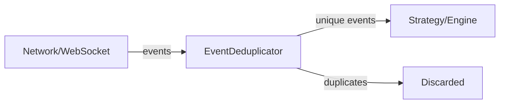

# deduplicator.py

## 기본 정보
| 항목 | 값 |
|------|---|
| **경로** | `backend/core/deduplicator.py` |
| **역할** | 실시간 이벤트 스트림에서 중복 이벤트 제거 (시간 윈도우 기반) |
| **라인 수** | 160 |
| **바이트** | 5,927 |

---

## 클래스

### `EventDeduplicator`
> 이벤트 중복 제거기 - 같은 이벤트가 여러 번 들어오면 한 번만 처리

| 메서드 | 시그니처 | 설명 |
|--------|----------|------|
| `__init__` | `(window_seconds: int = 60)` | 초기화, 중복 검사 시간 윈도우 설정 |
| `is_duplicate` | `(event_id: str, event_time: Optional[float] = None) -> bool` | 중복 여부 확인 (True=중복) |
| `mark_seen` | `(event_id: str, event_time: Optional[float] = None) -> None` | 이벤트를 "본 것으로" 표시 |
| `clear` | `() -> None` | 모든 기록 초기화 |
| `size` | `@property -> int` | 현재 추적 중인 이벤트 수 |
| `_cleanup` | `(now: float) -> None` | 만료된 이벤트 정리 |
| `make_event_id` | `@staticmethod (ticker, event_type, timestamp_ms) -> str` | 표준 event_id 생성 헬퍼 |

---

## 동작 원리

```
시간 윈도우 (기본 60초)
├── event_id 도착 → _seen 딕셔너리에 등록
├── 같은 event_id 재도착
│   ├── 60초 이내 → True (중복!)
│   └── 60초 이후 → False (새 이벤트로 처리)
└── 주기적 정리 (_cleanup)
    └── 윈도우 지난 event_id 제거 (메모리 누수 방지)
```

---

## 사용 예시

```python
from backend.core.deduplicator import EventDeduplicator

dedup = EventDeduplicator(window_seconds=60)

# 첫 번째 이벤트
dedup.is_duplicate("AAPL_tick_1736330000")  # False (최초)

# 같은 이벤트 재도착
dedup.is_duplicate("AAPL_tick_1736330000")  # True (중복!)

# 다른 이벤트
dedup.is_duplicate("AAPL_tick_1736330001")  # False (다른 이벤트)

# event_id 생성 헬퍼
event_id = EventDeduplicator.make_event_id("AAPL", "tick", 1736330000000)
# → "AAPL_tick_1736330000000"
```

---

## 🔗 외부 연결 (Connections)

### Imports From (이 파일이 가져오는 것)
| 파일 | 가져오는 항목 |
|------|--------------|
| `loguru` | `logger` |
| `time` | 현재 시간 |

### Imported By (이 파일을 가져가는 것)
| 파일 | 사용 목적 |
|------|----------|
| 실시간 데이터 처리 모듈 | 네트워크 중복 이벤트 필터링 |

### Data Flow


---

## 외부 의존성
| 패키지 | 사용 목적 |
|--------|----------|
| `time` | 타임스탬프 |
| `loguru` | 로깅 |
| `typing` | 타입 힌트 |
