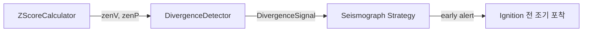

# divergence_detector.py

## 기본 정보
| 항목 | 값 |
|------|---|
| **경로** | `backend/core/divergence_detector.py` |
| **역할** | zenV-zenP Divergence 탐지 (매집 패턴) - Seismograph 전략의 Scout 단계 |
| **라인 수** | 133 |
| **바이트** | 4,389 |

---

## 클래스

### `DivergenceSignal` (dataclass)
> Divergence 탐지 신호

| 필드 | 타입 | 설명 |
|------|------|------|
| `ticker` | `str` | 종목 코드 |
| `zenV` | `float` | Volume Z-Score |
| `zenP` | `float` | Price Z-Score |
| `score` | `float` | Divergence 강도 (zenV - zenP) |
| `detected_at` | `datetime` | 탐지 시각 |

---

### `DivergenceDetector`
> zenV-zenP Divergence 탐지기

**Divergence 조건**:
- `zenV >= 2.0` (거래량이 평균 대비 2σ 이상)
- `zenP < 0.5` (가격 변동이 평균 이하)
- 해석: **거래량은 폭발, 가격은 조용 = 누군가 조용히 매집 중**

| 메서드 | 시그니처 | 설명 |
|--------|----------|------|
| `__init__` | `(zenV_threshold: float = 2.0, zenP_threshold: float = 0.5)` | 임계값 설정 |
| `check` | `(ticker: str, zenV: float, zenP: float) -> Optional[DivergenceSignal]` | Divergence 조건 확인 |
| `get_active_signals` | `() -> List[DivergenceSignal]` | 활성 신호 목록 |
| `get_signal` | `(ticker: str) -> Optional[DivergenceSignal]` | 특정 종목 신호 조회 |
| `clear_signal` | `(ticker: str) -> None` | 특정 종목 신호 제거 |
| `clear_all` | `() -> None` | 모든 신호 초기화 |

---

## 사용 예시

```python
detector = DivergenceDetector()
signal = detector.check("AAPL", zenV=2.5, zenP=0.3)
if signal:
    print(f"🔥 DIVERGENCE: {signal.ticker} (score={signal.score})")
```

---

## 🔗 외부 연결 (Connections)

### Imports From
| 파일 | 가져오는 항목 |
|------|--------------|
| `loguru` | `logger` |
| `datetime` | `datetime` |

### Used By
| 파일 | 사용 목적 |
|------|----------|
| `backend/strategies/seismograph/strategy.py` | Scout 단계 매집 패턴 탐지 |

### Data Flow


---

## 외부 의존성
| 패키지 | 사용 목적 |
|--------|----------|
| `dataclasses` | DivergenceSignal |
| `datetime` | 탐지 시각 |
| `loguru` | 로깅 |
