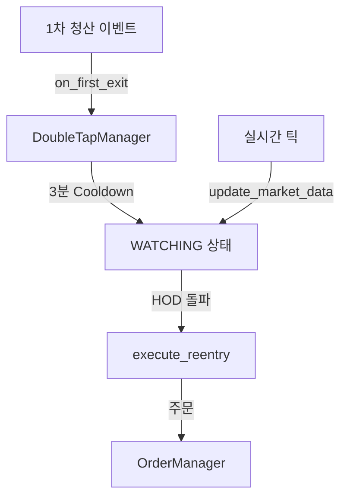

# double_tap.py

## 기본 정보
| 항목 | 값 |
|------|---|
| **경로** | `backend/core/double_tap.py` |
| **역할** | 1차 청산 후 재진입 로직 관리 (Double Tap 패턴) |
| **라인 수** | 368 |
| **바이트** | 12,430 |

---

## 클래스

### `DoubleTapState` (Enum)
> Double Tap 상태

| 값 | 설명 |
|----|------|
| `IDLE` | 대기 상태 |
| `COOLDOWN` | 쿨다운 중 (3분) |
| `WATCHING` | 재진입 조건 감시 중 |
| `TRIGGERED` | 재진입 트리거됨 |
| `ENTERED` | 2차 진입 완료 |
| `COMPLETED` | Double Tap 완료 |
| `CANCELLED` | 취소됨 |

---

### `DoubleTapEntry` (dataclass)
> Double Tap 진입 정보

| 필드 | 타입 | 설명 |
|------|------|------|
| `symbol` | `str` | 종목 심볼 |
| `first_exit_price` | `float` | 1차 청산 가격 |
| `first_qty` | `int` | 1차 수량 |
| `first_exit_time` | `datetime` | 1차 청산 시간 |
| `cooldown_minutes` | `int` | 쿨다운 시간 (기본 3분) |
| `hod` | `float` | High of Day |
| `vwap` | `float` | VWAP |
| `current_price` | `float` | 현재 가격 |
| `state` | `DoubleTapState` | 현재 상태 |
| `second_order_id` | `Optional[int]` | 2차 주문 ID |
| `exit_trailing_pct` | `float` | 청산 Trailing % |

| 프로퍼티 | 반환 타입 | 설명 |
|----------|----------|------|
| `cooldown_end` | `datetime` | 쿨다운 종료 시간 |
| `is_cooldown_over` | `bool` | 쿨다운 완료 여부 |
| `trigger_price` | `float` | HOD 돌파 트리거 가격 (HOD + $0.01) |

---

### `DoubleTapManager`
> Double Tap 관리자 - 1차 청산 후 재진입 조건 관리

**Process Flow**:
1. `on_first_exit()` → Cooldown 시작 (3분)
2. `update_market_data()` → HOD, VWAP 업데이트
3. `check_reentry()` → 재진입 조건 체크
4. `execute_reentry()` → 2차 진입 실행

**재진입 조건**:
- Cooldown 완료 (3분)
- 주가 > VWAP
- HOD 돌파 (current_price > HOD)

| 메서드 | 시그니처 | 설명 |
|--------|----------|------|
| `__init__` | `(connector=None, order_manager=None, trailing_manager=None)` | 초기화 |
| `on_first_exit` | `(symbol, exit_price, qty, reason) -> DoubleTapEntry` | 1차 청산 시 호출 |
| `update_market_data` | `(symbol, current_price, vwap, hod)` | 시장 데이터 업데이트 |
| `check_reentry` | `(symbol, current_price) -> bool` | 재진입 조건 체크 |
| `execute_reentry` | `(symbol) -> Optional[int]` | 2차 진입 실행 |
| `get_entry` | `(symbol) -> Optional[DoubleTapEntry]` | 엔트리 조회 |
| `cancel_reentry` | `(symbol) -> None` | 재진입 대기 취소 |
| `get_all_entries` | `() -> Dict[str, DoubleTapEntry]` | 모든 엔트리 |
| `get_watching_symbols` | `() -> List[str]` | 감시 중인 심볼 |

---

## 🔗 외부 연결 (Connections)

### Imports From
| 파일 | 가져오는 항목 |
|------|--------------|
| `loguru` | `logger` |
| `datetime` | `datetime`, `timedelta` |

### Calls To
| 대상 파일 | 호출 함수 |
|----------|----------|
| `OrderManager` | `execute_entry()` |
| `TrailingStopManager` | `create_trailing()` |
| `IBKRConnector` | 주문 실행 |

### Data Flow

---

## 외부 의존성
| 패키지 | 사용 목적 |
|--------|----------|
| `dataclasses` | DoubleTapEntry |
| `datetime` | 시간 관리 |
| `enum` | DoubleTapState |
| `loguru` | 로깅 |
