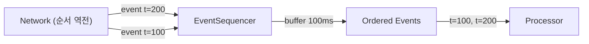

# event_sequencer.py

## 기본 정보
| 항목 | 값 |
|------|---|
| **경로** | `backend/core/event_sequencer.py` |
| **역할** | 비순차적으로 도착한 이벤트를 event_time 기준으로 재정렬 (버퍼링) |
| **라인 수** | 164 |
| **바이트** | 6,166 |

---

## 클래스

### `SequencedEvent` (dataclass)
> 순서 보장용 이벤트 래퍼

| 필드 | 타입 | 설명 |
|------|------|------|
| `event_time_ms` | `int` | 이벤트 발생 시간 (Unix ms) |
| `receive_time_ms` | `int` | 수신 시간 (Unix ms) |
| `data` | `Any` | 원본 이벤트 데이터 |

| 메서드 | 시그니처 | 설명 |
|--------|----------|------|
| `__lt__` | `(other: SequencedEvent) -> bool` | 우선순위 큐 정렬용 (event_time 기준 오름차순) |

---

### `EventSequencer`
> 이벤트 순서 보장기 - 네트워크 지연으로 인한 순서 역전 해결

**동작 원리**:
- 이벤트가 도착하면 min-heap에 저장
- buffer_ms (기본 100ms) 이후 시간순 정렬하여 방출
- "2번 이벤트"가 "1번 이벤트"보다 먼저 도착해도 올바른 순서로 처리

| 메서드 | 시그니처 | 설명 |
|--------|----------|------|
| `__init__` | `(buffer_ms: int = 100)` | 버퍼링 시간 설정 |
| `push` | `(event_data, event_time_ms, receive_time_ms) -> Iterator[SequencedEvent]` | 이벤트 추가 및 방출 |
| `flush` | `() -> Iterator[SequencedEvent]` | 버퍼 강제 방출 |
| `clear` | `() -> None` | 버퍼 초기화 |
| `pending_count` | `@property -> int` | 대기 중인 이벤트 수 |
| `oldest_event_age_ms` | `@property -> Optional[int]` | 가장 오래된 이벤트 대기 시간 |

---

## 사용 예시

```python
sequencer = EventSequencer(buffer_ms=100)

# 순서 뒤바뀐 이벤트 도착
for e in sequencer.push(event_data, event_t=200):
    pass  # 아직 안 나옴 (버퍼링 중)
    
for e in sequencer.push(event_data, event_t=100):
    pass  # 아직 안 나옴

for e in sequencer.flush():
    print(e.event_time_ms)  # 100, 200 순서로 출력!
```

---

## 🔗 외부 연결 (Connections)

### Imports From
| 파일 | 가져오는 항목 |
|------|--------------|
| `heapq` | `heappush`, `heappop` |
| `loguru` | `logger` |

### Data Flow


---

## 외부 의존성
| 패키지 | 사용 목적 |
|--------|----------|
| `heapq` | min-heap (우선순위 큐) |
| `time` | 현재 시간 |
| `dataclasses` | SequencedEvent |
| `loguru` | 로깅 |
