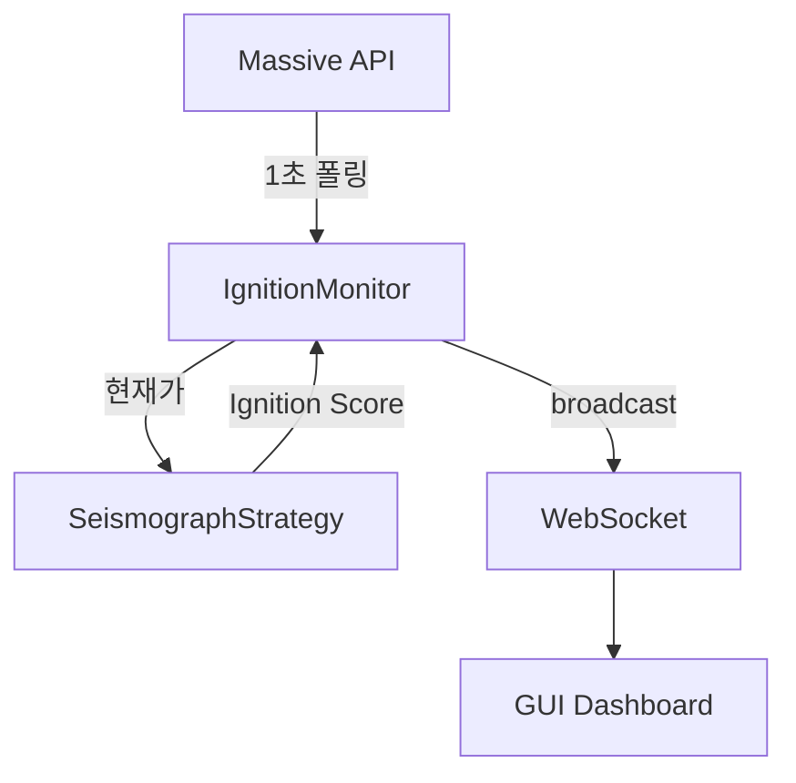

# ignition_monitor.py

## 기본 정보
| 항목 | 값 |
|------|---|
| **경로** | `backend/core/ignition_monitor.py` |
| **역할** | 실시간 Ignition Score 모니터링 서비스 (1초 폴링) - Phase 2 (Trigger) 로직 |
| **라인 수** | 443 |
| **바이트** | 18,000 |

---

## 클래스

### `IgnitionMonitor`
> 실시간 Ignition Score 모니터링 서비스 (v2 - Timer Polling)

**동작 방식**:
- 1초마다 REST API로 현재가 조회
- Ignition Score 계산
- WebSocket으로 GUI에 브로드캐스트

| 메서드 | 시그니처 | 설명 |
|--------|----------|------|
| `__init__` | `(strategy, ws_manager, poll_interval: float = 1.0)` | 초기화 |
| `start` | `(watchlist: List[Dict]) -> bool` | 모니터링 시작 |
| `stop` | `() -> None` | 모니터링 중지 |
| `on_tick` | `(ticker, price, volume, timestamp, side, bid, ask) -> None` | 틱 데이터 수신 (하위 호환성) |
| `get_all_scores` | `() -> Dict[str, float]` | 전체 Ignition Score |
| `get_score` | `(ticker: str) -> float` | 특정 종목 Score |
| `is_running` | `@property -> bool` | 실행 중 여부 |
| `ticker_count` | `@property -> int` | 모니터링 종목 수 |
| `_polling_loop` | `() -> None` | 메인 폴링 루프 |
| `_update_all_scores` | `(client) -> None` | 전체 Score 업데이트 |
| `_fetch_quotes` | `(client, tickers) -> Dict` | Massive Snapshot API 호출 |

---

## Ignition Score 계산

```
Ignition Score = f(zenV, zenP, volume_burst, price_momentum, ...)

점수 범위: 0 ~ 100
├── 70+ : 진입 신호 발생 가능
├── 80+ : 강한 진입 신호
└── 90+ : 매우 강한 진입 신호
```

---

## 🔗 외부 연결 (Connections)

### Imports From
| 파일 | 가져오는 항목 |
|------|--------------|
| `loguru` | `logger` |
| `asyncio` | 비동기 루프 |

### Calls To
| 대상 파일 | 호출 함수 |
|----------|----------|
| `SeismographStrategy` | `calculate_trigger_score()` |
| `ConnectionManager` | `broadcast_ignition()` |
| Massive API | Snapshot 현재가 조회 |

### Called By
| 호출 파일 | 사용 목적 |
|----------|----------|
| `backend/startup/realtime.py` | 서비스 초기화 |
| `backend/api/routes/ignition.py` | API 엔드포인트 |

### Data Flow


---

## 외부 의존성
| 패키지 | 사용 목적 |
|--------|----------|
| `asyncio` | 비동기 폴링 |
| `httpx` | HTTP 요청 (Massive API) |
| `loguru` | 로깅 |
| `datetime` | 시간 처리 |
