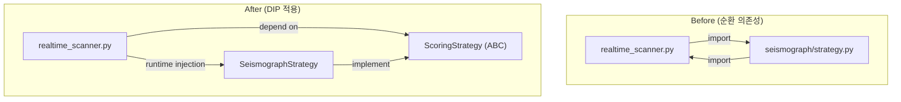
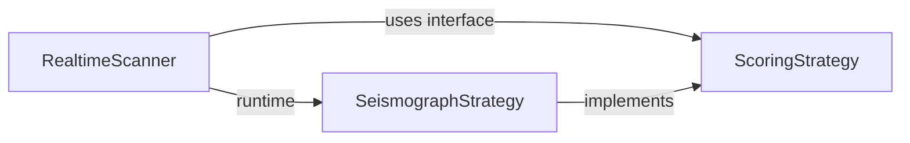

# interfaces/scoring.py

## 기본 정보
| 항목 | 값 |
|------|---|
| **경로** | `backend/core/interfaces/scoring.py` |
| **역할** | 점수 계산 전략 인터페이스 - 순환 의존성 해소를 위한 DIP 적용 |
| **라인 수** | 59 |
| **바이트** | 2,277 |

---

## 클래스

### `ScoringStrategy` (ABC)
> 점수 계산 전략 추상 인터페이스

**목적**: `realtime_scanner` ↔ `seismograph` 순환 의존성 해소

| 메서드 | 시그니처 | 설명 |
|--------|----------|------|
| `calculate_watchlist_score_detailed` | `(ticker: str, ohlcv_data: List[Dict]) -> Dict[str, Any]` | Watchlist 점수 상세 계산 (추상) |

### 반환값 구조
```python
{
    "score": float,          # Score V2
    "score_v3": float,       # Score V3
    "stage": str,            # 현재 단계 (예: "Accumulation")
    "stage_number": int,     # 단계 번호 (1-5)
    "signals": Dict[str, bool],  # 신호 상태
    "can_trade": bool,       # 거래 가능 여부
    "intensities_v3": Dict[str, float]  # 신호 강도
}
```

---

## Dependency Inversion Principle (DIP) 적용



---

## 🔗 외부 연결 (Connections)

### Implemented By (이 인터페이스를 구현하는 것)
| 파일 | 클래스 |
|------|--------|
| `backend/strategies/seismograph/strategy.py` | `SeismographStrategy` |

### Used By (이 인터페이스를 사용하는 것)
| 파일 | 사용 목적 |
|------|----------|
| `backend/core/realtime_scanner.py` | 런타임 전략 주입 |

### Data Flow


---

## 외부 의존성
| 패키지 | 사용 목적 |
|--------|----------|
| `abc` | ABC, abstractmethod |
| `typing` | List, Dict, Any |
