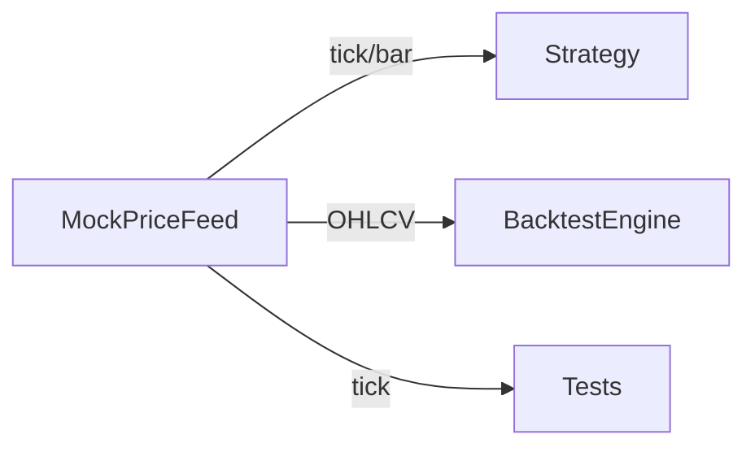

# mock_data.py

## 기본 정보
| 항목 | 값 |
|------|---|
| **경로** | `backend/core/mock_data.py` |
| **역할** | IBKR 없이 로컬 테스트를 위한 가상 시장 데이터 생성기 |
| **라인 수** | 440 |
| **바이트** | 18,853 |

---

## 클래스

### `MockFeedConfig` (dataclass)
> MockPriceFeed 설정값

| 필드 | 타입 | 기본값 | 설명 |
|------|------|--------|------|
| `initial_price` | `float` | 10.0 | 시작 가격 |
| `volatility` | `float` | 0.02 | 변동성 (2%) |
| `volume_base` | `int` | 10000 | 기본 거래량 |
| `volume_variance` | `float` | 0.5 | 거래량 변동 |
| `tick_per_bar` | `int` | 60 | 봉당 틱 수 |

---

### `MockPriceFeed`
> 가상 주가 데이터 생성기

**지원 모드**:
| 모드 | 설명 |
|------|------|
| `random_walk` | 브라운 운동 (랜덤 워크) - 기본 |
| `sine_wave` | 사인파 (규칙적 변동) |
| `spike` | 스파이크 (갑작스런 급등) - Ignition 테스트용 |

| 메서드 | 시그니처 | 설명 |
|--------|----------|------|
| `__init__` | `(mode, ticker, initial_price, config, seed)` | 생성기 초기화 |
| `generate_tick` | `() -> dict` | 단일 틱 데이터 생성 |
| `generate_ohlcv` | `(periods: int = 100) -> List[dict]` | OHLCV 봉 데이터 생성 |
| `reset` | `() -> None` | 생성기 상태 초기화 |
| `_calculate_price_change` | `() -> float` | 모드별 가격 변화량 |
| `_random_walk_change` | `() -> float` | 랜덤 워크 변화 |
| `_sine_wave_change` | `() -> float` | 사인파 변화 |
| `_spike_change` | `() -> float` | 스파이크 변화 |
| `_generate_volume` | `() -> int` | 거래량 생성 |

---

## 사용 예시

```python
from backend.core.mock_data import MockPriceFeed

# 랜덤 워크 모드
feed = MockPriceFeed(mode="random_walk", initial_price=10.0)
tick = feed.generate_tick()
print(f"가격: ${tick['price']:.2f}")

# OHLCV 봉 100개 생성
bars = feed.generate_ohlcv(periods=100)

# 스파이크 모드 (Ignition 테스트)
spike_feed = MockPriceFeed(mode="spike")
```

---

## 틱 데이터 구조

```python
{
    "ticker": "MOCK",
    "price": 10.25,
    "volume": 1500,
    "timestamp": datetime,
    "side": "B"  # Buy or Sell
}
```

## OHLCV 데이터 구조

```python
{
    "open": 10.00,
    "high": 10.50,
    "low": 9.90,
    "close": 10.25,
    "volume": 50000,
    "timestamp": datetime
}
```

---

## 🔗 외부 연결 (Connections)

### Exported By
| 파일 | 내보내는 항목 |
|------|--------------|
| `backend/core/__init__.py` | `MockPriceFeed` |

### Used By
| 파일 | 사용 목적 |
|------|----------|
| `tests/test_*.py` | 테스트용 Mock 데이터 |
| `scripts/demos/` | 데모 스크립트 |

### Data Flow


---

## 외부 의존성
| 패키지 | 사용 목적 |
|--------|----------|
| `math` | 사인파 계산 |
| `random` | 랜덤 생성 |
| `dataclasses` | MockFeedConfig |
| `datetime` | 타임스탬프 |
