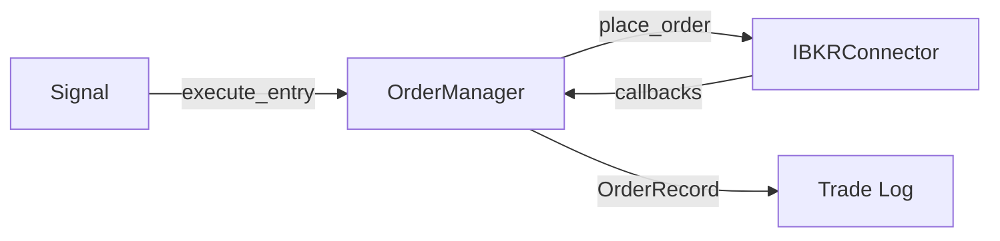

# order_manager.py

## 기본 정보
| 항목 | 값 |
|------|---|
| **경로** | `backend/core/order_manager.py` |
| **역할** | 주문 상태 관리 및 추적 - IBKRConnector와 연동하여 주문 라이프사이클 관리 |
| **라인 수** | 389 |
| **바이트** | 13,806 |

---

## 클래스

### `OrderStatus` (Enum)
> 주문 상태

| 값 | 설명 |
|----|------|
| `PENDING` | 대기 중 |
| `PARTIAL_FILL` | 부분 체결 |
| `FILLED` | 완전 체결 |
| `CANCELLED` | 취소됨 |
| `REJECTED` | 거부됨 |
| `ERROR` | 오류 |

---

### `OrderType` (Enum)
> 주문 유형

| 값 | 설명 |
|----|------|
| `MARKET` | 시장가 (MKT) |
| `LIMIT` | 지정가 (LMT) |
| `STOP` | 스탑 (STP) |
| `STOP_LIMIT` | 스탑 리밋 (STP LMT) |
| `TRAILING_STOP` | 트레일링 스탑 (TRAIL) |

---

### `OrderRecord` (dataclass)
> 주문 기록

| 필드 | 타입 | 설명 |
|------|------|------|
| `order_id` | `int` | 주문 ID |
| `symbol` | `str` | 종목 심볼 |
| `action` | `str` | BUY/SELL |
| `qty` | `int` | 수량 |
| `order_type` | `OrderType` | 주문 유형 |
| `status` | `OrderStatus` | 현재 상태 |
| `limit_price` | `Optional[float]` | 지정가 |
| `stop_price` | `Optional[float]` | 스탑가 |
| `fill_price` | `Optional[float]` | 체결가 |
| `created_at` | `datetime` | 생성 시간 |
| `filled_at` | `Optional[datetime]` | 체결 시간 |
| `cancelled_at` | `Optional[datetime]` | 취소 시간 |
| `oca_group` | `Optional[str]` | OCA 그룹 |
| `signal_id` | `Optional[str]` | 시그널 ID |
| `notes` | `str` | 비고 |

---

### `Position` (dataclass)
> 포지션 정보

| 필드 | 타입 | 설명 |
|------|------|------|
| `symbol` | `str` | 종목 심볼 |
| `qty` | `int` | 수량 |
| `avg_price` | `float` | 평균 단가 |
| `current_price` | `float` | 현재가 |
| `unrealized_pnl` | `float` | 미실현 손익 |
| `realized_pnl` | `float` | 실현 손익 |

| 프로퍼티 | 반환 타입 | 설명 |
|----------|----------|------|
| `market_value` | `float` | 시장 가치 |
| `pnl_pct` | `float` | 손익률 (%) |

---

### `OrderManager`
> 주문 관리자 - IBKRConnector와 연동

| 메서드 | 시그니처 | 설명 |
|--------|----------|------|
| `__init__` | `(connector=None)` | 초기화 (None이면 Mock 모드) |
| `execute_entry` | `(symbol, qty, action, signal_id) -> Optional[int]` | 진입 주문 실행 |
| `execute_oca_exit` | `(symbol, qty, entry_price, stop_loss_pct, profit_target_pct) -> Tuple` | OCA 청산 그룹 배치 |
| `get_order` | `(order_id) -> Optional[OrderRecord]` | 주문 조회 |
| `get_pending_orders` | `() -> List[OrderRecord]` | 미체결 주문 |
| `get_position` | `(symbol) -> Optional[Position]` | 포지션 조회 |
| `get_all_positions` | `() -> List[Position]` | 모든 포지션 |
| `get_trade_log` | `() -> List[OrderRecord]` | 거래 로그 |
| `cancel_order` | `(order_id) -> bool` | 주문 취소 |
| `cancel_all` | `() -> None` | 모든 주문 취소 |
| `_connect_signals` | `() -> None` | IBKRConnector 시그널 연결 |
| `_on_order_placed` | `(data) -> None` | 주문 접수 콜백 |
| `_on_order_filled` | `(data) -> None` | 체결 콜백 |
| `_on_order_cancelled` | `(data) -> None` | 취소 콜백 |
| `_on_positions_update` | `(positions) -> None` | 포지션 업데이트 |

---

## 🔗 외부 연결 (Connections)

### Calls To
| 대상 파일 | 호출 함수 |
|----------|----------|
| `IBKRConnector` | `place_market_order()`, `place_oca_group()`, `cancel_order()` |

### Called By
| 호출 파일 | 사용 목적 |
|----------|----------|
| `DoubleTapManager` | 2차 진입 주문 |
| `TradingEngine` | 시그널 기반 주문 |

### Data Flow

---

## 외부 의존성
| 패키지 | 사용 목적 |
|--------|----------|
| `dataclasses` | OrderRecord, Position |
| `enum` | OrderStatus, OrderType |
| `datetime` | 시간 처리 |
| `loguru` | 로깅 |
