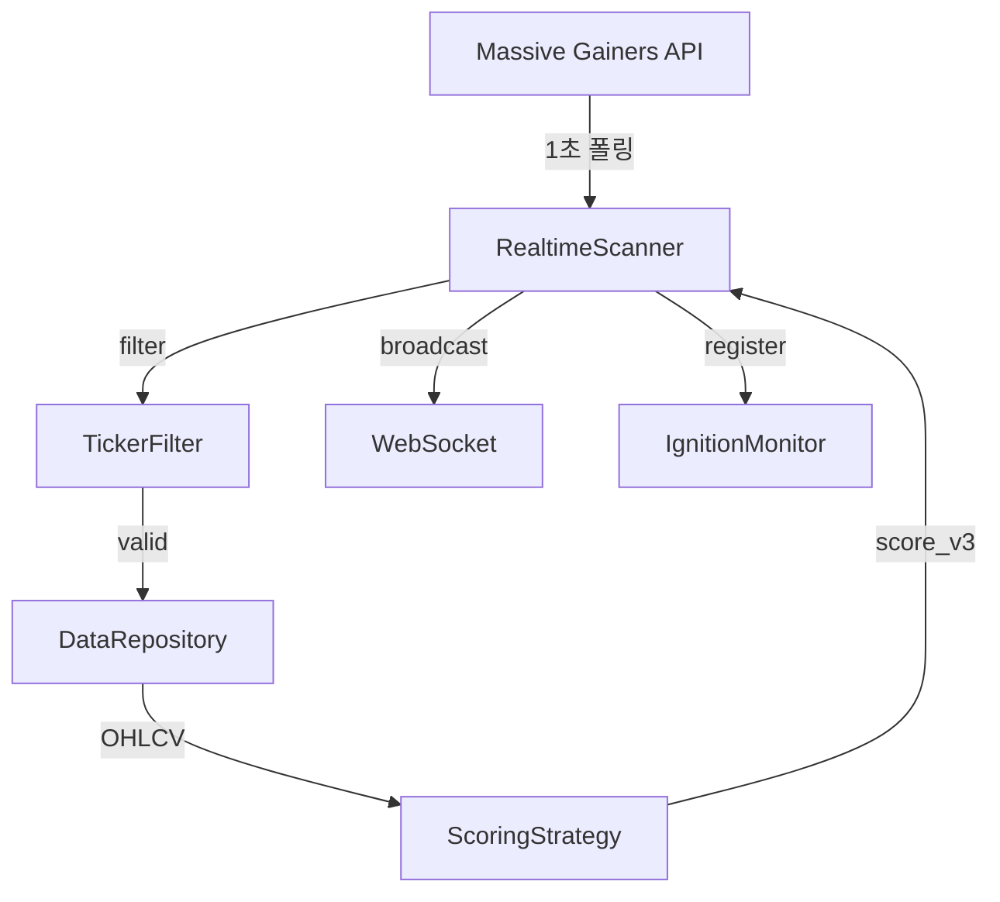

# realtime_scanner.py

## 기본 정보
| 항목 | 값 |
|------|---|
| **경로** | `backend/core/realtime_scanner.py` |
| **역할** | 실시간 급등 종목 스캐너 (1초 폴링) - Massive Gainers API 기반 |
| **라인 수** | 697 |
| **바이트** | 30,602 |

---

## 클래스

### `RealtimeScanner`
> 실시간 급등 종목 스캐너 - masterplan.md Section 7.3 "Source B (Real-Time Gainers)" 구현

**핵심 기능**:
- 1초마다 Massive Gainers API 폴링
- 신규 급등 종목 발견 시 Watchlist에 추가
- score_v3 계산 및 WebSocket 브로드캐스트
- IgnitionMonitor 연동

| 메서드 | 시그니처 | 설명 |
|--------|----------|------|
| `__init__` | `(massive_client, ws_manager, ignition_monitor, poll_interval, scoring_strategy, ticker_filter)` | 초기화 |
| `start` | `(initial_watchlist) -> bool` | 폴링 루프 시작 |
| `stop` | `() -> None` | 스캐너 중지 |
| `get_stats` | `() -> dict` | 스캐너 통계 |
| `get_known_tickers` | `() -> Set[str]` | 발견된 모든 종목 |
| `recalculate_all_scores` | `() -> dict` | 전체 Watchlist 점수 재계산 |
| `is_running` | `@property -> bool` | 실행 중 여부 |
| `watchlist` | `@property -> List[dict]` | 현재 Watchlist |
| `_polling_loop` | `() -> None` | 메인 폴링 루프 |
| `_poll_gainers` | `() -> None` | Gainers API 조회 |
| `_handle_new_gainer` | `(item) -> None` | 신규 급등 종목 처리 |
| `_periodic_watchlist_broadcast` | `() -> None` | 1초마다 Watchlist 브로드캐스트 |
| `_periodic_score_recalculation` | `() -> None` | 1시간마다 점수 재계산 |

---

## 신규 급등 종목 처리 흐름

```
1. _poll_gainers() → Massive API 호출
2. 신규 종목 발견
3. _handle_new_gainer()
   ├── TickerFilter로 제외 체크 (Warrant, Preferred 등)
   ├── DB에서 일봉 조회 (없으면 API fetch)
   ├── ScoringStrategy.calculate_watchlist_score_detailed()
   ├── Watchlist에 추가 (병합)
   ├── WebSocket 브로드캐스트
   └── IgnitionMonitor에 등록
```

---

## 🔗 외부 연결 (Connections)

### Imports From
| 파일 | 가져오는 항목 |
|------|--------------|
| `backend/core/ticker_filter.py` | `TickerFilter`, `get_ticker_filter()` |
| `backend/core/interfaces/scoring.py` | `ScoringStrategy` (TYPE_CHECKING) |
| `backend/data/data_repository.py` | `DataRepository` (TYPE_CHECKING) |

### Calls To
| 대상 파일 | 호출 함수 |
|----------|----------|
| `MassiveClient` | `get_gainers()` |
| `ScoringStrategy` | `calculate_watchlist_score_detailed()` |
| `ConnectionManager` | `broadcast_watchlist()` |
| `IgnitionMonitor` | `start()` |
| `DataRepository` | `get_daily_bars()`, `save_daily_bars()` |

### Data Flow


---

## 외부 의존성
| 패키지 | 사용 목적 |
|--------|----------|
| `asyncio` | 비동기 폴링 |
| `loguru` | 로깅 |
| `datetime` | 시간 처리 |
