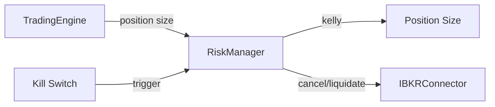

# risk_manager.py

## 기본 정보
| 항목 | 값 |
|------|---|
| **경로** | `backend/core/risk_manager.py` |
| **역할** | 리스크 관리, Kill Switch, 포지션 사이징 (Kelly Criterion) |
| **라인 수** | 543 |
| **바이트** | 21,404 |

---

## 클래스

### `DailyPnL` (dataclass)
> 일일 손익 기록

| 필드 | 타입 | 설명 |
|------|------|------|
| `date` | `str` | 날짜 |
| `realized_pnl` | `float` | 실현 손익 |
| `unrealized_pnl` | `float` | 미실현 손익 |
| `trade_count` | `int` | 거래 횟수 |

| 프로퍼티 | 반환 | 설명 |
|----------|------|------|
| `total_pnl` | `float` | 총 손익 |

---

### `RiskManager`
> 리스크 관리자 - 포지션 사이징, 손실 한도, Kill Switch

| 메서드 | 시그니처 | 설명 |
|--------|----------|------|
| `__init__` | `(connector=None, config: Optional[RiskConfig]=None)` | 초기화 |
| `set_starting_balance` | `(balance: float) -> None` | 시작 잔고 설정 |
| `update_balance` | `(balance: float) -> None` | 현재 잔고 업데이트 |
| `calculate_position_size` | `(symbol, entry_price, account_balance) -> int` | 포지션 사이즈 계산 |
| `get_daily_pnl_pct` | `() -> float` | 금일 손익률 |
| `check_daily_limit` | `() -> bool` | 일일 손실 한도 체크 |
| `check_weekly_limit` | `() -> bool` | 주간 손실 한도 체크 |
| `is_trading_allowed` | `() -> bool` | 거래 가능 여부 |
| `get_position_count` | `() -> int` | 현재 포지션 수 |
| `can_open_position` | `() -> bool` | 새 포지션 가능 여부 |
| `kill_switch` | `(reason: str) -> dict` | Kill Switch 발동 |
| `reset_kill_switch` | `() -> None` | Kill Switch 리셋 |
| `enable_trading` | `() -> None` | 거래 활성화 |
| `disable_trading` | `() -> None` | 거래 비활성화 |
| `record_trade` | `(symbol, pnl) -> None` | 거래 기록 |
| `_calculate_kelly_fraction` | `() -> float` | Kelly Criterion 계산 |
| `_calculate_weekly_pnl` | `() -> float` | 주간 손익 계산 |

---

## Kill Switch 동작

```
kill_switch(reason) 호출 시:
1. 모든 미체결 주문 취소
2. 전 포지션 시장가 청산
3. _kill_switch_active = True
4. 거래 중지

반환: {
    "cancelled_orders": int,
    "liquidated_positions": int,
    "success": bool
}
```

---

## Kelly Criterion

```
f* = (bp - q) / b

b = 승수 (평균 수익 / 평균 손실)
p = 승률
q = 1 - p

결과: 0.0 ~ 0.25 (최대 25% 배팅)
kelly_fraction 설정으로 추가 조정 (기본 0.5)
```

---

## 🔗 외부 연결 (Connections)

### Imports From
| 파일 | 가져오는 항목 |
|------|--------------|
| `backend/models/risk.py` | `RiskConfig` |

### Calls To
| 대상 파일 | 호출 함수 |
|----------|----------|
| `IBKRConnector` | `cancel_all_orders()`, `liquidate_all()`, `get_positions()` |

### Called By
| 호출 파일 | 사용 목적 |
|----------|----------|
| `OrderManager` | 주문 전 리스크 체크 |
| `TradingEngine` | 포지션 사이징 |
| `backend/api/routes/control.py` | Kill Switch API |

### Data Flow


---

## 외부 의존성
| 패키지 | 사용 목적 |
|--------|----------|
| `dataclasses` | DailyPnL |
| `datetime` | 날짜 처리 |
| `loguru` | 로깅 |
