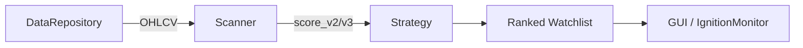

# scanner.py

## 기본 정보
| 항목 | 값 |
|------|---|
| **경로** | `backend/core/scanner.py` |
| **역할** | 과거 데이터 기반 일일 Watchlist 스캔 (Pre-market) |
| **라인 수** | 382 |
| **바이트** | 14,927 |

---

## 클래스

### `Scanner`
> 일일 Watchlist 스캐너 - masterplan.md Section 7.3 "Source A (Pre-Market Nightly Screen)" 구현

**핵심 기능**:
- DB에서 과거 OHLCV 조회
- 75% 이상 축적 점수 종목 필터링
- 병렬 점수 계산 (ThreadPoolExecutor)
- 순위 정렬 Watchlist 생성

| 메서드 | 시그니처 | 설명 |
|--------|----------|------|
| `__init__` | `(data_repo: DataRepository)` | 초기화 |
| `scan` | `(date, lookback_days, min_score, max_watchlist_size) -> List[dict]` | 일일 스캔 실행 |
| `rescan` | `(symbols, date, lookback_days) -> List[dict]` | 특정 종목 재스캔 |
| `get_ticker_data` | `(symbol, date, lookback_days) -> List[dict]` | 종목 OHLCV 조회 |
| `_calculate_score` | `(symbol, ohlcv_data) -> dict` | 단일 종목 점수 계산 |
| `_parallel_score_calc` | `(symbols, date, lookback_days, max_workers) -> List[dict]` | 병렬 점수 계산 |
| `_should_include` | `(symbol, ohlcv_data) -> bool` | 포함 여부 결정 |

---

## 반환값 구조

```python
[
    {
        "ticker": "AAPL",
        "score_v2": 85.5,
        "score_v3": 91.2,
        "stage": "Ignition",
        "stage_number": 4,
        "can_trade": True,
        "signals": {...},
        "intensities_v3": {...}
    },
    ...
]
```

---

## 스캔 흐름

```
1. data_repo.get_all_tickers() → 전체 종목 목록
2. 각 종목:
   ├── data_repo.get_daily_bars() → OHLCV
   ├── _should_include() → 필터링 (데이터 충분성)
   └── _calculate_score() → 점수 계산
3. score_v2 >= min_score 필터
4. 점수 내림차순 정렬
5. max_watchlist_size 제한
```

---

## 🔗 외부 연결 (Connections)

### Imports From
| 파일 | 가져오는 항목 |
|------|--------------|
| `backend/data/data_repository.py` | `DataRepository` |

### Calls To
| 대상 파일 | 호출 함수 |
|----------|----------|
| `DataRepository` | `get_all_tickers()`, `get_daily_bars()` |
| `SeismographStrategy` | `calculate_watchlist_score_detailed()` |

### Called By
| 호출 파일 | 사용 목적 |
|----------|----------|
| `TradingScheduler` | Pre-market 스캔 작업 |
| `backend/api/routes/scanner.py` | 수동 스캔 API |

### Data Flow


---

## 외부 의존성
| 패키지 | 사용 목적 |
|--------|----------|
| `concurrent.futures` | ThreadPoolExecutor |
| `datetime` | 날짜 처리 |
| `loguru` | 로깅 |
