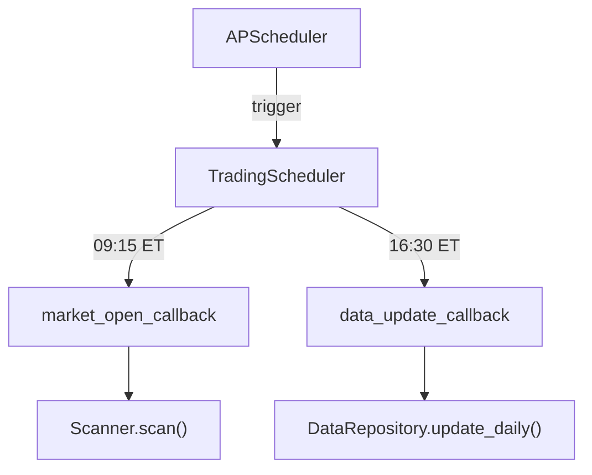

# scheduler.py

## 기본 정보
| 항목 | 값 |
|------|---|
| **경로** | `backend/core/scheduler.py` |
| **역할** | 트레이딩 작업 스케줄러 (장 시작/마감 작업 자동화) |
| **라인 수** | 317 |
| **바이트** | 12,090 |

---

## 클래스

### `TradingScheduler`
> APScheduler 기반 트레이딩 작업 스케줄러

**주요 예약 작업**:
| 작업 | 시간 (ET) | 설명 |
|------|----------|------|
| Pre-market Scan | 09:15 | 장 시작 15분 전 Watchlist 스캔 |
| Daily Data Update | 16:30 | 장 마감 후 일봉 업데이트 |

| 메서드 | 시그니처 | 설명 |
|--------|----------|------|
| `__init__` | `(config: SchedulerConfig = None)` | 초기화 |
| `start` | `() -> bool` | 스케줄러 시작 |
| `stop` | `() -> None` | 스케줄러 중지 |
| `set_market_open_callback` | `(callback: Callable) -> None` | 장 시작 콜백 설정 |
| `set_data_update_callback` | `(callback: Callable) -> None` | 데이터 업데이트 콜백 설정 |
| `set_market_close_callback` | `(callback: Callable) -> None` | 장 마감 콜백 설정 |
| `trigger_market_open` | `() -> None` | 장 시작 수동 트리거 |
| `trigger_data_update` | `() -> None` | 데이터 업데이트 수동 트리거 |
| `get_scheduled_jobs` | `() -> List[dict]` | 예약된 작업 목록 |
| `is_running` | `@property -> bool` | 실행 중 여부 |
| `_setup_jobs` | `() -> None` | 작업 스케줄 설정 |
| `_market_open_job` | `() -> None` | 장 시작 작업 실행 |
| `_data_update_job` | `() -> None` | 데이터 업데이트 작업 실행 |

---

## 스케줄 예시

```python
scheduler = TradingScheduler()

# 콜백 설정
scheduler.set_market_open_callback(async_scan_function)
scheduler.set_data_update_callback(async_update_function)

# 시작
scheduler.start()

# 예약 작업 확인
jobs = scheduler.get_scheduled_jobs()
# [
#   {"id": "market_open", "time": "09:15", "timezone": "America/New_York"},
#   {"id": "data_update", "time": "16:30", "timezone": "America/New_York"}
# ]
```

---

## 🔗 외부 연결 (Connections)

### Imports From
| 파일 | 가져오는 항목 |
|------|--------------|
| `backend/core/config_loader.py` | `SchedulerConfig` |

### Called By
| 호출 파일 | 사용 목적 |
|----------|----------|
| `backend/startup/realtime.py` | 스케줄러 초기화 및 시작 |
| `backend/api/routes/scheduler.py` | 수동 트리거 API |

### Data Flow


---

## 외부 의존성
| 패키지 | 사용 목적 |
|--------|----------|
| `apscheduler` | BackgroundScheduler, CronTrigger |
| `pytz` | 시간대 처리 |
| `loguru` | 로깅 |
