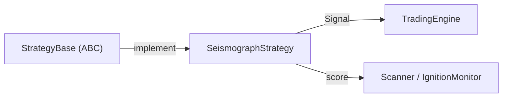

# strategy_base.py

## 기본 정보
| 항목 | 값 |
|------|---|
| **경로** | `backend/core/strategy_base.py` |
| **역할** | 전략 추상 베이스 클래스 (ABC) - 모든 전략의 공통 인터페이스 정의 |
| **라인 수** | 575 |
| **바이트** | 22,857 |

---

## 클래스

### `Signal` (dataclass)
> 전략에서 발생하는 트레이딩 신호

| 필드 | 타입 | 설명 |
|------|------|------|
| `signal_id` | `str` | 고유 신호 ID |
| `ticker` | `str` | 종목 심볼 |
| `action` | `str` | BUY / SELL |
| `reason` | `str` | 신호 발생 근거 |
| `score` | `float` | 확신도 점수 (0-100) |
| `entry_price` | `Optional[float]` | 진입 가격 |
| `stop_loss` | `Optional[float]` | 손절가 |
| `target_price` | `Optional[float]` | 목표가 |
| `timestamp` | `datetime` | 발생 시각 |
| `metadata` | `Dict[str, Any]` | 추가 메타데이터 |

---

### `StrategyBase` (ABC)
> 모든 전략의 추상 베이스 클래스

**Phase 1 (Watchlist) 메서드**:
| 메서드 | 시그니처 | 설명 |
|--------|----------|------|
| `calculate_watchlist_score` | `(ticker, ohlcv_data) -> float` | 기본 점수 계산 |
| `calculate_watchlist_score_detailed` | `(ticker, ohlcv_data) -> Dict` | 상세 점수 및 stage 반환 |

**Phase 2 (Trigger) 메서드**:
| 메서드 | 시그니처 | 설명 |
|--------|----------|------|
| `calculate_trigger_score` | `(ticker, current_price, ...) -> float` | Ignition Score 계산 (추상) |
| `on_tick` | `(ticker, price, volume, timestamp, ...) -> Optional[Signal]` | 틱 데이터 수신 시 호출 |
| `on_bar` | `(ticker, bar_data) -> Optional[Signal]` | 봉 데이터 수신 시 호출 |

**공통 메서드**:
| 메서드 | 시그니처 | 설명 |
|--------|----------|------|
| `name` | `@property -> str` | 전략 이름 (추상) |
| `version` | `@property -> str` | 전략 버전 (추상) |
| `description` | `@property -> str` | 전략 설명 |
| `is_enabled` | `@property -> bool` | 활성화 여부 |
| `enable` / `disable` | `() -> None` | 활성화 / 비활성화 |
| `reset` | `() -> None` | 상태 초기화 |
| `get_state` | `() -> Dict` | 현재 상태 반환 |
| `set_state` | `(state: Dict) -> None` | 상태 복원 |

---

## 전략 구현 예시

```python
from backend.core.strategy_base import StrategyBase, Signal

class MyStrategy(StrategyBase):
    @property
    def name(self) -> str:
        return "my_strategy"
    
    @property
    def version(self) -> str:
        return "1.0.0"
    
    def calculate_trigger_score(self, ticker, current_price, ...) -> float:
        # Ignition Score 계산 로직
        return score
    
    def on_tick(self, ticker, price, ...) -> Optional[Signal]:
        # 진입 조건 체크
        if self._check_entry(ticker, price):
            return Signal(ticker=ticker, action="BUY", ...)
        return None
```

---

## 🔗 외부 연결 (Connections)

### Exported By
| 파일 | 내보내는 항목 |
|------|--------------|
| `backend/core/__init__.py` | `StrategyBase`, `Signal` |

### Implemented By
| 파일 | 구현 클래스 |
|------|------------|
| `backend/strategies/seismograph/strategy.py` | `SeismographStrategy` |

### Used By
| 파일 | 사용 목적 |
|------|----------|
| `StrategyLoader` | 전략 동적 로드 |
| `BacktestEngine` | 백테스트 실행 |
| `Scanner` | Watchlist 점수 계산 |

### Data Flow


---

## 외부 의존성
| 패키지 | 사용 목적 |
|--------|----------|
| `abc` | ABC, abstractmethod, abstractproperty |
| `dataclasses` | Signal |
| `datetime` | 타임스탬프 |
| `uuid` | signal_id 생성 |
