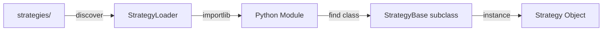

# strategy_loader.py

## 기본 정보
| 항목 | 값 |
|------|---|
| **경로** | `backend/core/strategy_loader.py` |
| **역할** | 전략 플러그인 동적 로드 시스템 (Hot Reload 지원) |
| **라인 수** | 485 |
| **바이트** | 19,553 |

---

## 클래스

### `StrategyLoader`
> 전략 플러그인 로더 - `strategies/` 디렉토리에서 전략 동적 로드

**핵심 기능**:
- 전략 파일 자동 발견 (`strategies/*/strategy.py`)
- 런타임 동적 로드/언로드
- Hot Reload (파일 변경 감지 시 자동 재로드)
- 전략 인스턴스 캐싱

| 메서드 | 시그니처 | 설명 |
|--------|----------|------|
| `__init__` | `(strategies_dir: str = "strategies")` | 초기화 |
| `discover` | `() -> List[str]` | 사용 가능한 전략 탐색 |
| `load` | `(strategy_name: str) -> Optional[StrategyBase]` | 전략 로드 |
| `reload` | `(strategy_name: str) -> Optional[StrategyBase]` | 전략 재로드 (Hot Reload) |
| `unload` | `(strategy_name: str) -> bool` | 전략 언로드 |
| `get` | `(strategy_name: str) -> Optional[StrategyBase]` | 로드된 전략 반환 |
| `list_loaded` | `() -> List[str]` | 로드된 전략 목록 |
| `list_available` | `() -> List[str]` | 사용 가능한 전략 목록 |
| `load_all` | `() -> Dict[str, StrategyBase]` | 모든 전략 로드 |
| `unload_all` | `() -> None` | 모든 전략 언로드 |
| `enable_hot_reload` | `(callback=None) -> None` | Hot Reload 활성화 |
| `disable_hot_reload` | `() -> None` | Hot Reload 비활성화 |
| `_load_module` | `(path: Path) -> ModuleType` | Python 모듈 로드 |
| `_find_strategy_class` | `(module) -> Type[StrategyBase]` | StrategyBase 서브클래스 탐색 |

---

## 전략 디렉토리 구조

```
strategies/
├── seismograph/
│   ├── __init__.py
│   ├── strategy.py      # SeismographStrategy 클래스
│   └── ...
├── momentum/
│   ├── __init__.py
│   └── strategy.py      # MomentumStrategy 클래스
└── ...
```

---

## 사용 예시

```python
loader = StrategyLoader("strategies")

# 탐색
available = loader.discover()  # ["seismograph", "momentum"]

# 로드
strategy = loader.load("seismograph")
print(strategy.name)  # "seismograph"

# Hot Reload
loader.enable_hot_reload()
# 파일 수정 시 자동 재로드

# 목록
loaded = loader.list_loaded()  # ["seismograph"]
```

---

## 🔗 외부 연결 (Connections)

### Imports From
| 파일 | 가져오는 항목 |
|------|--------------|
| `backend/core/strategy_base.py` | `StrategyBase` |

### Called By
| 호출 파일 | 사용 목적 |
|----------|----------|
| `backend/startup/realtime.py` | 전략 로드 |
| `backend/api/routes/strategy.py` | 전략 관리 API |

### Data Flow


---

## 외부 의존성
| 패키지 | 사용 목적 |
|--------|----------|
| `importlib` | 동적 모듈 로드 |
| `importlib.util` | spec_from_file_location |
| `pathlib` | 경로 처리 |
| `watchdog` | 파일 변경 감지 (Hot Reload) |
| `loguru` | 로깅 |
