# subscription_manager.py

## 기본 정보
| 항목 | 값 |
|------|---|
| **경로** | `backend/core/subscription_manager.py` |
| **역할** | Massive WebSocket 구독 동기화 (Watchlist ↔ 실시간 데이터 스트림) |
| **라인 수** | 277 |
| **바이트** | 11,096 |

---

## 클래스

### `SubscriptionManager`
> WebSocket 구독 관리자 - Watchlist 변경 시 자동 구독 동기화

**관리 채널**:
| 채널 | 설명 |
|------|------|
| `AM` | Aggregated Minute Bar (분봉) |
| `T` | Tick (체결) |

**Tier 분류**:
| Tier | 설명 | 구독 채널 |
|------|------|----------|
| **Tier 1** | Watchlist 종목 | AM |
| **Tier 2** | 활성 차트 티커 | AM + T |

| 메서드 | 시그니처 | 설명 |
|--------|----------|------|
| `__init__` | `(ws_client: MassiveWebSocketClient)` | 초기화 |
| `sync_watchlist` | `(tickers: List[str]) -> None` | Watchlist 구독 동기화 |
| `set_chart_ticker` | `(ticker: str) -> None` | 차트 티커 설정 (Tier 2) |
| `clear_chart_ticker` | `() -> None` | 차트 티커 해제 |
| `get_subscribed_tickers` | `() -> Set[str]` | 현재 구독 종목 |
| `get_am_subscriptions` | `() -> Set[str]` | AM 채널 구독 목록 |
| `get_tick_subscriptions` | `() -> Set[str]` | T 채널 구독 목록 |
| `unsubscribe_all` | `() -> None` | 모든 구독 해제 |
| `_subscribe` | `(ticker, channels) -> None` | 내부 구독 처리 |
| `_unsubscribe` | `(ticker, channels) -> None` | 내부 해제 처리 |
| `_calculate_diff` | `(new_set, old_set) -> Tuple[Set, Set]` | 추가/제거 종목 계산 |

---

## 동기화 흐름

```
Watchlist 변경 시:
1. sync_watchlist([AAPL, TSLA, NVDA])
2. _calculate_diff() → 추가/제거 종목 계산
3. 제거 종목 → _unsubscribe(AM)
4. 추가 종목 → _subscribe(AM)

Chart Ticker 변경 시:
1. set_chart_ticker("AAPL")
2. 이전 티커 → T 채널 해제 (AM은 유지)
3. 새 티커 → AM + T 채널 구독
```

---

## 🔗 외부 연결 (Connections)

### Calls To
| 대상 파일 | 호출 함수 |
|----------|----------|
| `MassiveWebSocketClient` | `subscribe()`, `unsubscribe()` |

### Called By
| 호출 파일 | 사용 목적 |
|----------|----------|
| `backend/startup/realtime.py` | 초기 구독 설정 |
| `RealtimeScanner` | Watchlist 변경 시 동기화 |
| `frontend/services/` | 차트 티커 변경 |

### Data Flow

```mermaid
graph LR
    A["Watchlist 변경"] -->|sync| B["SubscriptionManager"]
    B -->|subscribe/unsubscribe| C["MassiveWebSocketClient"]
    C -->|AM/T data| D["TickBroadcaster"]
```


---

## 외부 의존성
| 패키지 | 사용 목적 |
|--------|----------|
| `loguru` | 로깅 |
| `typing` | 타입 힌트 |
