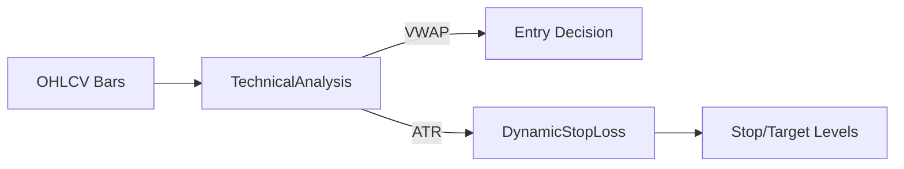

# technical_analysis.py

## 기본 정보
| 항목 | 값 |
|------|---|
| **경로** | `backend/core/technical_analysis.py` |
| **역할** | 기술적 분석 지표 계산 유틸리티 (VWAP, ATR, SMA, EMA, RSI 등) |
| **라인 수** | 530 |
| **바이트** | 20,142 |

---

## 클래스

### `TechnicalAnalysis` (Static Methods)
> 기술적 분석 지표 계산 유틸리티 클래스

| 메서드 | 시그니처 | 설명 |
|--------|----------|------|
| `vwap` | `(bars: List[dict]) -> float` | VWAP (Volume Weighted Average Price) |
| `atr` | `(bars: List[dict], period: int = 14) -> float` | ATR (Average True Range) |
| `sma` | `(values: List[float], period: int) -> float` | SMA (Simple Moving Average) |
| `ema` | `(values: List[float], period: int) -> float` | EMA (Exponential Moving Average) |
| `rsi` | `(closes: List[float], period: int = 14) -> float` | RSI (Relative Strength Index) |
| `bollinger_bands` | `(closes: List[float], period: int = 20, std_dev: float = 2.0) -> Tuple[float, float, float]` | Bollinger Bands (upper, middle, lower) |
| `macd` | `(closes: List[float], fast: int = 12, slow: int = 26, signal: int = 9) -> Tuple[float, float, float]` | MACD (macd, signal, histogram) |
| `stochastic` | `(bars: List[dict], k_period: int = 14, d_period: int = 3) -> Tuple[float, float]` | Stochastic (%K, %D) |
| `volume_profile` | `(bars: List[dict], bins: int = 10) -> List[dict]` | Volume Profile |
| `true_range` | `(high, low, prev_close) -> float` | True Range |

---

### `DynamicStopLoss`
> ATR 기반 동적 손절/익절 계산기

| 메서드 | 시그니처 | 설명 |
|--------|----------|------|
| `__init__` | `(atr_multiplier: float = 2.0, profit_multiplier: float = 3.0)` | 초기화 |
| `calculate` | `(entry_price, atr, direction) -> Dict` | 손절/익절가 계산 |
| `update` | `(current_price, direction) -> Dict` | 트레일링 업데이트 |

**반환값**:
```python
{
    "stop_loss": 9.50,
    "take_profit": 11.50,
    "risk": 0.50,
    "reward": 1.50,
    "risk_reward_ratio": 3.0
}
```

---

## 사용 예시

```python
from backend.core.technical_analysis import TechnicalAnalysis, DynamicStopLoss

# VWAP 계산
vwap = TechnicalAnalysis.vwap(bars)

# ATR 계산
atr = TechnicalAnalysis.atr(bars, period=14)

# 동적 손절/익절
dsl = DynamicStopLoss(atr_multiplier=2.0, profit_multiplier=3.0)
levels = dsl.calculate(entry_price=10.0, atr=0.25, direction="long")
# {"stop_loss": 9.50, "take_profit": 10.75, ...}
```

---

## 🔗 외부 연결 (Connections)

### Used By
| 파일 | 사용 목적 |
|------|----------|
| `SeismographStrategy` | Ignition Score 계산 시 지표 활용 |
| `BacktestEngine` | 진입/청산 조건 평가 |
| `DoubleTapManager` | VWAP 참조 |
| `TrailingStopManager` | ATR 기반 트레일링 |

### Data Flow


---

## 외부 의존성
| 패키지 | 사용 목적 |
|--------|----------|
| `numpy` | 수치 계산 |
| `statistics` | 표준편차 |
| `typing` | 타입 힌트 |
