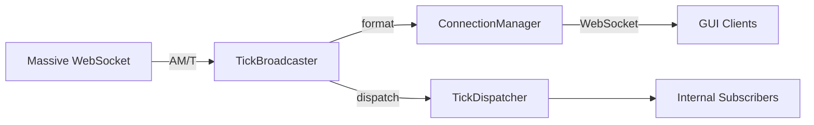

# tick_broadcaster.py

## 기본 정보
| 항목 | 값 |
|------|---|
| **경로** | `backend/core/tick_broadcaster.py` |
| **역할** | Massive WebSocket → GUI WebSocket 데이터 브릿지 |
| **라인 수** | 205 |
| **바이트** | 8,134 |

---

## 클래스

### `TickBroadcaster`
> 실시간 시장 데이터 브로드캐스터 - Massive → GUI 연결

**데이터 소스**:
- Massive WebSocket AM (Aggregated Minute) 채널
- Massive WebSocket T (Tick) 채널

**데이터 목적지**:
- GUI WebSocket 클라이언트
- TickDispatcher (내부 구독자)

| 메서드 | 시그니처 | 설명 |
|--------|----------|------|
| `__init__` | `(ws_manager: ConnectionManager, tick_dispatcher: Optional[TickDispatcher] = None)` | 초기화 |
| `on_am_message` | `(message: dict) -> None` | AM (분봉) 메시지 수신 콜백 |
| `on_tick_message` | `(message: dict) -> None` | T (틱) 메시지 수신 콜백 |
| `set_tick_dispatcher` | `(dispatcher: TickDispatcher) -> None` | TickDispatcher 설정 |
| `get_stats` | `() -> dict` | 브로드캐스트 통계 |
| `reset_stats` | `() -> None` | 통계 초기화 |
| `_format_bar_message` | `(data: dict) -> dict` | GUI용 봉 메시지 포맷 |
| `_format_tick_message` | `(data: dict) -> dict` | GUI용 틱 메시지 포맷 |

---

## 메시지 흐름

```
Massive WebSocket
    ├── AM 채널 → on_am_message()
    │       ├── _format_bar_message()
    │       ├── ws_manager.broadcast_bar()
    │       └── tick_dispatcher.dispatch_bar()
    │
    └── T 채널 → on_tick_message()
            ├── _format_tick_message()
            ├── ws_manager.broadcast_tick()
            └── tick_dispatcher.dispatch_tick()
```

---

## GUI 메시지 포맷

**봉 데이터 (AM)**:
```json
{
    "type": "bar",
    "ticker": "AAPL",
    "open": 150.00,
    "high": 151.20,
    "low": 149.80,
    "close": 150.50,
    "volume": 125000,
    "timestamp": "2026-01-16T10:30:00Z"
}
```

**틱 데이터 (T)**:
```json
{
    "type": "tick",
    "ticker": "AAPL",
    "price": 150.55,
    "size": 100,
    "side": "B",
    "timestamp": "2026-01-16T10:30:15.123Z"
}
```

---

## 🔗 외부 연결 (Connections)

### Calls To
| 대상 파일 | 호출 함수 |
|----------|----------|
| `ConnectionManager` | `broadcast_bar()`, `broadcast_tick()` |
| `TickDispatcher` | `dispatch_bar()`, `dispatch_tick()` |

### Called By
| 호출 파일 | 사용 목적 |
|----------|----------|
| `MassiveWebSocketClient` | 메시지 콜백 등록 |

### Data Flow


---

## 외부 의존성
| 패키지 | 사용 목적 |
|--------|----------|
| `loguru` | 로깅 |
| `datetime` | 타임스탬프 |
