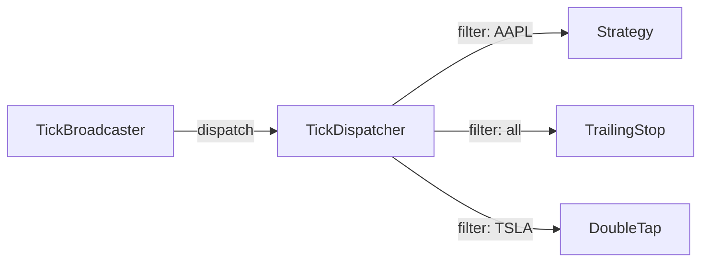

# tick_dispatcher.py

## 기본 정보
| 항목 | 값 |
|------|---|
| **경로** | `backend/core/tick_dispatcher.py` |
| **역할** | 실시간 틱 데이터를 내부 구독자에게 분배하는 중앙 허브 |
| **라인 수** | 191 |
| **바이트** | 7,156 |

---

## 클래스

### `TickDispatcher`
> 실시간 틱/봉 데이터 분배 허브 - Publisher/Subscriber 패턴

**구독자 예시**:
- Strategy (진입 조건 평가)
- TrailingStopManager (트레일링 스탑 업데이트)
- DoubleTapManager (재진입 조건 감시)
- GUI (차트 업데이트)

| 메서드 | 시그니처 | 설명 |
|--------|----------|------|
| `__init__` | `()` | 초기화 |
| `subscribe` | `(callback, ticker_filter=None, data_type="all") -> str` | 구독 등록 (ID 반환) |
| `unsubscribe` | `(subscription_id: str) -> bool` | 구독 해제 |
| `dispatch_tick` | `(ticker, price, volume, timestamp, side, bid, ask) -> None` | 틱 데이터 분배 |
| `dispatch_bar` | `(ticker, bar_data: dict) -> None` | 봉 데이터 분배 |
| `get_subscribers` | `() -> List[dict]` | 구독자 목록 |
| `clear_all` | `() -> None` | 모든 구독 해제 |
| `get_stats` | `() -> dict` | 분배 통계 |

---

## 구독 옵션

| 파라미터 | 타입 | 설명 |
|----------|------|------|
| `callback` | `Callable` | 데이터 수신 시 호출할 함수 |
| `ticker_filter` | `Optional[Set[str]]` | 특정 종목만 수신 (None = 전체) |
| `data_type` | `str` | "tick", "bar", "all" |

---

## 사용 예시

```python
dispatcher = TickDispatcher()

# 전체 틱 구독
def on_tick(ticker, price, volume, ...):
    print(f"{ticker}: ${price}")

sub_id = dispatcher.subscribe(on_tick, data_type="tick")

# 특정 종목만 구독
dispatcher.subscribe(
    on_bar_callback,
    ticker_filter={"AAPL", "TSLA"},
    data_type="bar"
)

# 틱 분배
dispatcher.dispatch_tick("AAPL", 150.5, 100, ...)
```

---

## 🔗 외부 연결 (Connections)

### Called By
| 호출 파일 | 사용 목적 |
|----------|----------|
| `TickBroadcaster` | 틱/봉 데이터 전달 |

### Subscribers (등록하는 것)
| 파일 | 구독 목적 |
|------|----------|
| `SeismographStrategy` | 실시간 Ignition 평가 |
| `TrailingStopManager` | 트레일링 스탑 업데이트 |
| `DoubleTapManager` | 재진입 조건 감시 |

### Data Flow


---

## 외부 의존성
| 패키지 | 사용 목적 |
|--------|----------|
| `uuid` | 구독 ID 생성 |
| `loguru` | 로깅 |
| `typing` | 타입 힌트 |
