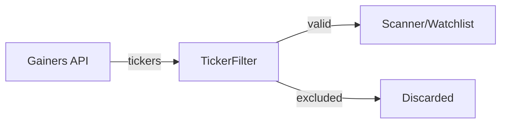

# ticker_filter.py

## 기본 정보
| 항목 | 값 |
|------|---|
| **경로** | `backend/core/ticker_filter.py` |
| **역할** | 거래 제외 종목 필터링 (Warrant, Preferred Stock 등) |
| **라인 수** | 245 |
| **바이트** | 9,388 |

---

## 클래스

### `TickerFilter`
> 거래 가능 종목 필터 - 패턴 기반 제외

**제외 대상 (기본)**:
| 패턴 | 설명 | 예시 |
|------|------|------|
| `*W`, `*WS` | Warrant | SPCE**W** |
| `*+` | Preferred Stock | BAC**+** |
| `*U` | Unit | DWAC**U** |
| `*R` | Rights | DWACU**R** |

| 메서드 | 시그니처 | 설명 |
|--------|----------|------|
| `__init__` | `(config_path: str = None)` | 초기화 (설정 파일 로드) |
| `should_exclude` | `(ticker: str) -> bool` | 제외 여부 판단 |
| `filter_tickers` | `(tickers: List[str]) -> List[str]` | 종목 리스트 필터링 |
| `add_exclusion` | `(ticker: str) -> None` | 수동 제외 추가 |
| `remove_exclusion` | `(ticker: str) -> None` | 수동 제외 제거 |
| `add_whitelist` | `(ticker: str) -> None` | 화이트리스트 추가 |
| `get_exclusions` | `() -> Set[str]` | 현재 제외 목록 |
| `get_patterns` | `() -> List[str]` | 제외 패턴 목록 |
| `load_config` | `(path: str) -> None` | YAML 설정 로드 |
| `save_config` | `(path: str) -> None` | YAML 설정 저장 |

---

## 설정 파일 구조

```yaml
# config/ticker_filter.yaml
patterns:
  - "*W"      # Warrants
  - "*WS"     # Warrants
  - "*+"      # Preferred
  - "*U"      # Units
  - "*R"      # Rights

exclusions:
  - "SPCE"    # 수동 제외
  
whitelist:
  - "AAPLW"   # 패턴 매칭되지만 예외 허용
```

---

## 사용 예시

```python
from backend.core.ticker_filter import TickerFilter, get_ticker_filter

# 싱글톤 인스턴스
filter = get_ticker_filter()

# 단일 체크
filter.should_exclude("SPACW")  # True (Warrant)
filter.should_exclude("AAPL")   # False

# 리스트 필터링
tickers = ["AAPL", "TSLA", "SPACW", "BACP+"]
valid = filter.filter_tickers(tickers)  # ["AAPL", "TSLA"]
```

---

## 🔗 외부 연결 (Connections)

### Used By
| 파일 | 사용 목적 |
|------|----------|
| `RealtimeScanner` | 신규 급등 종목 필터링 |
| `Scanner` | Pre-market 스캔 필터링 |

### Data Flow


---

## 외부 의존성
| 패키지 | 사용 목적 |
|--------|----------|
| `yaml` | 설정 파일 |
| `fnmatch` | 패턴 매칭 |
| `pathlib` | 경로 처리 |
| `loguru` | 로깅 |
