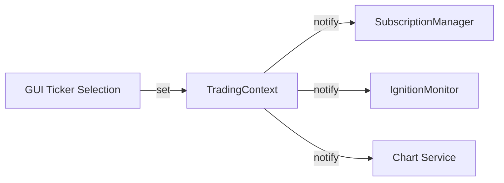

# trading_context.py

## 기본 정보
| 항목 | 값 |
|------|---|
| **경로** | `backend/core/trading_context.py` |
| **역할** | 현재 활성 티커 중앙 관리 (Single Source of Truth) |
| **라인 수** | 98 |
| **바이트** | 3,442 |

---

## 클래스

### `TradingContext`
> 활성 티커 컨텍스트 관리자 - 전역 상태 공유

**역할**:
- GUI에서 선택한 "현재 티커"를 백엔드 전체에서 공유
- 구독자 패턴으로 티커 변경 알림

| 메서드 | 시그니처 | 설명 |
|--------|----------|------|
| `__init__` | `()` | 초기화 |
| `set_active_ticker` | `(ticker: str) -> None` | 활성 티커 설정 |
| `get_active_ticker` | `() -> Optional[str]` | 활성 티커 조회 |
| `clear_active_ticker` | `() -> None` | 활성 티커 제거 |
| `subscribe` | `(callback: Callable[[str], None]) -> str` | 변경 구독 |
| `unsubscribe` | `(subscription_id: str) -> bool` | 구독 해제 |
| `active_ticker` | `@property -> Optional[str]` | 현재 활성 티커 |

---

## 사용 예시

```python
from backend.core.trading_context import TradingContext

context = TradingContext()

# 구독
def on_ticker_change(ticker: str):
    print(f"티커 변경: {ticker}")
    
sub_id = context.subscribe(on_ticker_change)

# 티커 설정 → 구독자 콜백 호출
context.set_active_ticker("AAPL")  # "티커 변경: AAPL" 출력

# 조회
current = context.get_active_ticker()  # "AAPL"
```

---

## 🔗 외부 연결 (Connections)

### Used By
| 파일 | 사용 목적 |
|------|----------|
| `SubscriptionManager` | 차트 티커 Tier 2 구독 |
| `IgnitionMonitor` | 우선 모니터링 티커 |
| `frontend/services/` | GUI 티커 선택 반영 |

### Data Flow


---

## 외부 의존성
| 패키지 | 사용 목적 |
|--------|----------|
| `uuid` | 구독 ID |
| `loguru` | 로깅 |
| `typing` | 타입 힌트 |
