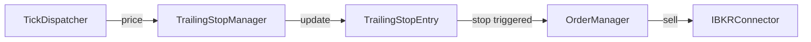

# trailing_stop.py

## 기본 정보
| 항목 | 값 |
|------|---|
| **경로** | `backend/core/trailing_stop.py` |
| **역할** | 트레일링 스탑 관리 (ATR 기반 동적 청산) |
| **라인 수** | 285 |
| **바이트** | 11,203 |

---

## 클래스

### `TrailingStopEntry` (dataclass)
> 트레일링 스탑 엔트리 정보

| 필드 | 타입 | 설명 |
|------|------|------|
| `symbol` | `str` | 종목 심볼 |
| `entry_price` | `float` | 진입가 |
| `qty` | `int` | 수량 |
| `direction` | `str` | "long" / "short" |
| `atr` | `float` | 진입 시 ATR |
| `trail_pct` | `float` | 트레일링 % |
| `highest_price` | `float` | 최고가 (Long) |
| `lowest_price` | `float` | 최저가 (Short) |
| `stop_price` | `float` | 현재 스탑가 |
| `created_at` | `datetime` | 생성 시간 |

| 프로퍼티 | 반환 | 설명 |
|----------|------|------|
| `unrealized_pnl_pct` | `float` | 미실현 손익률 |

---

### `TrailingStopManager`
> 트레일링 스탑 관리자

| 메서드 | 시그니처 | 설명 |
|--------|----------|------|
| `__init__` | `(connector=None, order_manager=None)` | 초기화 |
| `create_trailing` | `(symbol, entry_price, qty, direction, atr, trail_pct) -> TrailingStopEntry` | 트레일링 스탑 생성 |
| `update_price` | `(symbol, current_price) -> Optional[str]` | 가격 업데이트 (청산 신호 반환) |
| `get_entry` | `(symbol) -> Optional[TrailingStopEntry]` | 엔트리 조회 |
| `remove_entry` | `(symbol) -> bool` | 엔트리 제거 |
| `get_all_entries` | `() -> Dict[str, TrailingStopEntry]` | 모든 엔트리 |
| `check_stop` | `(symbol, current_price) -> bool` | 스탑 트리거 여부 |
| `execute_stop` | `(symbol, reason) -> bool` | 스탑 청산 실행 |
| `_calculate_new_stop` | `(entry, current_price) -> float` | 새 스탑가 계산 |

---

## 트레일링 로직

```
Long Position:
1. 가격 상승 시 → highest_price 갱신
2. stop_price = highest_price × (1 - trail_pct)
3. 가격 < stop_price → 청산

Short Position:
1. 가격 하락 시 → lowest_price 갱신
2. stop_price = lowest_price × (1 + trail_pct)
3. 가격 > stop_price → 청산
```

---

## 사용 예시

```python
manager = TrailingStopManager(connector, order_manager)

# 트레일링 스탑 생성
entry = manager.create_trailing(
    symbol="AAPL",
    entry_price=150.0,
    qty=100,
    direction="long",
    atr=2.5,
    trail_pct=0.05  # 5%
)

# 가격 업데이트 (실시간 틱에서 호출)
result = manager.update_price("AAPL", 155.0)  # highest 갱신
result = manager.update_price("AAPL", 147.0)  # "stop_triggered" 반환
```

---

## 🔗 외부 연결 (Connections)

### Calls To
| 대상 파일 | 호출 함수 |
|----------|----------|
| `OrderManager` | `execute_exit()` |
| `IBKRConnector` | 청산 주문 |

### Called By
| 호출 파일 | 사용 목적 |
|----------|----------|
| `TickDispatcher` | 실시간 가격 수신 → update_price |
| `DoubleTapManager` | 2차 진입 트레일링 설정 |

### Data Flow


---

## 외부 의존성
| 패키지 | 사용 목적 |
|--------|----------|
| `dataclasses` | TrailingStopEntry |
| `datetime` | 시간 처리 |
| `loguru` | 로깅 |
