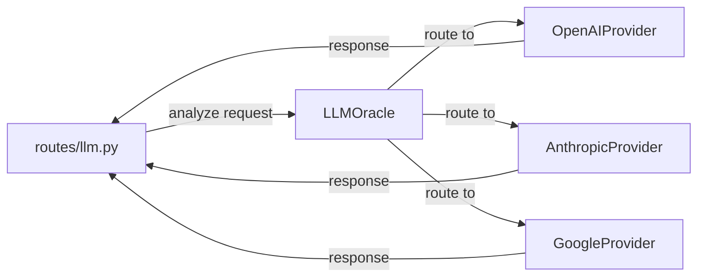

# oracle.py

## 기본 정보

| 항목 | 값 |
|------|---|
| **경로** | `backend/llm/oracle.py` |
| **역할** | Provider-Agnostic LLM Oracle Service - 다중 LLM 제공자 관리 |
| **라인 수** | 130 |

---

## 클래스

### `LLMProvider(ABC)`
> LLM 제공자 추상 베이스 클래스

| 메서드 | 시그니처 | 설명 |
|--------|----------|------|
| `get_name` | `(self) -> str` | 제공자 이름 반환 |
| `list_models` | `(self) -> List[str]` | 사용 가능한 모델 목록 |
| `generate_text` | `(system_prompt, user_prompt, model) -> str` | 텍스트 생성 |

### `OpenAIProvider(LLMProvider)`
> OpenAI API 제공자

| 모델 | 설명 |
|------|------|
| `gpt-4o` | GPT-4 Omni |
| `gpt-4-turbo` | GPT-4 Turbo |
| `gpt-3.5-turbo` | GPT-3.5 Turbo |

### `AnthropicProvider(LLMProvider)`
> Anthropic Claude API 제공자

| 모델 | 설명 |
|------|------|
| `claude-3-5-sonnet-20240620` | Claude 3.5 Sonnet |
| `claude-3-opus-20240229` | Claude 3 Opus |

### `GoogleProvider(LLMProvider)`
> Google Gemini API 제공자

| 모델 | 설명 |
|------|------|
| `gemini-1.5-pro` | Gemini 1.5 Pro |
| `gemini-1.5-flash` | Gemini 1.5 Flash |

### `LLMOracle`
> Provider-Agnostic LLM Oracle Service

| 메서드 | 시그니처 | 설명 |
|--------|----------|------|
| `__init__` | `(self)` | 3개 provider 초기화 |
| `get_available_models` | `(self) -> Dict[str, List[str]]` | 제공자별 모델 목록 |
| `analyze` | `(prompt, provider_name, model) -> str` | 분석 실행 메인 진입점 |

---

## 🔗 외부 연결 (Connections)

### Imports From (이 파일이 가져오는 것)
| 파일/라이브러리 | 가져오는 항목 |
|----------------|--------------|
| `abc` | `ABC`, `abstractmethod` |
| `typing` | `List`, `Optional`, `Dict` |
| `loguru` | `logger` |

### Imported By (이 파일을 가져가는 것)
| 파일 | 사용 목적 |
|------|----------|
| `backend/api/routes/llm.py` | LLM API 엔드포인트 |

### Data Flow


---

## 외부 의존성
- `abc` (추상 베이스 클래스)
- `loguru` (로깅)
- (향후) `openai`, `anthropic`, `google-generativeai`

---

## 글로벌 인스턴스
```python
oracle_service = LLMOracle()  # 싱글톤 인스턴스
```

---

## 시스템 프롬프트
```python
system_prompt = "You are a highly experienced professional stock trader. Analyze the following market data."
```
