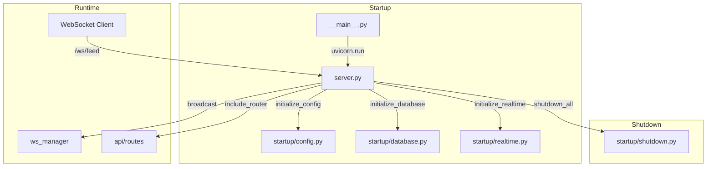

# server.py

## 기본 정보

| 항목 | 값 |
|------|---|
| **경로** | `backend/server.py` |
| **역할** | FastAPI 기반 메인 백엔드 서버 - 라이프사이클 관리, WebSocket, 라우터 등록 |
| **라인 수** | 295 |
| **바이트** | 13,194 |

## 클래스

### `AppState`
> FastAPI `app.state` 대신 사용하는 명시적 상태 컨테이너 (타입 힌팅 및 IDE 지원용)

| 속성 | 타입 | 설명 |
|------|------|------|
| `config` | `ServerConfig | None` | 서버 설정 |
| `ibkr` | `IBKRConnector | None` | IBKR 브로커 연결 |
| `engine` | `TradingEngine | None` | 트레이딩 엔진 (미사용) |
| `scheduler` | `APScheduler | None` | 스케줄러 |
| `db` | `DB | None` | 데이터베이스 연결 |
| `strategy_loader` | `StrategyLoader | None` | 전략 로더 |
| `massive_ws` | `MassiveWebSocketClient | None` | Massive WS 클라이언트 |
| `tick_broadcaster` | `TickBroadcaster | None` | 틱 브로드캐스터 |
| `tick_dispatcher` | `TickDispatcher | None` | 틱 디스패처 |
| `sub_manager` | `SubscriptionManager | None` | 구독 관리자 |
| `trailing_stop` | `TrailingStopManager | None` | 트레일링 스탑 |
| `ignition_monitor` | `IgnitionMonitor | None` | 점화 모니터 |
| `realtime_scanner` | `RealtimeScanner | None` | 실시간 스캐너 |

## 함수 목록

| 함수명 | 시그니처 | 설명 |
|--------|----------|------|
| `get_app_state` | `() -> AppState` | FastAPI 의존성 주입용 AppState 반환 |
| `lifespan` | `(app: FastAPI) -> AsyncContextManager` | 서버 Startup/Shutdown 라이프사이클 관리 |
| `websocket_endpoint` | `(websocket: WebSocket) -> None` | `/ws/feed` WebSocket 엔드포인트 |
| `_handle_set_active_ticker` | `(data: dict) -> None` | 활성 티커 변경 요청 처리 (내부) |
| `health_check` | `() -> dict` | `/health` 헬스체크 엔드포인트 |

## 전역 객체

| 객체 | 타입 | 설명 |
|------|------|------|
| `app_state` | `AppState` | 전역 애플리케이션 상태 |
| `app` | `FastAPI` | FastAPI 애플리케이션 인스턴스 |

## 🔗 외부 연결 (Connections)

### Imports From (이 파일이 가져오는 것)
| 파일 | 가져오는 항목 |
|------|--------------|
| `backend/startup/config.py` | `initialize_config()` |
| `backend/startup/database.py` | `initialize_database()`, `sync_daily_data()` |
| `backend/startup/realtime.py` | `initialize_realtime_services()` |
| `backend/startup/shutdown.py` | `shutdown_all()` |
| `backend/api/routes/__init__.py` | `router` (API 라우터) |
| `backend/api/websocket.py` | `manager` (WebSocket 매니저) |
| `backend/container.py` | `container` (런타임 import) |

### Imported By (이 파일을 가져가는 것)
| 파일 | 사용 목적 |
|------|----------|
| `backend/__main__.py` | `uvicorn.run("backend.server:app")` |
| `backend/api/routes/status.py` | `app_state` 참조 |
| `backend/api/routes/tier2.py` | `app_state` 참조 |
| `backend/api/routes/strategy.py` | `app_state` 참조 |
| `backend/api/routes/position.py` | `app_state` 참조 (주석 처리됨) |

### Calls To (이 파일이 호출하는 외부 함수)
| 대상 파일 | 호출 함수 |
|----------|----------|
| `backend/startup/config.py` | `initialize_config()` |
| `backend/startup/database.py` | `initialize_database()`, `sync_daily_data()` |
| `backend/startup/realtime.py` | `initialize_realtime_services()` |
| `backend/startup/shutdown.py` | `shutdown_all()` |
| `backend/container.py` | `container.trading_context()` |
| `backend/api/websocket.py` | `ws_manager.connect()`, `broadcast()`, `disconnect()` |

### Data Flow

## API 엔드포인트

| 경로 | 메서드 | 설명 |
|------|--------|------|
| `/health` | GET | 서버 헬스체크 |
| `/ws/feed` | WebSocket | 실시간 데이터 피드 |
| `/api/*` | - | API 라우터 (`/docs`에서 확인) |

## WebSocket 메시지 타입

| 타입 | 방향 | 설명 |
|------|------|------|
| `PING` | Client → Server | 하트비트 요청 |
| `PONG:{json}` | Server → Client | 하트비트 응답 (서버 시간 포함) |
| `SET_ACTIVE_TICKER` | Client → Server | 활성 티커 변경 요청 |
| `ACTIVE_TICKER_CHANGED` | Server → Clients | 활성 티커 변경 브로드캐스트 |

## 외부 의존성
- `fastapi` - 웹 프레임워크
- `uvicorn` - ASGI 서버
- `dotenv` - 환경변수 로드
- `loguru` - 로깅
