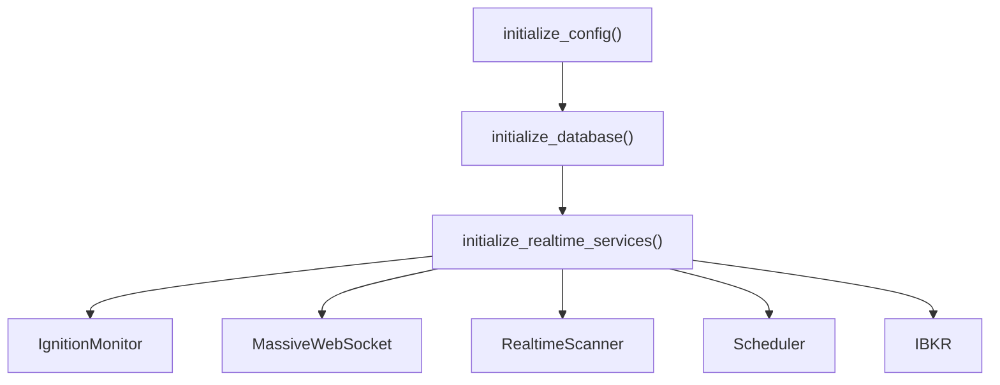
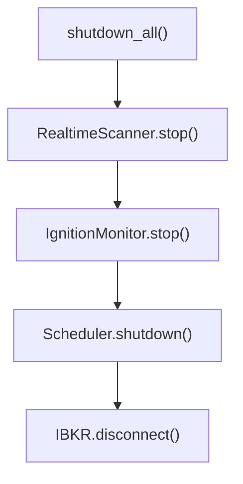

# Backend Startup Module

> 📍 **Location**: `backend/startup/`  
> **Role**: 서버 시작/종료 시 초기화 및 정리 로직

---

## 파일 목록 (5 files)

| 파일 | 역할 | 주요 함수 |
|------|------|----------|
| `__init__.py` | 패키지 진입점, re-export | - |
| `config.py` | 설정 + 로깅 초기화 | `initialize_config()`, `setup_logging()` |
| `database.py` | DB + Strategy Loader 초기화 | `initialize_database()`, `sync_daily_data()` |
| `realtime.py` | 실시간 서비스 초기화 | `initialize_realtime_services()` |
| `shutdown.py` | 종료 로직 | `shutdown_all()`, `shutdown_from_result()` |

---

## 주요 클래스

### `RealtimeServicesResult`
> 실시간 서비스 초기화 결과 컨테이너

| 필드 | 타입 | 설명 |
|------|------|------|
| `ignition_monitor` | `IgnitionMonitor` | Ignition Score 모니터 |
| `massive_ws` | `MassiveWebSocket` | Massive WebSocket |
| `tick_broadcaster` | `TickBroadcaster` | 틱 브로드캐스터 |
| `tick_dispatcher` | `TickDispatcher` | 틱 디스패처 |
| `sub_manager` | `SubscriptionManager` | 구독 관리자 |
| `trailing_stop` | `TrailingStop` | 트레일링 스탑 |
| `realtime_scanner` | `RealtimeScanner` | 실시간 스캐너 |
| `scheduler` | `TradingScheduler` | 스케줄러 |
| `ibkr` | `IBKRConnector` | IBKR 커넥터 |

---

## 초기화 순서 (Startup Flow)

---

## 종료 순서 (Shutdown Flow)

---

## 🔗 외부 연결

### Imports From
| 파일 | 가져오는 항목 |
|------|--------------|
| `backend/core/config_loader` | `load_server_config`, `ServerConfig` |
| `backend/container` | `container` (DI Container) |
| `backend/data/database` | `MarketDB` |
| `backend/core/strategy_loader` | `StrategyLoader` |
| `backend/core/ignition_monitor` | `IgnitionMonitor` |
| `backend/core/realtime_scanner` | `RealtimeScanner` |
| `backend/broker/ibkr_connector` | `IBKRConnector` |

### Imported By
| 파일 | 사용 목적 |
|------|----------|
| `backend/server.py` | lifespan에서 startup/shutdown 호출 |

---

## 외부 의존성
- `loguru`
- (내장) `typing`, `pathlib`
