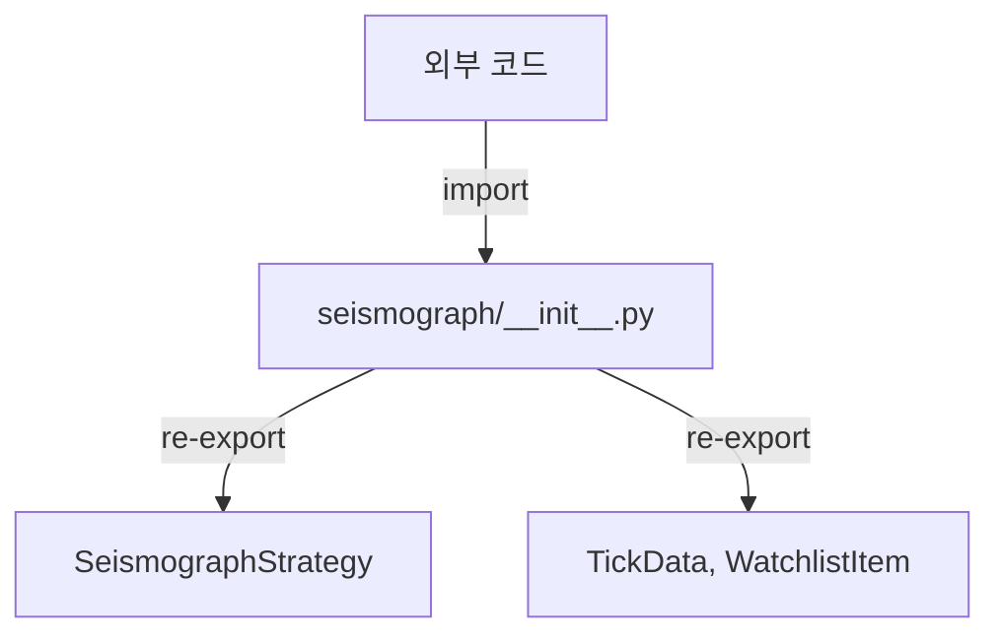

# seismograph/__init__.py

## 기본 정보

| 항목 | 값 |
|------|---|
| **경로** | `backend/strategies/seismograph/__init__.py` |
| **역할** | Seismograph Strategy 패키지 진입점 - Public API exports |
| **라인 수** | 47 |
| **바이트** | 2,146 |

## 패키지 구조

```
seismograph/
├── __init__.py       # 진입점 (이 파일)
├── strategy.py       # SeismographStrategy 클래스
├── models.py         # TickData, WatchlistItem 데이터 모델
├── scoring/          # 점수 계산 모듈 (v1, v2, v3)
└── signals/          # 시그널 탐지 모듈
```

## Export 목록

```python
__all__ = [
    "SeismographStrategy",
    "TickData",
    "WatchlistItem",
]
```

| Export | 소스 | 설명 |
|--------|------|------|
| `SeismographStrategy` | `strategy.py` | 메인 전략 클래스 |
| `TickData` | `backend/models` | 틱 데이터 모델 |
| `WatchlistItem` | `backend/models` | 워치리스트 아이템 모델 |

## 🔗 외부 연결 (Connections)

### Imports From (이 파일이 가져오는 것)
| 파일 | 가져오는 항목 |
|------|--------------|
| `backend/strategies/seismograph/strategy.py` | `SeismographStrategy` |
| `backend/models/__init__.py` | `TickData`, `WatchlistItem` |

### Imported By (이 파일을 가져가는 것)
| 파일 | 사용 목적 |
|------|----------|
| `backend/container.py` | `_create_scoring_strategy()` |
| `backend/core/realtime_scanner.py` | 전략 인스턴스 사용 |
| `backend/core/ignition_monitor.py` | 점화 점수 계산 |
| 기타 | `from backend.strategies.seismograph import SeismographStrategy` |

### Data Flow


## 리팩터링 히스토리

| 버전 | 변경 내용 |
|------|----------|
| [03-001] | 패키지 구조 + 모듈 분리 |
| [03-002] | 완전 마이그레이션 (signals/, scoring/ 실제 사용) |

## 참조
- 원본 백업: `docs/archive/seismograph_backup.py`

## 외부 의존성
- (없음 - backend 내부 모듈만 사용)
