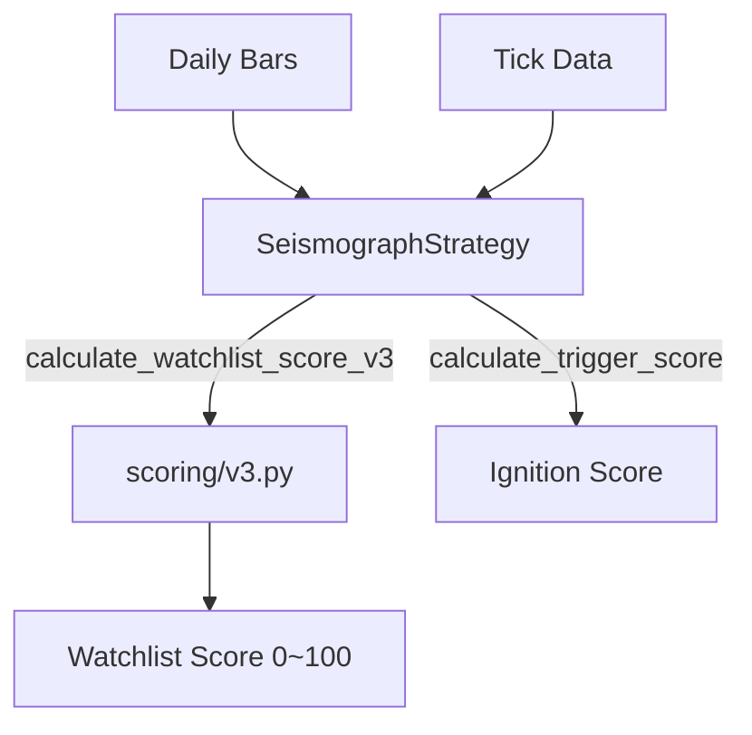

# strategy.py

## 기본 정보

| 항목 | 값 |
|------|---|
| **경로** | `backend/strategies/seismograph/strategy.py` |
| **역할** | Seismograph 메인 전략 클래스 - 매집 탐지 + 폭발 포착 |
| **라인 수** | 449 |
| **바이트** | 18,244 |

## 클래스

### `SeismographStrategy(StrategyBase)`
> 세력의 매집을 탐지하는 전략 ("지진계"처럼 미세한 진동 감지)

#### 메타정보
| 속성 | 값 |
|------|---|
| `name` | Seismograph Strategy |
| `version` | 3.0 |

#### Scoring Layer 메서드 (watchlist 점수)
| 메서드 | 시그니처 | 설명 |
|--------|----------|------|
| `calculate_watchlist_score` | `(ticker, daily_data) -> float` | V1: Stage-Based Priority |
| `calculate_watchlist_score_v2` | `(ticker, daily_data) -> float` | V2: 가중합 연속 점수 |
| `calculate_watchlist_score_v3` | `(ticker, daily_data, vwap?) -> float` | V3: Pinpoint Algorithm |
| `calculate_watchlist_score_detailed` | `(ticker, daily_data) -> dict` | 상세 점수 (개별 시그널 포함) |

#### Signal Intensity 메서드
| 메서드 | 시그니처 | 설명 |
|--------|----------|------|
| `_calculate_signal_intensities` | `(data) -> dict` | V2 시그널 강도 계산 |
| `_calculate_signal_intensities_v3` | `(data, vwap?) -> dict` | V3 시그널 강도 계산 |

#### Trading Layer 메서드
| 메서드 | 시그니처 | 설명 |
|--------|----------|------|
| `initialize` | `() -> None` | 전략 초기화 |
| `on_tick` | `(ticker, price, volume, timestamp) -> Signal?` | 틱 처리 |
| `on_bar` | `(ticker, bar_data) -> Signal?` | 분봉/일봉 처리 |
| `on_order_filled` | `(ticker, order_id, price, qty) -> None` | 주문 체결 콜백 |
| `add_tick` | `(ticker, tick) -> None` | 틱 데이터 추가 |
| `calculate_trigger_score` | `(ticker) -> float` | Ignition Score 계산 |

#### Configuration
| 메서드 | 시그니처 | 설명 |
|--------|----------|------|
| `get_config` | `() -> dict` | 현재 설정값 반환 |
| `set_config` | `(key, value) -> None` | 설정값 변경 |
| `get_universe_filter` | `() -> dict` | Universe 필터 조건 |
| `get_anti_trap_filter` | `() -> dict` | Anti-Trap 필터 조건 |
| `get_watchlist` / `set_watchlist` | - | Watchlist CRUD |

## 🔗 외부 연결 (Connections)

### Imports From (이 파일이 가져오는 것)
| 파일 | 가져오는 항목 |
|------|--------------|
| `backend/core/strategy_base.py` | `StrategyBase`, `Signal` |
| `backend/models` | `TickData` |
| `./signals/` | `calc_tight_range_intensity_v3`, `calc_absorption_intensity_v3`, etc. |
| `./scoring/` | `calculate_score_v1`, `calculate_score_v2`, `calculate_score_v3` |

### Imported By (이 파일을 가져가는 것)
| 파일 | 사용 목적 |
|------|----------|
| `seismograph/__init__.py` | `SeismographStrategy` re-export |
| `backend/container.py` | DI Container에서 인스턴스 생성 |

### Data Flow

## 리팩터링 히스토리

| 버전 | 변경 내용 |
|------|----------|
| [03-001] | 패키지 구조 분리 |
| [03-002] | 내부 메서드 → signals/, scoring/ 모듈 위임 |

## 외부 의존성
- (없음 - backend 내부 모듈만)
