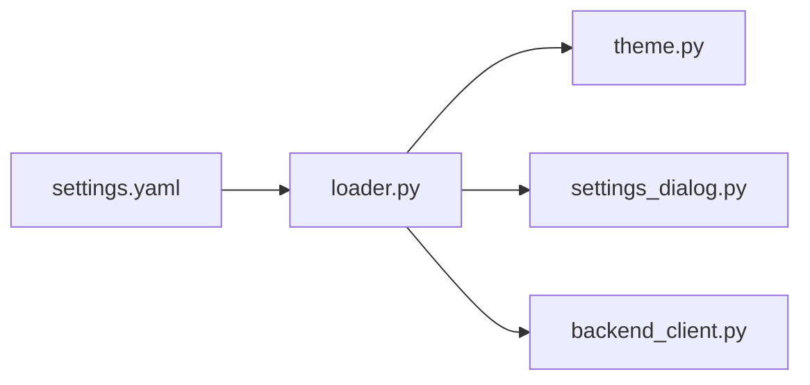

# loader.py

## 기본 정보
| 항목 | 값 |
|------|---|
| **경로** | `frontend/config/loader.py` |
| **역할** | settings.yaml 로드/저장 유틸리티 |
| **라인 수** | 89 |

## 함수

| 함수 | 시그니처 | 설명 |
|------|----------|------|
| `load_settings` | `() -> dict` | settings.yaml 로드 (LRU Cache) |
| `get_setting` | `(key_path: str, default) -> Any` | 점(.) 구분 키로 설정값 조회 |
| `save_settings` | `(new_config: dict) -> bool` | 전체 설정 저장 |
| `save_setting` | `(key_path: str, value) -> bool` | 단일 설정값 변경 및 저장 |

## 상수

| 상수 | 값 | 설명 |
|------|---|------|
| `CONFIG_DIR` | `Path(__file__).parent` | 설정 파일 디렉토리 |
| `SETTINGS_PATH` | `CONFIG_DIR / "settings.yaml"` | 설정 파일 경로 |

## 🔗 외부 연결 (Connections)

### Imports From
| 파일/모듈 | 가져오는 항목 |
|----------|--------------|
| `yaml` | `safe_load`, `dump` |
| `functools` | `lru_cache` |
| `pathlib` | `Path` |

### Imported By
| 파일 | 사용 목적 |
|------|----------|
| `frontend/gui/theme.py` | 테마 설정 로드 |
| `frontend/gui/settings_dialog.py` | 설정 읽기/저장 |
| `frontend/services/backend_client.py` | 연결 설정 |

### Data Flow

## 외부 의존성
- `PyYAML`
