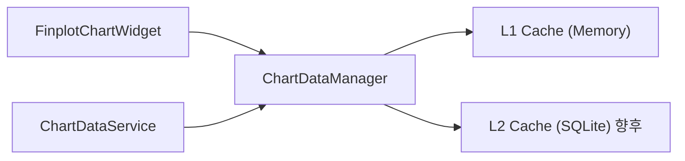

# chart_data_manager.py

## 기본 정보
| 항목 | 값 |
|------|---|
| **경로** | `frontend/gui/chart/chart_data_manager.py` |
| **역할** | 2-Tier Cache 기반 차트 데이터 동적 로딩 관리자 |
| **라인 수** | 307 |

## 클래스

### `LoadedRange` (dataclass)
> 로드된 데이터 범위 추적

| 필드 | 타입 | 설명 |
|------|------|------|
| `start_idx` | `int` | 시작 인덱스 |
| `end_idx` | `int` | 끝 인덱스 |
| `start_timestamp` | `int` | 시작 타임스탬프 |
| `end_timestamp` | `int` | 끝 타임스탬프 |

---

### `ChartDataManager`
> 차트 데이터 캐싱 및 동적 로딩 관리자

#### Features
- **L1 Cache**: Memory (빠른 액세스)
- **L2 Cache**: SQLite (영구 저장, 향후)
- **Buffer**: 뷰포트 양쪽 50봉 버퍼로 부드러운 스크롤
- **Prepend/Append**: 과거/미래 데이터 병합

#### 주요 메서드
| 메서드 | 시그니처 | 설명 |
|--------|----------|------|
| `reset` | `(ticker, timeframe)` | 종목/TF 변경 시 캐시 초기화 |
| `set_initial_data` | `(data: List[Dict])` | 초기 데이터 설정 |
| `needs_more_data` | `(view_start, view_end) -> bool` | 추가 데이터 필요 여부 확인 |
| `calculate_fetch_range` | `(view_start, view_end) -> tuple` | Fetch할 데이터 범위 계산 |
| `merge_data` | `(new_data, prepend)` | 새 데이터 병합 |
| `get_visible_data` | `(start_idx, end_idx) -> List` | 뷰포트 데이터 반환 |
| `get_cache_stats` | `() -> dict` | 캐시 통계 (디버그) |

## 🔗 외부 연결 (Connections)

### Imports From
| 파일/모듈 | 가져오는 항목 |
|----------|--------------|
| `loguru` | `logger` |
| `dataclasses` | `dataclass` |

### Imported By
| 파일 | 사용 목적 |
|------|----------|
| `frontend/gui/chart/__init__.py` | 패키지 export |
| `frontend/gui/chart/finplot_chart.py` | 동적 히스토리 로딩 |

### Data Flow

## 외부 의존성
- `loguru`
- `dataclasses`
